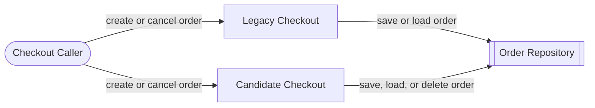
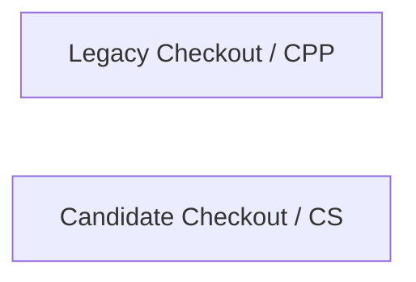
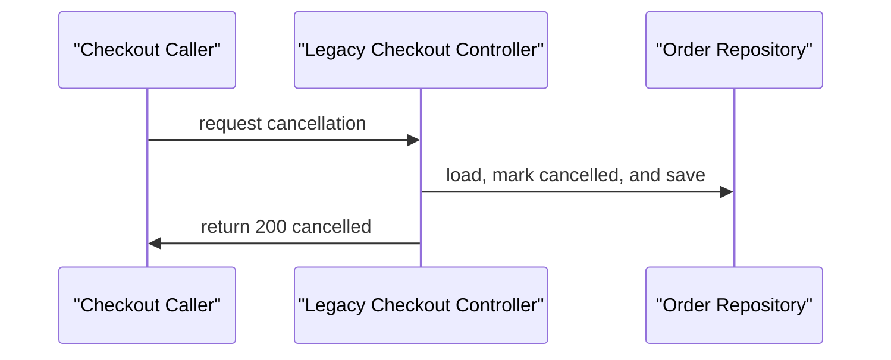
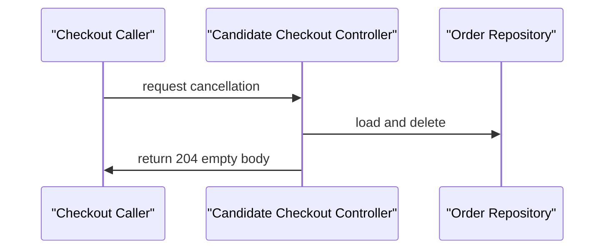
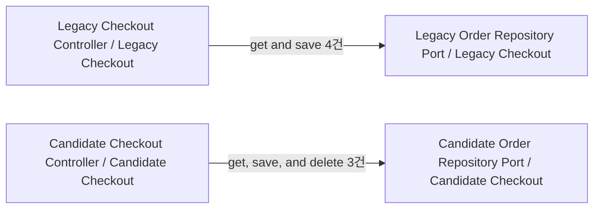
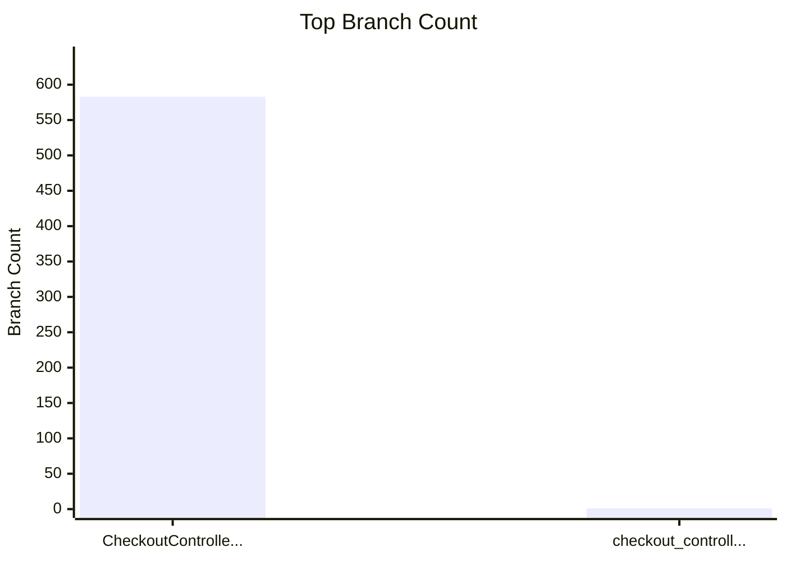
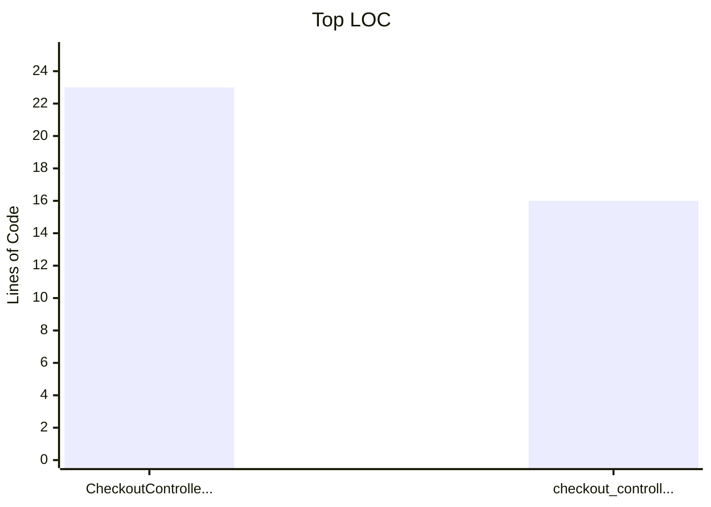
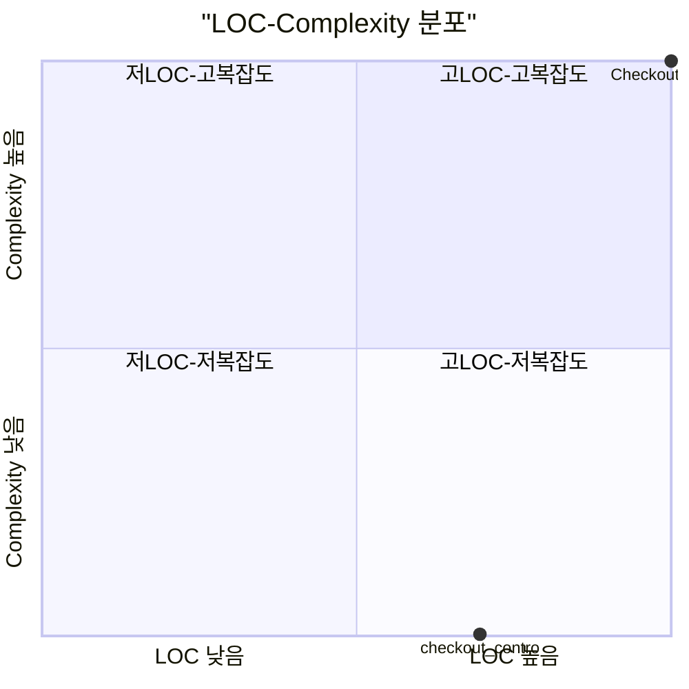
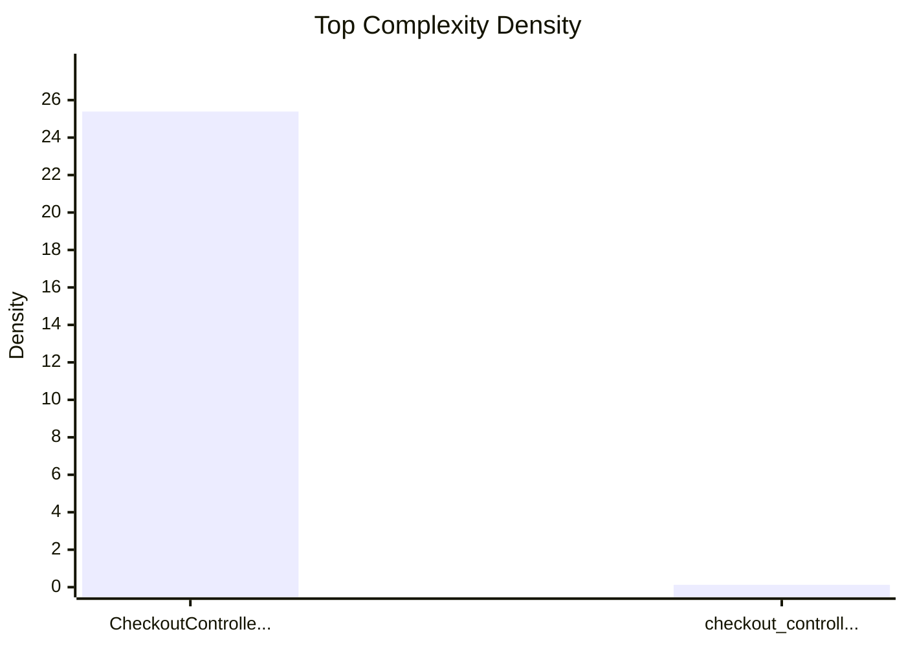

# Codebase Analysis Report

- generated_at: 2026-07-10T13:36:10.558288+00:00
- repo_path: /private/tmp/skill-system-solar-910-20260710/codebase
- commit_range: 6fd8d01eebcfc1f9430b2b004acb7919eb433c5a..6fd8d01eebcfc1f9430b2b004acb7919eb433c5a
- mode: full
- policy_path: /Users/master/repo/software/skill-system/Skill-System/source/skills/analysis-codebase/references/policy-default.json

## 1. 실행 요약

| 항목 | 값 |
| --- | --- |
| 총 Finding | 1 |
| High/Critical | 1 |
| Static-only 확인 후보 | 0 |
| Quality Gate | FAIL |
| Unverified 항목 | 14 |
| 엔트리포인트 수 | 4 |
| 컨테이너/컴포넌트 | 2 / 4 |
| 대표 시나리오 수 | 4 |
| 콜그래프 노드/엣지 | 0 / 0 |
| C/C++ lizard 보강 | missing |

| Top10 품질속성 | 건수 |
| --- | --- |
| correctness | 1 |

- Gate 상태: **FAIL**
- Gate 실패 사유: semantic_contract_high=1 > 0, unverified_ratio=0.933 > fail_threshold=0.35, fallback_diagrams=3 > 1
- Gate 경고: 없음

## 2. 범위/가정/비목표

- 범위
  - tracked files 기반 정적/동적/Git/보안 시그널을 결합해 단일 통합 마크다운 리포트를 생성
  - 증거를 context/container/component/interface/scenario/deployment 모델로 승격한 뒤 HLD/LLD 뷰를 파생 생성
  - finding 전수를 단일 개선 백로그 표로 출력
  - 승인된 evidence lane: tracked source, `fixtures/`, `artifacts/runtime/`
  - tracked file 6개를 전수 열거했고, 구현 소스 2개·fixture 1개·captured runtime 결과 2개·범위 선언 README 1개를 모두 직접 검사
- 가정
  - `artifacts/runtime/` JSON은 캡처된 실행 결과로 사용하되, 실행 시각·환경·생성 도구의 독립적인 provenance는 저장소에 없어 별도 확인이 필요
  - 동적 워크로드/트레이스 입력이 제공되지 않으면 해당 구간은 Unverified로 유지
  - 정적 도구(coverage/semgrep/sca) 부재 시 실패 원인을 그대로 보고
  - 정책 가중치(priority_model)는 우선순위 점수 계산의 단일 기준
- 비목표
  - 자동 코드 수정/자동 병합
  - 네트워크, 자격증명, 외부 시스템 접근 및 추적 소스 변경
  - 근거 없는 일반론 다이어그램 생성
  - finding 축약 요약본 별도 생성

- 포함 파일 분류 수: 4
- 제외 파일 수: 2
| 카테고리 | 포함 파일 수 |
| --- | --- |
| unknown | 2 |
| code | 2 |

## 3. 코드베이스 개요

- 주요 모듈(파인딩 기준): semantic-comparison
- 브랜치 수: 1
- 30일 초과 장기 브랜치: 0
- 엔트리포인트 수: 4
- 외부 인터페이스 수: 2
- 결정 후보 수: 2
- call graph 노드 수: 0
- call graph 엣지 수: 0
- 분석 카테고리: code, config, test

| 메트릭 | 현재 | 이전 | 추세 |
| --- | --- | --- | --- |
| Line Coverage(%) | None | Unverified | Unverified |
| Unverified Ratio | 0.933 | Unverified | Unverified |
| Avg Complexity Score | 293.0 | Unverified | Unverified |
| Fallback Diagrams | 3 | Unverified | Unverified |

| 모듈 | Finding 수 |
| --- | --- |
| semantic-comparison | 1 |

| 뷰 | 타입 | 생성 경로 | 근거 |
| --- | --- | --- | --- |
| Context View | context | primary | README.md, legacy-qt/checkout_controller.cpp, candidate-dotnet/CheckoutController.cs |
| Container View | container | primary | README.md, legacy-qt/checkout_controller.cpp, candidate-dotnet/CheckoutController.cs |
| Deployment View | deployment | fallback | Unverified |
| Component View | component | primary | legacy-qt/checkout_controller.cpp, candidate-dotnet/CheckoutController.cs |
| Legacy invalid-amount create | runtime | primary | fixtures/invalid-amount.json, artifacts/runtime/legacy-invalid-amount.json |
| Candidate invalid-amount create | runtime | primary | fixtures/invalid-amount.json, artifacts/runtime/candidate-invalid-amount.json |
| Legacy cancel order candidate flow | runtime | fallback | legacy-qt/checkout_controller.cpp |
| Candidate cancel order candidate flow | runtime | fallback | candidate-dotnet/CheckoutController.cs |

## 4. 상위 설계 (HLD)

### Context View


- provenance: README.md, legacy-qt/checkout_controller.cpp, candidate-dotnet/CheckoutController.cs
- generation: primary

### Container View


- provenance: README.md, legacy-qt/checkout_controller.cpp, candidate-dotnet/CheckoutController.cs
- generation: primary

### Deployment View
> _Unverified — Deployment Unverified: 다이어그램 생성에 필요한 구조 evidence가 부족하여 다이어그램을 생략합니다._

- provenance: Unverified
- generation: fallback

### Crosscutting Concepts
| 개념 | 증거 수 | 대표 근거 |
| --- | --- | --- |
| Persistence | 2 | legacy-qt/checkout_controller.cpp, candidate-dotnet/CheckoutController.cs |
| Input Validation | 2 | legacy-qt/checkout_controller.cpp, candidate-dotnet/CheckoutController.cs, fixtures/invalid-amount.json |
| Error Mapping | 2 | legacy-qt/checkout_controller.cpp, candidate-dotnet/CheckoutController.cs, artifacts/runtime/legacy-invalid-amount.json, artifacts/runtime/candidate-invalid-amount.json |

### Architecture Decision Candidates
| 결정 후보 | 유형 | 상태 | 요약 | 확인 방법 | 대표 근거 |
| --- | --- | --- | --- | --- | --- |
| Canonical checkout error contract | contract-boundary | verification-needed | Choose and document the canonical invalid-amount status/body before release; paired runtime shows candidate drift from the legacy baseline. | Run a shared contract test for invalid, boundary, and valid amounts against both implementations. | artifacts/runtime/legacy-invalid-amount.json, artifacts/runtime/candidate-invalid-amount.json |
| Canonical cancellation lifecycle | state-boundary | verification-needed | Tracked source suggests soft cancellation versus deletion, but no paired runtime result establishes the deployed state contract. | Execute the same existing-order cancellation fixture and compare post-state plus response contract. | legacy-qt/checkout_controller.cpp, candidate-dotnet/CheckoutController.cs |

### 결합도 상위 파일(보조 근거)

| 파일 | fan_in | fan_out | coupling | category |
| --- | --- | --- | --- | --- |
| candidate-dotnet/CheckoutController.cs | 0 | 0 | 0 | code |
| legacy-qt/checkout_controller.cpp | 0 | 0 | 0 | code |

## 5. 상세 설계 (LLD)

### 대표 런타임 시나리오
#### Legacy invalid-amount create
```mermaid
sequenceDiagram
participant R1 as "Checkout Caller"
participant R2 as "Legacy Checkout Controller"
R1->>R2: submit amount_cents 0
R2->>R1: return 400 INVALID_AMOUNT; persist 0 orders
```
- entrypoint_id: legacy-create-order
- source: captured-runtime
- provenance: fixtures/invalid-amount.json, artifacts/runtime/legacy-invalid-amount.json
- generation: primary

#### Candidate invalid-amount create
```mermaid
sequenceDiagram
participant R1 as "Checkout Caller"
participant R2 as "Candidate Checkout Controller"
R1->>R2: submit amount_cents 0
R2->>R1: return 500 INTERNAL_ERROR; persist 0 orders
```
- entrypoint_id: candidate-create-order
- source: captured-runtime
- provenance: fixtures/invalid-amount.json, artifacts/runtime/candidate-invalid-amount.json
- generation: primary

#### Legacy cancel order candidate flow

- entrypoint_id: legacy-cancel-order
- source: tracked-source
- provenance: legacy-qt/checkout_controller.cpp
- generation: fallback

#### Candidate cancel order candidate flow

- entrypoint_id: candidate-cancel-order
- source: tracked-source
- provenance: candidate-dotnet/CheckoutController.cs
- generation: fallback

### Component View


- provenance: legacy-qt/checkout_controller.cpp, candidate-dotnet/CheckoutController.cs
- generation: primary

### Interface Contracts
| Source Component | Kind | Target | Evidence |
| --- | --- | --- | --- |
| Legacy Checkout Controller | database | Order Repository | legacy-qt/checkout_controller.cpp |
| Candidate Checkout Controller | database | Order Repository | candidate-dotnet/CheckoutController.cs |

### End-to-end 의미 계약 비교
- 구현체/언어/프레임워크 차이는 의미 비교에서 제외하며, 동일 capability/input의 관찰 가능한 동작만 표시합니다.
- 분류: verified-difference=1, intentional=0, equivalent=1, Unverified=3, implementation-only-excluded=0, not-comparable-excluded=0, invalid-dimension-excluded=0
| Capability / Input / Pair Key | Dimension | Baseline Observable | Candidate Observable | Semantic Delta / Status | Paired Evidence | Validation |
| --- | --- | --- | --- | --- | --- | --- |
| create order with fixtures/invalid-amount.json [pair_key=create-order\|invalid-amount\|http-error-contract] | error | HTTP 400 with body {error: INVALID_AMOUNT} | HTTP 500 with body {error: INTERNAL_ERROR} | different: HTTP 400 with body {error: INVALID_AMOUNT} → HTTP 500 with body {error: INTERNAL_ERROR} | baseline(runtime)=artifacts/runtime/legacy-invalid-amount.json; candidate(runtime)=artifacts/runtime/candidate-invalid-amount.json | Replay fixtures/invalid-amount.json against both implementations and assert HTTP status, error body, and persisted-order count. |
| create order with a valid positive amount [pair_key=create-order\|valid-amount-fixture-needed\|success-contract] | output | Static candidate: HTTP 201 with body {status: created} and one repository save | Static candidate: HTTP 201 with body {status: created} and one repository save | Unverified: missing paired behavioral result artifacts | baseline(static)=legacy-qt/checkout_controller.cpp; candidate(static)=candidate-dotnet/CheckoutController.cs | Add one shared positive-amount fixture, capture both executions, and assert status, body, persisted record, and persisted field values. |
| cancel an existing order [pair_key=cancel-order\|existing-order-fixture-needed\|state-contract] | state | Static candidate: mark the order cancelled and save it | Static candidate: delete the order | Unverified: missing paired behavioral result artifacts | baseline(static)=legacy-qt/checkout_controller.cpp; candidate(static)=candidate-dotnet/CheckoutController.cs | Add one shared existing-order fixture, execute cancellation on isolated stores, and compare record existence, lifecycle status, and persisted fields. |
| cancel an existing order [pair_key=cancel-order\|existing-order-fixture-needed\|response-contract] | output | Static candidate: HTTP 200 with body {status: cancelled} | Static candidate: HTTP 204 with an empty body | Unverified: missing paired behavioral result artifacts | baseline(static)=legacy-qt/checkout_controller.cpp; candidate(static)=candidate-dotnet/CheckoutController.cs | Run the same existing-order cancellation fixture on both implementations and assert status and body against the accepted API contract. |

### Code-Level Detail (Optional)
> _Unverified — Unverified Class: 다이어그램 생성에 필요한 구조 evidence가 부족하여 다이어그램을 생략합니다._

### 클래스 근거 테이블
| Class | File | Parents | Children | Methods |
| --- | --- | --- | --- | --- |
| Unverified | Unverified | Unverified | Unverified | Unverified |

### 클래스 함수 명세
| Class | File | Method Signatures |
| --- | --- | --- |
| Unverified | Unverified | Unverified |

## 6. 정적 분석 결과

- 복잡도 측정식: $Complexity(file)=1+BranchCount$
- 결합도 측정식: $Coupling(file)=FanIn+FanOut$
- 우선순위 추정식: $Priority=\sum(w_i\cdot signal_i)+category\_bias+rank\_boost$

- files_analyzed: 2
- avg_complexity_score: 293.0
- line_coverage(%): None
- branch_coverage(%): None
- c_cpp_lizard_status: missing

> 주의: collector가 23-line C# 파일에 branch 583을 산출했으므로 C# complexity/branch/density 그래프는 heuristic anomaly입니다. 아래 정적 그래프는 수집기 원출력을 보존하되 parity, severity, release 판단 근거로 사용하지 않았습니다.

### 복잡도 상위 파일 분포


### 브랜치 수 상위 파일 분포


### LOC 상위 파일 분포


### LOC 대비 복잡도 사분면


### 밀도 상위 파일 분포


### 정적 분석 핵심 수치
| 지표 | 값 |
| --- | --- |
| 최대 복잡도 파일 | candidate-dotnet/CheckoutController.cs |
| 평균 복잡도 점수 | 293.0 |
| 분석 파일 수 | 2 |
| Coverage(Line/Branch) | None / None |
| C/C++ lizard 보강 | missing (no artifact) |

## 7. 동적 분석 결과

- workload_status: Unverified
- workload_message: CBIR_WORKLOAD_CMD not set
- workload_exit_code: None
- trace_backed_scenarios: 0
- static_fallback_scenarios: 2
- tools_available: bpftrace=False, java=True, otelcol=False, perf=False, pprof=False, valgrind=False
- latency_percentiles: Unverified
- 참고: 동적 워크로드/트레이스 미제공 상태이므로 성능 결론은 Unverified입니다.

## 8. 수동 리뷰 결과

목적: 자동 분석으로 확정하기 어려운 구조/정확성/보안 판단을 사람이 검증하기 위한 근거 섹션입니다.

| 영역 | 수동 검토 포인트 | 활용 목적 |
| --- | --- | --- |
| Architecture | 컨테이너/컴포넌트 경계와 fallback 뷰 의존 여부 | architecture model + provenance 표를 기준으로 경계 타당성 검토 |
| Algorithm | 핫패스 분기/루프 복잡도와 입력 규모 증가시 기울기 | complexity + churn 상위 파일 중심으로 개선 우선순위 확정 |
| Runtime | 대표 시나리오가 실제 entrypoint/trace와 연결되는지 | trace-backed 여부와 runtime entrypoint linkage 확인 |
| Semantic Comparison | 동일 capability/input의 output, state, error, side effect 차이에 paired evidence가 있는지 | implementation vocabulary를 제외하고 material delta 또는 Unverified 검증 과제만 확정 |

## 9. 우선순위 개선 백로그

| 파인딩 | 액션 | Severity | Priority | 구체적인 개선 내용 | 관련 파일 |
| --- | --- | --- | --- | --- | --- |
| F-2026-C001 | Align candidate invalid-amount error contract | high | 6.0 | paired evidence에서 HTTP 400 with body {error: INVALID_AMOUNT} → HTTP 500 with body {error: INTERNAL_ERROR} 차이가 확인됐습니다. 기대 계약을 명시한 뒤 최소 구현을 정렬하고 동일 fixture로 재검증합니다. | legacy-qt/checkout_controller.cpp, candidate-dotnet/CheckoutController.cs, fixtures/invalid-amount.json |

## 10. 부록

### Coverage Ledger

| 그룹 | 후보/검사 경로 | 대표 strata | 근거 | 판정 한계 |
| --- | --- | --- | --- | --- |
| legacy Qt | 1 / 1 | boundary handler, validation, persistence, error mapping | `legacy-qt/checkout_controller.cpp` | invalid create만 paired runtime 존재 |
| candidate .NET | 1 / 1 | boundary handler, validation, persistence, error mapping | `candidate-dotnet/CheckoutController.cs` | invalid create만 paired runtime 존재 |
| shared fixtures | 1 / 1 | invalid create input | `fixtures/invalid-amount.json` | valid create/cancel fixture 없음 |
| captured runtime | 2 / 2 | 양측 invalid create 결과 | `artifacts/runtime/legacy-invalid-amount.json`, `artifacts/runtime/candidate-invalid-amount.json` | 실행 환경·시각 provenance 미제공 |

- 상세 ledger: `artifacts/manual/coverage-ledger.json`
- weakest-stratum expansion: cancel의 state/output 두 observable을 양측 소스까지 확장했으나 paired runtime 부재로 top backlog와 FAIL gate는 바뀌지 않았습니다.

### Artifact Index
```json
{
  "manual.contract-comparisons.json": "artifacts/manual/contract-comparisons.json",
  "manual.coverage-ledger.json": "artifacts/manual/coverage-ledger.json",
  "runtime.candidate-invalid-amount.json": "artifacts/runtime/candidate-invalid-amount.json",
  "runtime.legacy-invalid-amount.json": "artifacts/runtime/legacy-invalid-amount.json",
  "architecture.architecture-summary.json": "artifacts/architecture/architecture-summary.json",
  "architecture.component-model.json": "artifacts/architecture/component-model.json",
  "architecture.container-model.json": "artifacts/architecture/container-model.json",
  "architecture.context-model.json": "artifacts/architecture/context-model.json",
  "architecture.crosscutting-model.json": "artifacts/architecture/crosscutting-model.json",
  "architecture.decision-candidates.json": "artifacts/architecture/decision-candidates.json",
  "architecture.deployment-model.json": "artifacts/architecture/deployment-model.json",
  "architecture.entrypoints.json": "artifacts/architecture/entrypoints.json",
  "architecture.interface-model.json": "artifacts/architecture/interface-model.json",
  "architecture.scenario-model.json": "artifacts/architecture/scenario-model.json",
  "dynamic.runtime.json": "artifacts/dynamic/runtime.json",
  "git.branches.tsv": "artifacts/git/branches.tsv",
  "git.churn_all.tsv": "artifacts/git/churn_all.tsv",
  "git.recent_commits.tsv": "artifacts/git/recent_commits.tsv",
  "notes.unverified.tsv": "artifacts/notes/unverified.tsv",
  "policy-effective.json": "artifacts/policy-effective.json",
  "static.architecture.json": "artifacts/static/architecture.json",
  "static.call-graph.json": "artifacts/static/call-graph.json",
  "static.class-hierarchy.json": "artifacts/static/class-hierarchy.json",
  "static.complexity.json": "artifacts/static/complexity.json",
  "static.coverage-summary.json": "artifacts/static/coverage-summary.json",
  "static.file_inventory.tsv": "artifacts/static/file_inventory.tsv",
  "static.path-classification.tsv": "artifacts/static/path-classification.tsv",
  "tools.tsv": "artifacts/tools.tsv"
}
```

### Policy Snapshot
```json
{
  "weights": {
    "architecture": 0.35,
    "algorithm": 0.25,
    "performance": 0.2,
    "refactor": 0.15,
    "test_guard": 0.05
  },
  "category_bias": {
    "code": 0.8,
    "config": 0.4,
    "test": -1.1,
    "asset": -2.5,
    "doc": -2.5,
    "unknown": 0.0
  },
  "severity_thresholds": {
    "critical": 4.6,
    "high": 3.8,
    "medium": 2.9,
    "low": 2.0
  },
  "profile_thresholds": {
    "architecture": 3.6,
    "algorithm": 3.3,
    "performance": 3.2,
    "refactor": 2.4
  },
  "due_days_by_severity": {
    "critical": 14,
    "high": 30,
    "medium": 60,
    "low": 90,
    "info": 120
  }
}
```

### Architecture Summary
```json
{
  "status": "partial",
  "counts": {
    "entrypoints": 4,
    "containers": 2,
    "components": 4,
    "interfaces": 2,
    "scenarios": 4,
    "deployment_nodes": 0,
    "crosscutting": 3,
    "decision_candidates": 2
  },
  "warnings": [
    "deployment evidence 없음",
    "cancel-order paired runtime evidence 없음",
    "valid create paired runtime evidence 없음"
  ]
}
```

### View Provenance
| 뷰 | 타입 | 생성 경로 | 근거 |
| --- | --- | --- | --- |
| Context View | context | primary | README.md, legacy-qt/checkout_controller.cpp, candidate-dotnet/CheckoutController.cs |
| Container View | container | primary | README.md, legacy-qt/checkout_controller.cpp, candidate-dotnet/CheckoutController.cs |
| Deployment View | deployment | fallback | Unverified |
| Component View | component | primary | legacy-qt/checkout_controller.cpp, candidate-dotnet/CheckoutController.cs |
| Legacy invalid-amount create | runtime | primary | fixtures/invalid-amount.json, artifacts/runtime/legacy-invalid-amount.json |
| Candidate invalid-amount create | runtime | primary | fixtures/invalid-amount.json, artifacts/runtime/candidate-invalid-amount.json |
| Legacy cancel order candidate flow | runtime | fallback | legacy-qt/checkout_controller.cpp |
| Candidate cancel order candidate flow | runtime | fallback | candidate-dotnet/CheckoutController.cs |

### Unverified
- git.churn: No churn records for commit range
- static.coverage: Coverage file not found (coverage.xml or coverage/lcov.info)
- static.semgrep: semgrep command not found
- static.sca: dependency-check.sh not found
- dynamic.workload: CBIR_WORKLOAD_CMD not set
- dynamic.trace: CBIR_TRACE_FILE not provided
- dynamic.latency: CBIR_LATENCY_CSV not provided
- semantic.create-valid: No shared positive-amount fixture or paired runtime result
- semantic.cancel-order: No shared existing-order fixture or paired runtime result
- architecture.deployment: No tracked deployment or runtime topology evidence
- static.complexity.csharp: Collector reported 583 branches for a 23-line C# file; treat the heuristic metric as anomalous and do not use it for parity or release risk
- semantic-comparison:create order with a valid positive amount: missing paired behavioral result artifacts
- semantic-comparison:cancel an existing order: missing paired behavioral result artifacts
- semantic-comparison:cancel an existing order: missing paired behavioral result artifacts
