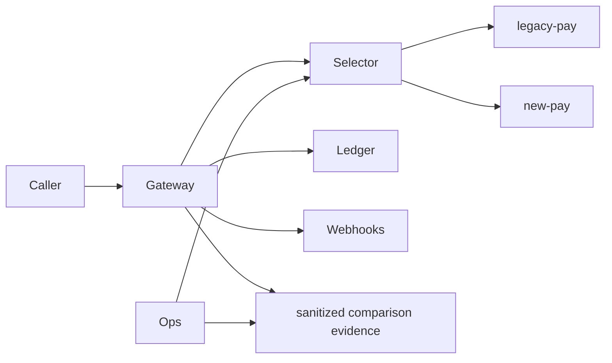
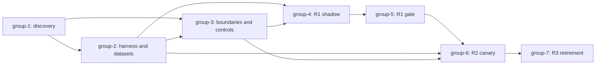

# PaymentEngineReplacement

## Purpose
- Navigation entrypoint for the three-release `legacy-pay` to `new-pay` replacement package.
- Canonical status and approval remain in `docs/plan/2026-07-10-payment-engine-replacement.md`.
- The derived evidence boundary is indexed in `docs/plan/PaymentEngineReplacement/domain-ingest-summary.md`.

## Derived Status Notice
- This README is a **derived navigation document**.
- Do not trust this file for execution status, approval state, TODO truth, or canonical scope.
- The canonical authority for status is: `docs/plan/2026-07-10-payment-engine-replacement.md`

## Human Quickstart
1. Read the canonical dated plan for status, blockers, and approval.
2. Read the Active Implementation Card below and open that group.
3. Read only its `relevant_specs`; update a canonical spec before derived text.
4. Produce the group's named evidence and update dated-plan progress/TODO state.

## Domain Context Inputs
- Derived ingest summary: `docs/plan/PaymentEngineReplacement/domain-ingest-summary.md`
- This file is derived evidence, not canonical truth.
- Use it to fill Purpose, Current State, Target State, Acceptance Criteria, and TODOs with domain-specific content.

## Canonical Documents
| Concern | Canonical Document |
| --- | --- |
| Capability Map | `docs/spec/payment-engine-replacement-capability-map.md` |
| Api Contract | `docs/spec/payment-engine-replacement-api-contract.md` |
| Data Contract | `docs/spec/payment-engine-replacement-data-contract.md` |
| Integration Contract | `docs/spec/payment-engine-replacement-integration-contract.md` |
| Observability Contract | `docs/spec/payment-engine-replacement-observability-contract.md` |
| Release Gate | `docs/spec/payment-engine-replacement-release-gate.md` |
| Behavior Parity Contract | `docs/spec/payment-engine-replacement-behavior-parity-contract.md` |
| Parity Contract | `docs/spec/payment-engine-replacement-parity-contract.md` |
| Old New Mapping | `docs/spec/payment-engine-replacement-old-new-mapping.md` |
| Compatibility Matrix | `docs/spec/payment-engine-replacement-compatibility-matrix.md` |
| Rollback Plan | `docs/spec/payment-engine-replacement-rollback-plan.md` |
| Rollback Trigger | `docs/spec/payment-engine-replacement-rollback-trigger.md` |
| Source Of Truth Policy | `docs/spec/payment-engine-replacement-source-of-truth-policy.md` |
| Agent Handoff Index | `docs/spec/payment-engine-replacement-agent-handoff-index.md` |
| Migration Map | `docs/spec/payment-engine-replacement-migration-map.md` |
| Security Contract | `docs/spec/payment-engine-replacement-security-contract.md` |
| Current execution status / approval / TODO | `docs/plan/2026-07-10-payment-engine-replacement.md` |

## Archetype
- archetype: `backend-service`
- modifiers: `strict-behavior-parity, legacy-parity, rollback-required, cross-session-handoff, data-sensitive, security-sensitive`

## Active Implementation Card
- Active group: `group-1` — `Evidence Baseline/Group1-Service-Baseline.md`
- Goal: recover exact source/evidence paths and safe repository-native validation commands.
- Must read: canonical dated plan, domain ingest summary, capability map, API contract, integration contract, security contract.
- Blocking contracts: API contract API-* discovery rows; integration IF-AUTH-NORMALIZED and IF-SHADOW; security evidence-use approval.
- First file to inspect: the implementation repository source outline for `gateway/`, `ledger/`, `webhooks/`, and `ops/`.
- First artifact to produce: `artifacts/payment-engine-replacement/contracts/source-outline.txt`.
- Stop condition: source/evidence access is absent or inspection would copy prohibited data.

## Target Module Structure


## Phase Index
- `Evidence Baseline`
  - `Evidence Baseline/Group1-Service-Baseline.md` — source/evidence discovery
  - `Evidence Baseline/Group2-Api-And-Data-Contracts.md` — compatibility harness/datasets
  - `Evidence Baseline/Group3-Dependency-And-Boundary-Map.md` — boundaries/controls/safe telemetry
- `R1 Shadow Authorization`
  - `R1 Shadow Authorization/Group4-Execution-Surface.md` — decision-only shadow path
  - `R1 Shadow Authorization/Group5-Observability-And-Failure-Contract.md` — R1 observation/gate
- `R2 Test Tenant Canary`
  - `R2 Test Tenant Canary/Group6-Stability-Refactor.md` — eligible canary/immediate rollback
- `R3 Legacy Retirement`
  - `R3 Legacy Retirement/Group7-Validation-And-Release.md` — clean window/retirement

## Group Index
- `Evidence Baseline/Group1-Service-Baseline.md`
- `Evidence Baseline/Group2-Api-And-Data-Contracts.md`
- `Evidence Baseline/Group3-Dependency-And-Boundary-Map.md`
- `R1 Shadow Authorization/Group4-Execution-Surface.md`
- `R1 Shadow Authorization/Group5-Observability-And-Failure-Contract.md`
- `R2 Test Tenant Canary/Group6-Stability-Refactor.md`
- `R3 Legacy Retirement/Group7-Validation-And-Release.md`

## Dependency Graph


## Spec Docs
- `docs/spec/payment-engine-replacement-capability-map.md`
- `docs/spec/payment-engine-replacement-api-contract.md`
- `docs/spec/payment-engine-replacement-data-contract.md`
- `docs/spec/payment-engine-replacement-integration-contract.md`
- `docs/spec/payment-engine-replacement-observability-contract.md`
- `docs/spec/payment-engine-replacement-release-gate.md`
- `docs/spec/payment-engine-replacement-behavior-parity-contract.md`
- `docs/spec/payment-engine-replacement-parity-contract.md`
- `docs/spec/payment-engine-replacement-old-new-mapping.md`
- `docs/spec/payment-engine-replacement-compatibility-matrix.md`
- `docs/spec/payment-engine-replacement-rollback-plan.md`
- `docs/spec/payment-engine-replacement-rollback-trigger.md`
- `docs/spec/payment-engine-replacement-source-of-truth-policy.md`
- `docs/spec/payment-engine-replacement-agent-handoff-index.md`
- `docs/spec/payment-engine-replacement-migration-map.md`
- `docs/spec/payment-engine-replacement-security-contract.md`

## Canonical Read Order
1. `docs/plan/2026-07-10-payment-engine-replacement.md`
2. `docs/spec/payment-engine-replacement-capability-map.md`
3. `docs/spec/payment-engine-replacement-api-contract.md`
4. `docs/spec/payment-engine-replacement-data-contract.md`
5. `docs/spec/payment-engine-replacement-integration-contract.md`
6. `docs/spec/payment-engine-replacement-observability-contract.md`
7. `docs/spec/payment-engine-replacement-release-gate.md`
8. `docs/spec/payment-engine-replacement-behavior-parity-contract.md`
9. `docs/spec/payment-engine-replacement-parity-contract.md`
10. `docs/spec/payment-engine-replacement-old-new-mapping.md`
11. `docs/spec/payment-engine-replacement-compatibility-matrix.md`
12. `docs/spec/payment-engine-replacement-rollback-plan.md`
13. `docs/spec/payment-engine-replacement-rollback-trigger.md`
14. `docs/spec/payment-engine-replacement-source-of-truth-policy.md`
15. `docs/spec/payment-engine-replacement-agent-handoff-index.md`
16. `docs/spec/payment-engine-replacement-migration-map.md`
17. `docs/spec/payment-engine-replacement-security-contract.md`
18. active phase/group doc
19. package README

## Validation Commands
```bash
python3 /Users/master/repo/software/skill-system/Skill-System/source/skills/plan-long-term-package/scripts/validate_phase_plan_package.py --root . --package PaymentEngineReplacement --slug payment-engine-replacement --dated-plan docs/plan/2026-07-10-payment-engine-replacement.md --archetype backend-service --modifiers "strict-behavior-parity,legacy-parity,rollback-required,cross-session-handoff,data-sensitive,security-sensitive"
python3 /Users/master/repo/software/skill-system/Skill-System/source/skills/plan-long-term-package/scripts/validate_phase_plan_package.py --root . --package PaymentEngineReplacement --slug payment-engine-replacement --dated-plan docs/plan/2026-07-10-payment-engine-replacement.md --archetype backend-service --modifiers "strict-behavior-parity,legacy-parity,rollback-required,cross-session-handoff,data-sensitive,security-sensitive" --strict --quality-lint
python3 /Users/master/repo/software/skill-system/Skill-System/source/skills/plan-long-term-package/scripts/validate_phase_plan_package.py --root . --package PaymentEngineReplacement --slug payment-engine-replacement --dated-plan docs/plan/2026-07-10-payment-engine-replacement.md --archetype backend-service --modifiers "strict-behavior-parity,legacy-parity,rollback-required,cross-session-handoff,data-sensitive,security-sensitive" --strict-handoff
python3 /Users/master/repo/software/skill-system/Skill-System/source/skills/plan-long-term-package/scripts/validate_phase_plan_package.py --root . --package PaymentEngineReplacement --slug payment-engine-replacement --dated-plan docs/plan/2026-07-10-payment-engine-replacement.md --archetype backend-service --modifiers "strict-behavior-parity,legacy-parity,rollback-required,cross-session-handoff,data-sensitive,security-sensitive" --strict --quality-lint --write-validation-stamp
```

## Notes
- This README should not contain checklists or execution status.
- If this file conflicts with a canonical document, update this file.
