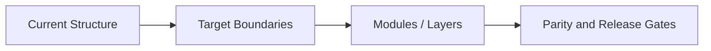
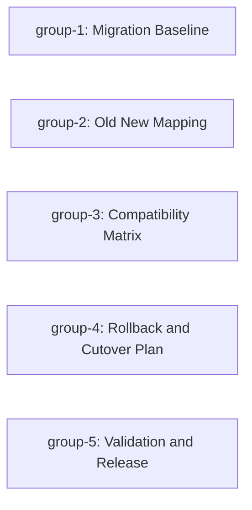

# PaymentEngineReplacement

## Purpose
- Planning package entrypoint for `PaymentEngineReplacement`
- Navigation only
- No domain ingest summary was generated because no report input was admitted.

## Derived Status Notice
- This README is a **derived navigation document**.
- Do not trust this file for execution status, approval state, TODO truth, or canonical scope.
- The canonical authority for status is: `docs/plan/2026-07-10-payment-engine-replacement.md`

## Human Quickstart
1. Read this section for orientation only.
2. Read the Active Implementation Card.
3. Open the active phase/group doc.
4. Open only the relevant specs listed by that group.
5. If domain details look thin, inspect the source/evidence named by the canonical plan.
6. Use Canonical Read Order when changing scope, state, interfaces, or gates.

## Domain Context Inputs
- No derived ingest summary is part of this manifest; add one only when an actual report input is admitted.

## Canonical Documents
| Concern | Canonical Document |
| --- | --- |
| Migration Map | `docs/spec/payment-engine-replacement-migration-map.md` |
| Old New Mapping | `docs/spec/payment-engine-replacement-old-new-mapping.md` |
| Compatibility Matrix | `docs/spec/payment-engine-replacement-compatibility-matrix.md` |
| Rollback Plan | `docs/spec/payment-engine-replacement-rollback-plan.md` |
| Parity Contract | `docs/spec/payment-engine-replacement-parity-contract.md` |
| Release Gate | `docs/spec/payment-engine-replacement-release-gate.md` |
| Behavior Parity Contract | `docs/spec/payment-engine-replacement-behavior-parity-contract.md` |
| Rollback Trigger | `docs/spec/payment-engine-replacement-rollback-trigger.md` |
| Data Contract | `docs/spec/payment-engine-replacement-data-contract.md` |
| Security Contract | `docs/spec/payment-engine-replacement-security-contract.md` |
| Source Of Truth Policy | `docs/spec/payment-engine-replacement-source-of-truth-policy.md` |
| Agent Handoff Index | `docs/spec/payment-engine-replacement-agent-handoff-index.md` |
| Current execution status / approval / TODO | `docs/plan/2026-07-10-payment-engine-replacement.md` |

## Archetype
- archetype: `migration-modernization`
- modifiers: `strict-behavior-parity, rollback-required, data-sensitive, security-sensitive, cross-session-handoff, legacy-parity`

## Active Implementation Card
- Active group: `group-1`
- Goal: `Migration Baseline`
- Must read: `docs/spec/payment-engine-replacement-migration-map.md, docs/spec/payment-engine-replacement-old-new-mapping.md, docs/spec/payment-engine-replacement-compatibility-matrix.md, docs/spec/payment-engine-replacement-rollback-plan.md, docs/spec/payment-engine-replacement-parity-contract.md, docs/spec/payment-engine-replacement-release-gate.md`
- Blocking contracts: `docs/spec/payment-engine-replacement-migration-map.md, docs/spec/payment-engine-replacement-old-new-mapping.md, docs/spec/payment-engine-replacement-compatibility-matrix.md, docs/spec/payment-engine-replacement-rollback-plan.md, docs/spec/payment-engine-replacement-parity-contract.md, docs/spec/payment-engine-replacement-release-gate.md`
- First file to inspect: `inspect current code assets referenced by the active group`
- First artifact to produce: `group-specific evidence artifact named in Acceptance Criteria`
- Stop condition: `stop if a required contract, dependency, or blocking interface is unresolved`

## Target Module Structure


## Phase Index
- `R1 Shadow Authorization`
  - `R1 Shadow Authorization/Group1-Migration-Baseline.md`
  - `R1 Shadow Authorization/Group2-Old-New-Mapping.md`
- `R2 Test-Tenant Canary`
  - `R2 Test-Tenant Canary/Group3-Compatibility-Matrix.md`
- `R3 Legacy Retirement`
  - `R3 Legacy Retirement/Group4-Rollback-And-Cutover-Plan.md`
- `Cross-Release Validation and Handoff`
  - `Cross-Release Validation and Handoff/Group5-Validation-And-Release.md`

## Group Index
- `R1 Shadow Authorization/Group1-Migration-Baseline.md`
- `R1 Shadow Authorization/Group2-Old-New-Mapping.md`
- `R2 Test-Tenant Canary/Group3-Compatibility-Matrix.md`
- `R3 Legacy Retirement/Group4-Rollback-And-Cutover-Plan.md`
- `Cross-Release Validation and Handoff/Group5-Validation-And-Release.md`

## Dependency Graph


## Spec Docs
- `docs/spec/payment-engine-replacement-migration-map.md`
- `docs/spec/payment-engine-replacement-old-new-mapping.md`
- `docs/spec/payment-engine-replacement-compatibility-matrix.md`
- `docs/spec/payment-engine-replacement-rollback-plan.md`
- `docs/spec/payment-engine-replacement-parity-contract.md`
- `docs/spec/payment-engine-replacement-release-gate.md`
- `docs/spec/payment-engine-replacement-behavior-parity-contract.md`
- `docs/spec/payment-engine-replacement-rollback-trigger.md`
- `docs/spec/payment-engine-replacement-data-contract.md`
- `docs/spec/payment-engine-replacement-security-contract.md`
- `docs/spec/payment-engine-replacement-source-of-truth-policy.md`
- `docs/spec/payment-engine-replacement-agent-handoff-index.md`

## Canonical Read Order
1. `docs/plan/2026-07-10-payment-engine-replacement.md`
2. `docs/spec/payment-engine-replacement-migration-map.md`
3. `docs/spec/payment-engine-replacement-old-new-mapping.md`
4. `docs/spec/payment-engine-replacement-compatibility-matrix.md`
5. `docs/spec/payment-engine-replacement-rollback-plan.md`
6. `docs/spec/payment-engine-replacement-parity-contract.md`
7. `docs/spec/payment-engine-replacement-release-gate.md`
8. `docs/spec/payment-engine-replacement-behavior-parity-contract.md`
9. `docs/spec/payment-engine-replacement-rollback-trigger.md`
10. `docs/spec/payment-engine-replacement-data-contract.md`
11. `docs/spec/payment-engine-replacement-security-contract.md`
12. `docs/spec/payment-engine-replacement-source-of-truth-policy.md`
13. `docs/spec/payment-engine-replacement-agent-handoff-index.md`
14. active phase/group doc
15. package README

## Validation Commands
```bash
python3 scripts/validate_phase_plan_package.py --root <repo-root> --package PaymentEngineReplacement --slug payment-engine-replacement --dated-plan 2026-07-10-payment-engine-replacement.md --archetype migration-modernization --modifiers "strict-behavior-parity,rollback-required,data-sensitive,security-sensitive,cross-session-handoff,legacy-parity"
python3 scripts/validate_phase_plan_package.py --root <repo-root> --package PaymentEngineReplacement --slug payment-engine-replacement --dated-plan 2026-07-10-payment-engine-replacement.md --archetype migration-modernization --modifiers "strict-behavior-parity,rollback-required,data-sensitive,security-sensitive,cross-session-handoff,legacy-parity" --strict --strict-handoff
python3 scripts/validate_phase_plan_package.py --root <repo-root> --package PaymentEngineReplacement --slug payment-engine-replacement --dated-plan 2026-07-10-payment-engine-replacement.md --archetype migration-modernization --modifiers "strict-behavior-parity,rollback-required,data-sensitive,security-sensitive,cross-session-handoff,legacy-parity" --strict --strict-handoff --quality-lint
python3 scripts/validate_phase_plan_package.py --root <repo-root> --package PaymentEngineReplacement --slug payment-engine-replacement --dated-plan 2026-07-10-payment-engine-replacement.md --archetype migration-modernization --modifiers "strict-behavior-parity,rollback-required,data-sensitive,security-sensitive,cross-session-handoff,legacy-parity" --strict --strict-handoff --write-validation-stamp
```

## Notes
- This README should not contain checklists or execution status.
- If this file conflicts with a canonical document, update this file.
