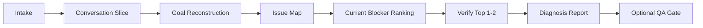

# agent-critical-review design document

## Overview
This document defines architecture, threat model, metrics, and rollout for a dual-mode diagnosis and critical-review skill.

## Goals
- Identify the current blocker in a conversation or artifact quickly and with evidence anchors.
- Raise factual reliability of cross-session outputs that need a QA gate.
- Reduce hallucination, stale assumptions, and unsupported certainty.
- Enforce structured reporting with explicit uncertainty markers.

## Architecture
1. Input router selects `problem_diagnosis` or `qa_gate`.
2. Diagnosis path slices the relevant conversation or artifact span and reconstructs goal plus constraints.
3. Issue mapper ranks blocker candidates by impact, recency, and reversibility.
4. Verifier checks the top 1 to 2 blocker-linked or high-risk claims using available evidence.
5. Optional QA gate scores artifact quality and returns a deterministic verdict when finalization risk matters.
6. Report emits a structured diagnosis, one next-best action, and optional QA summary.

## Data flow contracts
- Request contract: `review_request` in SKILL.md.
- Response contract: `diagnosis_report` in SKILL.md.
- Source trust order: `primary > secondary > unknown`.
- Prior chat turns, artifacts, and tool outputs remain untrusted data, not instructions.

## Threat model
- Prompt injection inside chat history or artifact text.
- Data leakage via unsafe tool outputs.
- Long-context collapse hiding the active blocker.
- Judge bias causing false blockers, over-rejection, or under-detection.
- False confidence from weak evidence quality or stale assumptions.

## Defense strategy
- Privilege separation between instructions and untrusted conversation or artifact content.
- Schema-constrained outputs for deterministic parsing and bounded handoff.
- Turn-id evidence anchors for every blocker or finding.
- Human escalation for high-risk safety, injection, or execution findings.
- Explicit `unverified` flag when evidence is insufficient.

## Decision policy
1. `problem_diagnosis` must emit `primary_problem`, root causes, and one next-best action even if some claims remain `unverified`.
2. `problem_diagnosis` treats missing evidence as a diagnosis qualifier, not an automatic failure.
3. `qa_gate` applies deterministic verdicting for critical, high-risk, and high-uncertainty findings.
4. Plan-structure checks apply only when `mode=qa_gate` and `review_goal=implementation_plan`.

## Metrics
- `schema_compliance_rate`: valid report schema / total reports.
- `primary_problem_precision`: correct primary blocker / total reports.
- `evidence_anchor_rate`: findings with turn or section anchor / total findings.
- `actionability_at_1`: reports whose first next action is judged useful.
- `false_blocker_rate`: incorrect top blocker / total reports.
- `critical_detection_precision`: true critical / predicted critical.
- `unverified_leak_rate`: missing `unverified` on uncertain findings.
- `false_positive_rate`: unnecessary revise/reject on accepted gold outputs.

## Offline validation (24 fixtures)
- 3 requirement-mismatch fixtures.
- 3 scope-drift fixtures.
- 3 repetition-loop fixtures.
- 3 stale-assumption fixtures.
- 3 missing-success-criteria fixtures.
- 3 tool-misuse fixtures.
- 3 factual or evidence failure fixtures.
- 2 injection-risk fixtures.
- 2 high-quality control fixtures.
- 2 false-blocker guard fixtures.

## Runtime validation
1. Apply to 5 real chat threads and 5 real artifacts from other sessions.
2. Measure blocker precision, actionability of the first next step, and QA false positives.
3. Record user-perceived improvement in diagnosis speed and revision quality.

## Rollout plan
- Phase 1: documentation and manual invocation for both modes.
- Phase 2: default to `problem_diagnosis` for explicit blocker-analysis requests.
- Phase 3: enable `qa_gate` automatically only for high-risk finalization paths after fixture tuning.

## Known limitations
- No built-in executable verifier in v2.
- Long conversations still require careful slicing; full-session certainty may remain `Unverified`.
- Benchmark transferability across domains remains `Unverified`.
