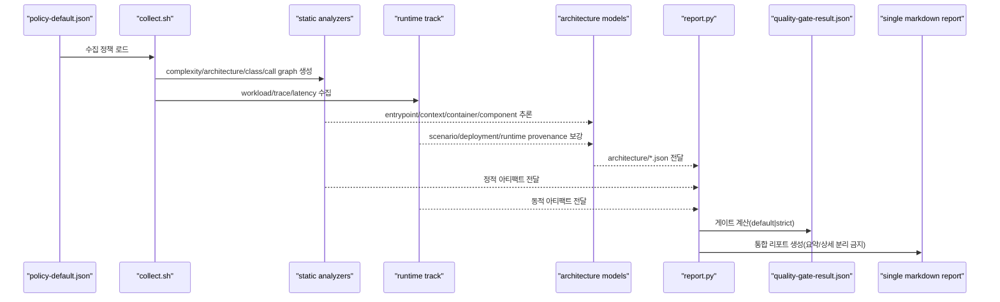

# Analysis Codebase - Execution and CI Guide



## 구성요소
- `scripts/collect.sh`
  - tracked files 분류(`path-classification.tsv`)
  - Git churn/branches/commits 수집
  - complexity/architecture/class-hierarchy/call-graph 생성
  - architecture model 생성(`architecture/*.json`)
  - manifest-aware entrypoint 보강(`package.json`, `pyproject.toml`, `Procfile`, `Makefile`)
  - C/C++ entrypoint 보강(`main()` 및 `CMakeLists.txt add_executable()`)
  - optional `lizard` C/C++ 함수/CCN 보강 산출물(`artifacts/static/lizard-complexity.txt`)
  - command path 기반 component/container 연결
  - env/DSN 기반 external system 추론
  - deployment evidence 확장(`Docker/Compose/K8s/Terraform/GitHub Actions/Vercel/Render/Fly/Serverless/Skaffold`)
  - internal relation이 약할 때도 entrypoint -> external interface runtime scenario 확장
  - deployment relation(`defines/manages/runs/builds/deploys`) 복원
  - coverage/security/dynamic 트랙 수집(가능 시)
- `scripts/report.py`
  - 정책 기반 finding 스코어링/게이트 계산
  - HLD: context/container/deployment/crosscutting/decision 뷰 생성
  - LLD: 대표 runtime 시나리오 + component/interface view 생성
  - code-level detail은 선택형으로 클래스 다이어그램/함수 명세 생성
  - 정적 분석 그래프 생성(LOC/Complexity/Branches/Density)
  - 개선 백로그 표 생성(파인딩/액션/Severity/Priority/구체적인 개선 내용/관련 파일)

## CI 예시
```bash
CODEX_HOME="${CODEX_HOME:-$HOME/.codex}"
SKILL_ROOT="${SKILL_ROOT:-$CODEX_HOME/skills/analysis-codebase}"
test -d "$SKILL_ROOT" || { echo "Set CODEX_HOME or SKILL_ROOT to analysis-codebase" >&2; exit 1; }

# 1) 수집
"$SKILL_ROOT/scripts/collect.sh" \
  --repo-path "$PWD" \
  --commit-range auto \
  --mode full \
  --output-dir "$PWD/.analysis/latest" \
  --top-n 120 \
  --policy "$SKILL_ROOT/references/policy-default.json"

# 2) 보고서
python3 "$SKILL_ROOT/scripts/report.py" \
  --input-dir "$PWD/.analysis/latest" \
  --output "$PWD/docs/report/codebase-analysis-report.md" \
  --risk-model default \
  --policy "$SKILL_ROOT/references/policy-default.json"
```

## 권한 차단 대응
- 권한/도구 부재로 수집 실패한 트랙은 `Unverified`로 유지합니다.
- 실패 원인은 `artifacts/notes/unverified.tsv`에 기록합니다.
- 승인 후 동일 명령을 재실행해 증거를 채웁니다.

## 검증 포인트
1. 산출물 존재 확인
   - `artifacts/index.json`
   - `artifacts/findings.json`
   - `artifacts/quality-gate-result.json`
   - 단일 리포트 마크다운
2. 구조 검증
   - 10개 섹션 존재
   - HLD/LLD Mermaid 다이어그램 존재
   - `architecture/*.json` 핵심 모델 존재
   - runtime 시나리오가 entrypoint 또는 trace와 연결되는지 확인
   - 정적 분석 그래프(최소 4개) 존재
   - C/C++ repo에서 `lizard`가 설치된 경우 `artifacts/static/lizard-complexity.txt` 존재
   - `quadrantChart` 라벨이 무따옴표 정규화 규칙을 따르고 렌더 오류가 없는지 확인
3. 백로그 검증
   - 컬럼이 `파인딩/액션/Severity/Priority/구체적인 개선 내용/관련 파일`인지 확인
   - 상위 10개 finding의 계획 필드 공란 없음
