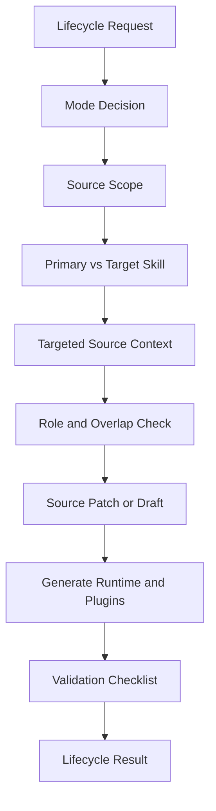

# create-skill-pack Design Document

## Overview
`create-skill-pack` is the lifecycle manager for the Skill System bundle. It keeps canonical source skills, routing references, eval smoke tests, agent metadata, role plugin packages, and generated runtime targets aligned.

The old direct-home model treated `.codex/skills/*` as the main editable surface. The current bundle is source-driven: edit `source/`, regenerate `.codex`, `.claude`, and `plugins`, then install or mirror into local runtimes only as deployment.

## Scope Boundary
App-managed `.codex/skills/.system`, live home runtime directories, plugin caches, host-local config, automations, and credentials are outside the source lifecycle. Do not audit, patch, migrate, deprecate, route-register, smoke-test, or add metadata to those locations through this workflow.

## Goals
- Create new canonical Skill System source skills and runtime companion packs.
- Harden and migrate existing skills into the current source/plugin architecture.
- Manage metadata, route matrix entries, registry rows, eval smoke tests, and plugin membership when explicitly in scope.
- Keep `SKILL.md` compact while placing templates and examples in `reference.md`, `references/`, or docs.
- Regenerate runtime and plugin targets from source to prevent drift.
- Prevent dummy template placeholders from leaking into final answers or generated artifacts.

## Lifecycle Architecture

## Workflow Model
1. PREPARE: choose lifecycle mode, confirm source scope, and distinguish `primary_skill` from `target_skill`.
2. ACQUIRE: read only target source files and at most one or two adjacent source examples.
3. REASON: classify role, trigger overlap, routing registration need, metadata need, plugin membership, and whether the request should be a skill, runtime companion payload, memory rule, repo rule, or one-turn response.
4. ACT: patch only required source skill, reference, docs, metadata, routing, registry, eval, plugin membership, or runtime companion source files.
5. GENERATE: run `source/tools/generate_targets.py` for runtime and/or plugins when source changes require generated outputs.
6. VERIFY: run placeholder checks, source registry/eval checks, `verify_bundle --profile core`, and bundle hygiene as appropriate.
7. RECOVER: fix only mismatched artifacts; return to scheduling if the task is not lifecycle work.
8. FINALIZE: report lifecycle mode, source files, generated targets, plugin membership, routing/metadata/smoke decisions, validation, and follow-up review.

## Target Skill vs Primary Skill
For hardening, migration, deprecation, metadata updates, or plugin membership updates, `create-skill-pack` owns execution as `primary_skill`. The inspected or patched skill is `target_skill`; it may be read and modified but should be listed under `exclude_as_primary_skill` in route smoke tests when execution would otherwise be ambiguous.

## Source And Generated Targets
- Source skills live under `source/skills/{skill-id}/`.
- Shared routing, docs, evals, and schemas live under `source/shared/`.
- Platform-specific runtime companion payloads live under `source/platform/codex/` and `source/platform/claude/`.
- Role plugin membership lives under `source/plugins/*.yaml`.
- Generated runtime targets are `.codex/` and `.claude/`.
- Generated plugin packages are `plugins/skill-system-*`.

Do not fix generated targets without fixing source. If a generated target is stale, regenerate it.

## Routing, Metadata, And Plugin Decisions
Update `source/shared/context-routing.md` only when a source skill should be discoverable, the user explicitly asks for routing registration, trigger overlap or smoke-test coverage requires it, or a skill is deprecated, superseded, merged, split, or renamed.

Create or update `agents/openai.yaml` for source skills when role, trigger, lifecycle scope, or ownership changes. If route/eval cases expect a skill as `expected_primary_skill`, avoid `support_only` metadata.

Update `source/plugins/{role}.yaml` when a skill is added, renamed, moved between role packages, deprecated out of a package, or when package boundaries change. Regenerate `plugins/` after membership changes.

## Template Safety
Templates in `reference.md` intentionally contain placeholder text. They are not final answers. Creation or migration patches must replace placeholders with concrete values, and analysis/review requests should report findings instead of dumping template blocks. A focused placeholder search should run over changed non-reference artifacts before completion.

## Validation
- `.codex/skills/.system`, live runtime homes, host-local config, and plugin caches were not modified.
- Source `SKILL.md` frontmatter has stable `name` and specific `description` under 1024 chars.
- `primary_skill` and `target_skill` are distinguished where relevant.
- Routing Card has standard fields and complete `context_targets`/`risk_profile` subfields.
- Skill packs include Resource/Risk Boundary, Recovery/Context Expansion, Known Limits, Validation, Anti-Patterns, and Output Contract.
- Runtime companion payloads are not route-registered as skills unless promoted.
- `agents/openai.yaml` policy matches routing ownership.
- `source/plugins/*.yaml` membership is updated or intentionally skipped.
- `source/shared/context-routing.md`, `source/shared/docs/skill_registry.md`, and eval cases are updated or intentionally skipped.
- Generated `.codex`, `.claude`, and `plugins` targets match source after generation.
- Packaging excludes `.DS_Store`, `__MACOSX/*`, and `*/._*` without deleting `.system`.

## Risks
- Broad lifecycle triggers can steal ordinary skill execution.
- Support-only metadata can under-activate a skill that route/eval cases expect as primary.
- Silent routing or plugin membership registration can create drift.
- Hand-editing generated targets can hide stale source.
- Dummy templates can leak into output when not treated as scaffolding.
- Split/merge/deprecation decisions may require user approval before destructive changes.
- `.system` and plugin caches must remain app-managed/deployment state.

*Last Updated: 2026-07-01*
*Version: 2.0*
