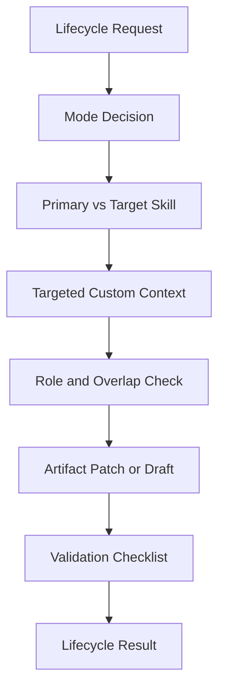

# create-skill-pack Design Document

## Overview
`create-skill-pack` is the lifecycle manager for user-managed custom skills in this `.codex` library. It keeps skill artifacts, routing references, metadata, and smoke tests aligned without turning global `AGENTS.md` into a large policy file.

## Scope Boundary
`.codex/skills/.system` is Codex app-managed and outside the custom skill lifecycle. Do not audit, patch, migrate, deprecate, route-register, smoke-test, or add metadata to `.system` skills through this workflow. Custom skill counts and completeness checks exclude `.system`.

## Goals
- Create new user-managed Codex custom skill packs and reference packs.
- Harden and migrate existing custom skills into the current Routing Card style.
- Manage metadata, route matrix entries, and route smoke tests when explicitly in scope.
- Keep `SKILL.md` compact while placing templates and examples in `reference.md` or docs.
- Avoid `.system`, full skill-library, full repo, and full memory loading by default.

## Lifecycle Architecture

## Workflow Model
1. PREPARE: choose lifecycle mode, confirm custom scope, and distinguish `primary_skill` from `target_skill`.
2. ACQUIRE: read only target custom files and at most one or two adjacent custom examples.
3. REASON: classify role, trigger overlap, routing registration need, metadata need, and whether the request should be a skill, reference pack, memory rule, repo rule, or one-turn response.
4. ACT: patch only required custom skill, reference, docs, metadata, or routing files.
5. VERIFY: run checklist against `.system` exclusion, primary/target distinction, frontmatter, Routing Card, risk boundary, recovery, Known Limits, metadata, smoke tests, host paths, and secret hygiene.
6. RECOVER: fix only mismatched artifacts; return to scheduling if the task is not custom lifecycle work.
7. FINALIZE: report lifecycle mode, files, routing/metadata/smoke decisions, validation, and follow-up review.

## Target Skill vs Primary Skill
For hardening, migration, deprecation, or metadata updates, `create-skill-pack` owns execution as `primary_skill`. The inspected or patched custom skill is `target_skill`; it may be read and modified but should be listed under `exclude_as_primary_skill` in route smoke tests when execution would otherwise be ambiguous.

## Reference-Only Packs
Real skills live under `.codex/skills/{skill-id}/` and include `SKILL.md`. Reference-only packs should prefer `.codex/references/{reference-pack-id}/` and should not include `SKILL.md`, `agents/openai.yaml`, or route registration unless the user asks to promote them into real skills. A temporary reference-only directory under `.codex/skills/` must not pretend to be a skill.

## Routing and Metadata Decisions
Update `context-routing.md` only when a custom skill should be discoverable, the user explicitly asks for routing registration, trigger overlap or smoke-test coverage requires it, or a custom skill is deprecated, superseded, merged, split, or renamed. Skip routing updates for reference-only packs, typo cleanup, `.system`, non-routing notes, or proposal-only requests.

Create or update `agents/openai.yaml` for user-managed custom skills when role, trigger, or lifecycle scope changes. Skip metadata for reference-only packs, `.system`, docs-only notes, one-turn preferences, and repo `AGENTS.md`-only rules. Default custom metadata policy is `allow_implicit_invocation: false`.

## Validation
- `.codex/skills/.system` was not modified and custom skill counts exclude it.
- `SKILL.md` frontmatter has stable `name` and specific `description` under 1024 chars.
- `primary_skill` and `target_skill` are distinguished where relevant.
- Routing Card has standard fields and complete `context_targets`/`risk_profile` subfields.
- Skill packs include Resource/Risk Boundary, Recovery/Context Expansion, Known Limits, Validation, and Anti-Patterns.
- Reference packs do not create `SKILL.md`, metadata, or route registration unless promoted.
- `agents/openai.yaml` policy is conservative unless explicitly justified.
- `context-routing.md` route matrix/smoke tests use auditable fields and avoid wildcard/free-form ambiguity.
- Packaging excludes `.DS_Store`, `__MACOSX/*`, and `*/._*` without deleting `.system`.

## Risks
- Broad lifecycle triggers can steal ordinary skill execution.
- Metadata can under-activate when `allow_implicit_invocation: false` is too conservative.
- Silent routing registration can create drift; draft the decision first when unsure.
- Split/merge/deprecation decisions may require user approval before destructive changes.
- `.system` must remain app-managed; treating it as a custom skill can create invalid audit or patch work.

*Last Updated: 2026-05-07*
*Version: 1.3*
