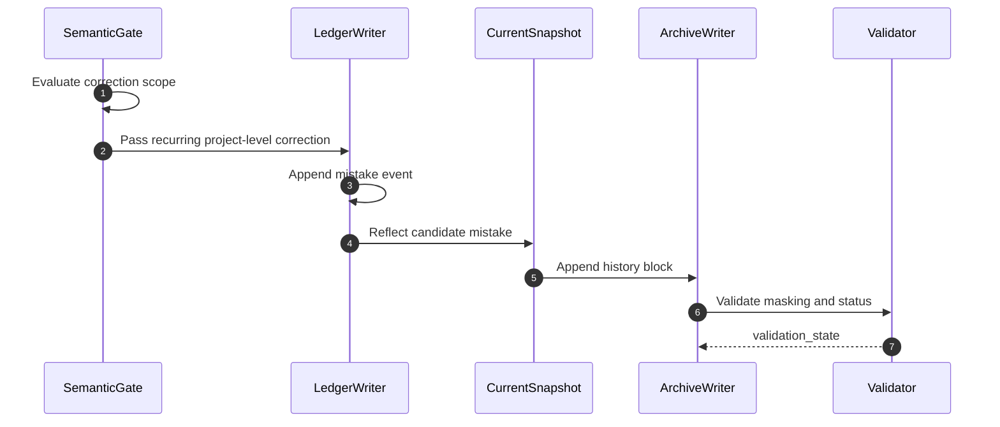

# memory-bank-correction-capture Design Document

## Overview
This workflow captures recurring correction patterns without overfitting on every disagreement or wording fix.

## Runtime Rules
- Semantic gating happens before any write.
- New mistake items start as `candidate` and `unverified`.
- Promotion to `active` belongs to maintenance, not correction capture.

## Failure Paths
- Gate fails because the correction is turn-local: no writes.
- Duplicate match is ambiguous: return `user-verification-needed`.
- Evidence contains raw PII: redact before any write.

## Validation
- Scope gate integrity
- PII masking integrity
- Candidate-state integrity
