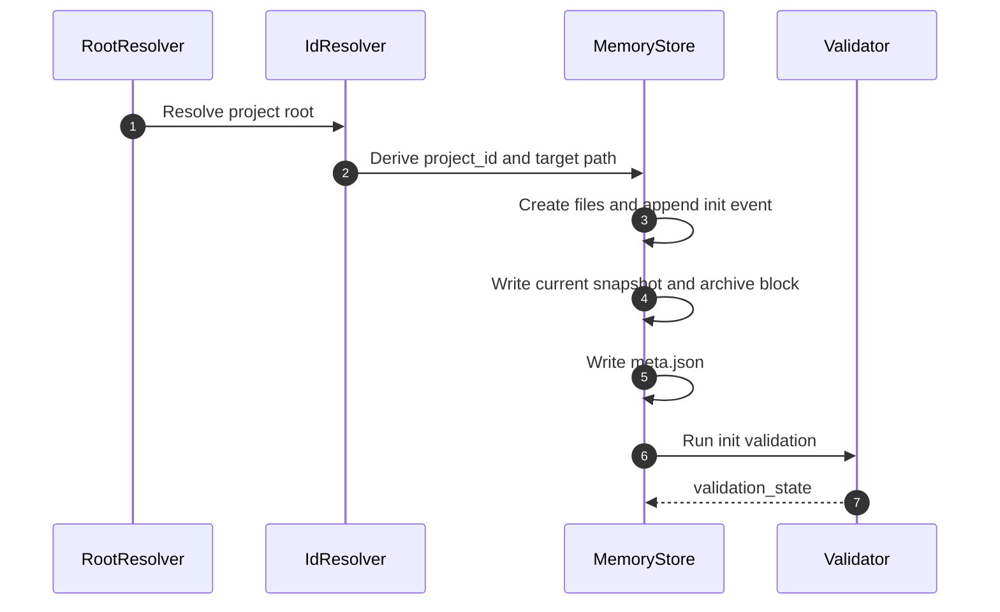

# memory-bank-init Design Document

## Overview
This workflow creates the initial project-scoped memory bank and leaves a verifiable append-only origin event.

## Runtime Rules
- Append the init event before writing the current snapshot.
- Never silently overwrite an existing memory bank.
- Record the project locator source in `meta.json`.

## Failure Paths
- Existing files without explicit reinitialization approval: stop with `blocked`.
- Missing project root or unwritable path: stop with `blocked`.
- Invalid JSON written during initialization: stop and repair before returning.

## Validation
- Confirm file existence.
- Confirm JSON parseability.
- Confirm the init event and archive block refer to the same `event_id`.
