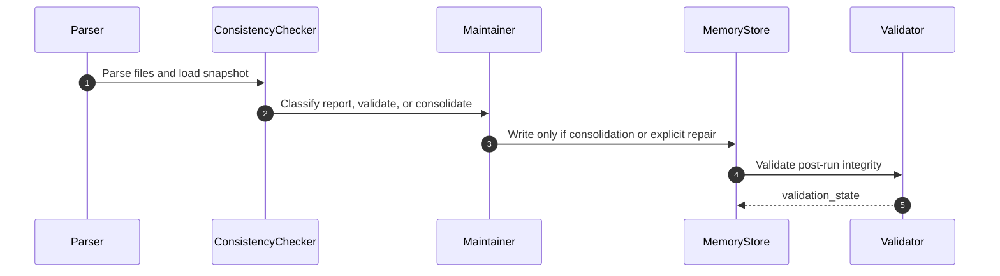

# memory-bank-maintenance Design Document

## Overview
This workflow keeps an existing memory bank healthy and inspectable without conflating read-only checks and write-producing consolidation.

## Runtime Rules
- Read-only requests stay read-only.
- Consolidation writes a `system` event and increments `snapshot_version`.
- Conflict reporting must identify the exact mismatched fields or item IDs.

## Failure Paths
- Missing files: stop with `blocked`.
- Invalid JSON or schema drift: stop and surface the exact mismatch.
- Ambiguous consolidation candidate: return `unverified` without writing.

## Validation
- File parseability
- Cross-file consistency
- Snapshot monotonicity
- Read-only/write boundary integrity
