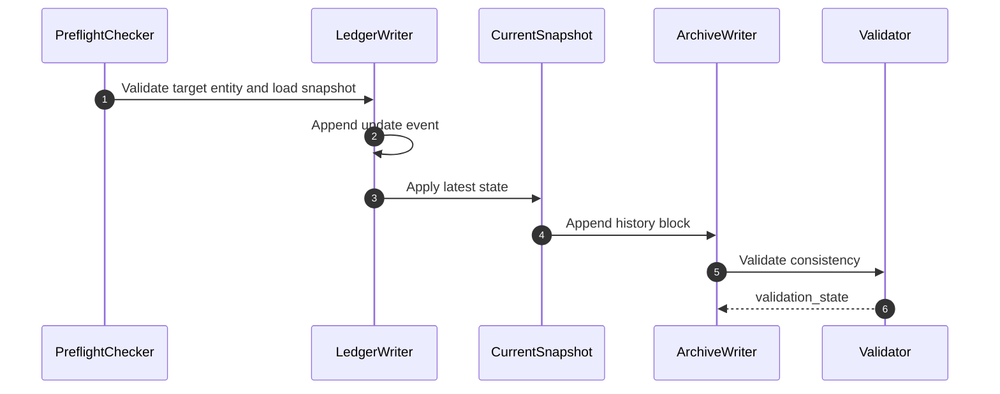

# memory-bank-update Design Document

## Overview
This workflow handles persistent goal and rule mutations for an existing project memory bank.

## Runtime Rules
- `events.jsonl` is written first.
- `current.md` reflects only the latest visible state.
- `archive.md` receives the matching compact change block.
- `meta.json.updated_at` moves forward on every successful mutation.

## Failure Paths
- Missing memory-bank files: stop and route to init.
- Entity outside `goal|rule`: stop with `blocked`.
- Missing target item for update or deprecate: return `user-verification-needed`.

## Validation
- Event/order integrity
- Snapshot integrity
- Archive integrity
