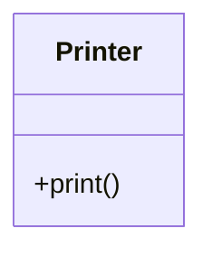
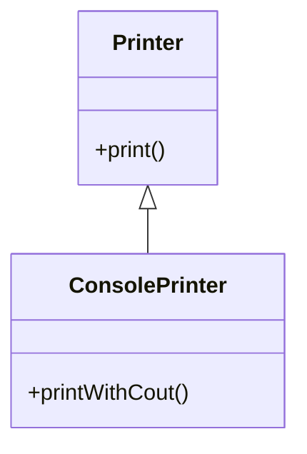

# Plan Document Template

> File location: `docs/plan/YYYY-MM-DD-<task-slug>.md`
> Activation note: casual `플랜` mentions alone do not create a plan; use this template for persisted plan artifacts or active plan synchronization.

This plan remains planning-only until an explicit implementation transition is recorded.

## 1) 작업 개요
- 목적:
- 범위:
- 비범위:

## 2) 변경 파일 목록
- [ ] `<path>`

## 3) 변경 요약 (What / Why)
- What:
- Why:

## 4) 현재 상태 vs 예정 상태

### 4.1 코드 (필요 시)
- 코드 변경이 유의미할 때만 작성한다. 실제 변경 언어로 before/after를 각각 별도 코드 블록에 넣는다(placeholder/toy code 금지).
### 변경 전
```text
(실제 현재 코드)
```

### 변경 후
```text
(실제 변경 코드)
```

### 4.2 수식 (필요 시)
### 수식 변경 전
$$C_{old} = a + b$$

### 수식 변경 후
$$C_{new} = a + b + \delta$$

### 4.3 다이어그램 (필요 시)
- 다이어그램은 실제 runtime interaction, component boundary, class/data model 변화가 있을 때만 추가한다.
- agent workflow, plan lifecycle, approval flow만 설명하는 다이어그램은 기본 생성하지 않는다.
- 권장 기준:
  - 클래스 변경: 클래스 다이어그램
  - 호출/상호작용 변경: 시퀀스 다이어그램
  - 컴포넌트/배치 변경: 아키텍처 다이어그램
  - 스키마 변경: ERD

#### 현재 구조

```mermaid
classDiagram
    class Printer {
        +print()
    }
```

#### 변경 예정 구조

```mermaid
classDiagram
    class Printer {
        +print()
    }
    class ConsolePrinter {
        +printWithCout()
    }
    Printer <|-- ConsolePrinter
```

## 5) 리스크
- 리스크:
- 영향:
- 대응:

## 6) 검증 절차
### Primary verifier
- 종류: `existing-repository | direct-observation | smoke | unavailable`
- 명령/관찰:
- 기대 결과:
- 최신 결과: `not-run | pass | fail | user-verification-needed`
- 근거 요약: (원문 로그나 receipt 이력을 붙이지 않는다)

### User 런타임 확인 (필요 시 하나만)
- 시나리오:
- 기대 결과:

검증을 위해 새 테스트 프레임워크, mock 계층, fixture 묶음, dependency, LoopRun을 추가하지 않는다. 그것이 사용자 산출물이거나 이미 정의된 실질 회귀 위험을 직접 다루는 경우에만 구현 범위에 포함한다. 검증 수단이 없으면 범위를 늘리지 않고 `user-verification-needed`로 남긴다.

## 7) 질의 (Questions)
- Q1:
  - 상태: `open | answered | decided`
  - 답변:
  - 근거:

## 8) TODO
- [ ] `todo` 항목
- [ ] `doing` 항목
- [ ] `blocked` 항목 (차단 원인 명시)
- [x] `done` 항목

## 9) 승인 게이트
- 현재 상태: `pending | approved`
- 승인 문구:
- 승인 시각:
- 승인자:

## 10) 현재 진행 스냅샷
- 갱신 시각:
- 완료된 구현:
- 남은 구현:
- 최신 결정적 검증:
- 다음 한 단계:

이 섹션은 매번 교체한다. 명령 로그, receipt, 재시도, superseded 결과를 누적하지 않는다.
