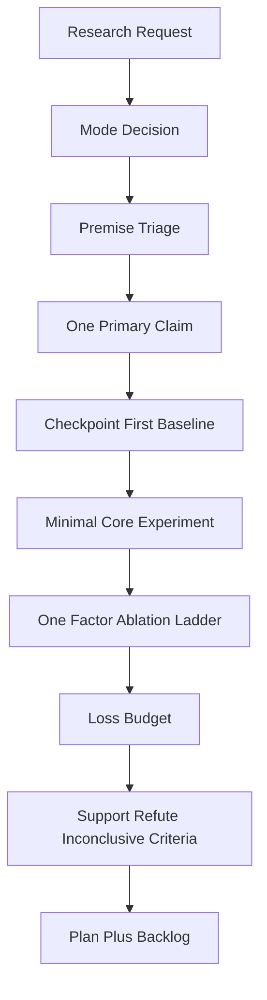

# research-hypothesis-planning Design Document

## Overview
`research-hypothesis-planning` handles research plans, paper ideas, hypotheses, experiment design, ablation, loss design, and training plans. It is intentionally scoped so research skepticism does not leak into software implementation tasks.

## Design Principles
- User research premises are hypotheses, not facts.
- Keep one primary research claim.
- Prefer checkpoint-only and baseline-only evaluation before new training.
- Design the smallest core experiment first.
- Add one ablation factor at a time.
- Prevent multi-loss soup by separating training losses from evaluation and analysis metrics.
- Keep `plan-doc-workflow` as artifact writer only when persisted `docs/plan` output is explicitly requested.

## Boundary With Development
Development and implementation tasks should remain direct and keyword-grounded. If the user asks to implement a chosen method, use concrete requirements, file names, APIs, and metrics as task specifications unless unsafe, contradictory, impossible, or repo-conflicting. Do not run broad research premise skepticism in that mode.

## Research Plan Flow

## Validation Focus
- No unverified user hypothesis is promoted to fact.
- No new training appears before checkpoint/baseline evaluation is considered.
- The core experiment changes the fewest factors possible.
- Each ablation stage names one changed factor and frozen factors.
- Loss design has at most one primary objective and one justified auxiliary per stage.
- Support, refute, and inconclusive outcomes are explicit.

## Known Risks
- Literature freshness may require explicit browsing or provided papers.
- Too much skepticism can block implementation; return to development mode when the method is already chosen.
- Conservative ablation design may delay ambitious ideas, so keep them visible in Ablation Backlog.

*Last Updated: 2026-05-08*
*Version: 1.0*
