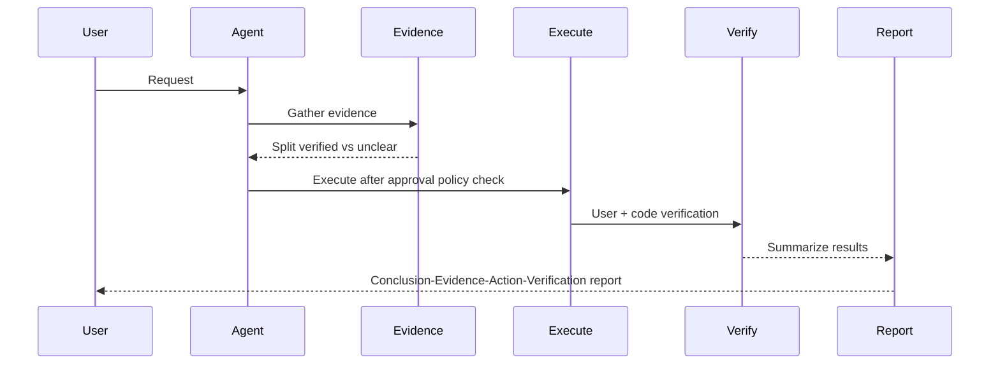

# Strict Response Quality Process

## Routing Card
- role: output_modifier
- intent_signature:
  - `srq`, `srq로`, `제대로 보고해`, `formal report`, evidence-first report requests
- use_when:
  - the user explicitly asks for formal evidence-first reporting, completion reporting, review reporting, or handoff formatting.
- do_not_use_when:
  - `제대로` appears alone without report-quality intent.
  - execution rigor, root-cause analysis, or diff presentation is the actual primary task.
- expected_inputs:
  - verified facts, uncertainty, action, and validation evidence from the primary workflow
- expected_outputs:
  - concise conclusion, evidence, action, and verification sections when relevant
- context_targets:
  must_read:
    - primary workflow result or artifact slice to report
  read_if_needed:
    - validation output
    - changed file list
    - review findings
  do_not_load_by_default:
    - full repo
    - full memory bank
    - unrelated plans or reports
- risk_profile:
  reads:
    - final evidence bundle only
  writes:
    - none unless producing an explicitly requested report artifact
  tools:
    - none by default
  sensitive_resources:
    - credentials default deny
- entry_scene:
  - FINALIZE

## Related Skills
- `strict-evidence-driven-reporting-workflow`: owns execution rigor, review, and completion criteria for implementation work.
- `deep-analysis-workflow`: owns root-cause-first analysis flow for recurring or complex issues.

## Purpose
- This skill is an explicit reporting mode for formal review, completion, and handoff replies.
- It improves report consistency by separating verified facts, uncertainty, and next actions without forcing a global response format.
- Execution rigor for implementation tasks is controlled by `strict-evidence-driven-reporting-workflow` when that skill is active.

## When To Apply
- Apply immediately when the user invokes `srq`, `srq로`, `제대로 보고해`, or another explicit report-mode alias.
- Apply only when the user explicitly invokes this skill or clearly asks for a formal evidence-first report.
- Typical fits: code review findings, implementation completion reports, audit-style summaries, and handoff notes.
- Do not use as a default response wrapper for ordinary chat, routine coding updates, or short answers.

## Trigger Shortcuts
- `srq`
- `srq로`
- `srq 형식으로`
- `srq 모드로`
- `response-quality`
- `evidence-first`
- `report-mode`
- `제대로 보고해`
- `제대로 정리해`

## Explicit Trigger Rule
- Treat the shortcuts above as explicit invocation aliases or repo-level wrappers, not free-form keyword auto-triggers.
- Do not auto-activate execution-control skills from wording alone.
- Do not treat `제대로` alone as sufficient activation.
- Treat `srq`, `srq로`, and similar forms as this skill's invocation aliases, not as shell commands or local executables to look up.

## Trigger Guard (Do Not Trigger)
- Pure greeting or chit-chat with no decision, no evidence demand, and no delivery requirement.
- Translation-only requests.
- Rewrite/polish-only requests where verification and uncertainty handling are not required.
- User explicitly asks for short informal chat response.
- Normal implementation turns where execution matters more than a rigid report shape.
- If intent is unclear, mark `Unclear` and do not activate unless an explicit trigger or clear report request is present.

## Reporting Contract
Use this structure when the user asks for a formal report or this skill is explicitly invoked:
1. Conclusion: one-line first sentence.
2. Evidence: up to 3 points (code/log/observation + location proof).
3. Action: one concrete next action or one completed change.
4. Verification: include only for code, workflow, or delivery tasks.
- When explicitly invoked, prefer visible section labels (`Conclusion`, `Evidence`, `Action`, and when relevant `Verification`) rather than collapsing the report into unlabeled prose.
- Do not replace this contract with a generic short summary when an explicit alias such as `srq` or `제대로 보고해` triggered the skill.

## Cross-Skill Resolution
- If `strict-evidence-driven-reporting-workflow` is active, execution rigor and completion gates follow it.
- If `deep-analysis-workflow` is active, root-cause analysis steps follow it.
- If this skill is active, final response should prefer this skill's reporting structure unless the user explicitly asks for a different shape.
- Other skill templates are treated as internal checklists unless the user requested their output format directly.
- If all three are active, fixed order is: DAW procedure -> evidence-driven execution -> SRQ final formatting.

## Uncertainty Rule
- Mark unconfirmed content as `Unverified` or `Unclear`.
- Separate assumptions from verified facts.

## Tone Rule
- Default polite professional tone.
- No filler, hype, emotional overstatements, or vague padding.
- Keep context concise unless detail is explicitly requested.

## Implementation Request Handling
- If runtime approval policy is active, verify approval first.
- If `strict-evidence-driven-reporting-workflow` is active, follow its selected mode before deciding report depth.
- After approval, execute without unnecessary delay and use this skill only for the reporting layer.
- Keep extra confirmation for destructive/high-risk actions.
- Avoid repeated approval loops on the same item.

## Resource and Risk Boundary
- Reads: final evidence, validation output, review findings, and artifact slices needed for the report.
- Writes: none unless the user explicitly requests a report artifact.
- Tool/process calls: none by default; reporting should not trigger validation commands by itself.
- Network access: none by default.
- Credential access: default deny.
- Generated artifacts: explicit report or handoff artifact only.
- Destructive actions: out of scope.
- Required checkpoints: confirm report-quality intent before applying this output wrapper.

## Recovery and Context Expansion
- If evidence is insufficient, ask the primary workflow for the missing evidence or mark it `Unverified`.
- If validation is missing, read validation output only when already available; do not run broad checks just for formatting.
- If the user wanted diff blocks, return to scheduling and use `readable-diff-report`.
- If the user wanted critical verdicts, return to scheduling and use `agent-critical-review`.
- Never recover by loading all memory, all repo docs, or all skills at once.

## Output Templates
### Standard Report Template
```markdown
Conclusion: <one-line result>

Evidence:
- [type + location] <fact 1>
- [type + location] <fact 2>
- [type + location] <fact 3 or omit>

Action:
- <one concrete next action OR one completed change>

Verification:
- Include only when code/workflow validation is relevant.
- User-impact check: <result>
- Code/static check: <result>
```

### Completion Report Template
```markdown
changed files
- <path>

behavior changes
- <what changed for users/system>

verification results
- <what was run + outcome>

remaining risks
- None
```

## Completion Report Contract
If the user asks for a completion report, prefer only these 4 sections unless they request a different format:
- changed files
- behavior changes
- verification results
- remaining risks (or `None`)

## Self-check
- [ ] Is the first sentence the conclusion?
- [ ] Is evidence limited to <=3 points with location references?
- [ ] Are `Unverified`/`Unclear` items explicitly separated?
- [ ] Is there exactly one concrete action item?
- [ ] If verification is needed, are both user-impact and code/static checks present?
- [ ] Is there no conflict with approval policy?

## Minimal Sequence


## Known Limits
- This output modifier improves presentation but does not validate the underlying work.
- It can separate verified from unverified claims, but cannot fill evidence gaps.
- Formal report shape can obscure missing task completion unless validation context is supplied.
- Return to scheduling if content ownership conflicts with a primary skill.
