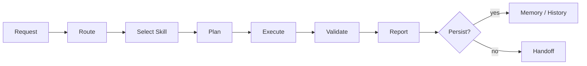

# Personal Skill System

[English README](README.md)

Personal Skill System은 로컬 프롬프트 파일에서 출발해, 더 쉽게 점검할 수 있는 스킬 운영 모델로 발전한 개인 AI 작업 시스템을 공개용으로 정리한 문서입니다.

이 저장소의 목적은 모든 비공개 규칙, 백업, 세부 작업 흐름을 공개하는 데 있지 않습니다. 대신 공유 가능한 범위인 변화 과정, 설계 관점, 운영 방식, 공개 가능한 구조를 중심으로 설명합니다.

## 요약

이 시스템은 AI 도구에 같은 지시를 반복해서 입력하지 않기 위해 시작했습니다. 시간이 지나면서 작업을 알맞게 나누고, 프로젝트 맥락을 유지하고, 실행 계획을 세우고, 결과를 검증하고, 보고서를 만들고, 연구 작업까지 정리하는 계층형 작업 흐름으로 발전했습니다.

짧게 말하면:

> 스킬 시스템은 단순히 더 긴 프롬프트가 아닙니다. 반복되는 AI 작업을 명확한 실행 단위, 드러난 상태, 검증 가능한 결과, 사람이 통제하는 경계 안에서 다루기 위한 방식입니다.

## 변화 과정

버전 이력은 완전한 기능 목록이 아니라, 시스템이 어떤 방향으로 설계되어 왔는지를 보여주는 흐름으로 정리했습니다.

| Version | Focus | Design Shift |
|---:|---|---|
| 1.0 | Prompt bootstrap | 기본 작업 규칙을 로컬 지시 파일에 담았습니다. |
| 2.0 | AGENT subskills | 큰 지시 묶음을 재사용 가능한 스킬 형태의 모듈로 나눴습니다. |
| 3.0 | Design and reporting | HLD, LLD, 상호작용, 보고, 스킬 작성 방식이 반복 가능한 작업 흐름으로 자리 잡았습니다. |
| 4.0 | Memory bank | 오래 이어지는 프로젝트 맥락을 대화 기억이 아니라 명시적인 상태 파일과 이력으로 옮겼습니다. |
| 5.0 | Agentic workflow | 계획, 실행, 검증, 보고, 검토를 서로 다른 책임으로 분리했습니다. |
| 5.6.x | Stabilization | 발동 조건 충돌, 스킬 간 책임 경계, 검증 상태, 차이 점검이 중요한 관리 대상이 되었습니다. |
| 6.0 | Research lifecycle | 문헌 검토, 가설 수립, 실험 계획, 분석, 작성, 검토를 연구 절차로 정리했습니다. |
| 7.0 | Public specification | 비공개 시스템을 공개 가능한 변화 과정, 설계 철학, manifest/profile 구조로 다시 정리했습니다. |
| 7.1 | Drop-in bundle | 읽기 전용 상태 점검과 보수적인 명시 우선 라우팅을 갖춘 수동 설치 번들로 다시 묶었습니다. |
| 7.2 | Skill families | 사용자가 이해하기 쉬운 스킬 묶음, 묶음 이름을 반영한 스킬 이름 변경, 새로운 search/coordination/evaluation 묶음, `search-router` / `memory-bank-ingestion` / `evaluation-usage-tracker` 스킬을 추가했습니다. 7.2.1에서는 실행 계열 스킬(`workflow-plan-runner` / `workflow-validation` / `workflow-recovery`)과 새로 정리한 `report-qualitative` 평가 보고 스킬을 추가했습니다. 7.2.5에서는 사용자가 스킬의 뜻을 바로 이해할 수 있도록 묶음별 Skill Catalog를 추가했습니다. |

## 7.2.5 Drop-in Bundle

이 저장소에는 7.2.5 수동 설치용 스킬 번들이 들어 있습니다.

- `.codex/skills`: Codex 스킬 패키지
- `.codex/docs`: 실행 지침과 스킬 목록 문서
- `.codex/eval`: 라우팅 및 사용 평가 사례
- `.codex/tools`: 읽기 전용 번들 점검 도구
- `.claude`: Claude 쪽 실행 지침, 문서, 평가 사례
- `CHANGELOG.md`, `TERMS.md`, `FIELD_FEEDBACK.md`: 패키징 기록과 현장 피드백 양식

이 번들은 의도적으로 `.codex/config.toml`, `automations/`, 기본 `.codex/skills/.system` 내용을 포함하지 않습니다. 앱이 관리하는 시스템 스킬은 기본 저장소 구성물이 아니라, 필요할 때 따로 검토하는 자료로 취급합니다.

## Skill Catalog

스킬은 묶음별로 정리되어 있습니다. 사용자는 모든 스킬 이름을 외우지 않아도, 하려는 일의 성격에서 출발해 알맞은 스킬을 찾을 수 있습니다. 스킬 이름은 7.2에서 도입한 묶음 기반 이름 규칙을 따릅니다.

### Analysis

Analysis 스킬은 실패 원인을 찾거나, 접근 방식을 비교하거나, 코드베이스를 더 넓게 이해할 때 사용합니다.

| Skill | 설명 |
| --- | --- |
| `analysis-router` | 복잡한 기술 질문을 어떤 분석 방식으로 풀지 고릅니다. 기본적으로 저장소 전체 보고서를 만들지는 않고, 버그 진단, 알고리즘 제안, 두 방식을 섞은 흐름 중 알맞은 쪽으로 보냅니다. |
| `analysis-bug` | 반복되거나 위험도가 높은 실패를 재현하고 원인을 좁힙니다. 빠른 추측보다 근거, 실제 원인, 회귀를 막을 수 있는 검증에 집중합니다. |
| `analysis-algorithm` | 제약 조건과 성공 기준이 있을 때 알고리즘, 구조, 모델, 검색 방식, 구현 접근을 비교합니다. |
| `analysis-codebase` | 사용자가 저장소 전체 산출물, 아키텍처 지도, 의존성 보기, 품질 점검 보고서를 명시적으로 원할 때 넓은 범위의 코드베이스 분석 보고서를 만듭니다. |

### Design

Design 스킬은 시각적 의도를 실제 UI 구현 작업이나 검증 가능한 근거로 바꿉니다.

| Skill | 설명 |
| --- | --- |
| `design-frontend` | 구체적인 시각 디자인을 실제 프론트엔드 코드로 구현합니다. 대상 저장소의 기존 방식을 따르고, 가능하면 렌더링된 화면까지 확인합니다. |
| `design-ui-decomposer` | 구현 전에 UI 참고 자료를 계층, 배치 영역, 구성 요소 후보, 토큰 후보, 상태, 검증할 부분으로 나눕니다. |
| `design-layout-translator` | Auto Layout, flex/grid, 크기, 넘침 처리, 화면 폭별 제약을 구현 가능한 배치 규칙으로 바꿉니다. |
| `design-tokens` | 디자인 토큰을 정리하고 플랫폼 값에 맞춥니다. 값을 임의로 만들지 않고, 빠졌거나 충돌하는 토큰을 보고합니다. |
| `design-component-mapper` | 디자인 구성 요소, 변형, 상태, 슬롯, 이벤트를 저장소의 기존 구성 요소에 연결하고 아직 해결되지 않은 차이를 찾습니다. |
| `design-visual-regression` | 렌더링된 화면을 캡처하거나 살펴보고, 빈 화면 여부와 화면 안에 제대로 들어오는지를 확인하며, 화면 크기별 시각 차이를 보고합니다. |
| `design-a11y-audit` | 구현된 UI의 접근성 근거를 검토합니다. 키보드 이동, 포커스 표시, 의미 구조, 대비, 터치 대상 크기, 반응형 가독성을 포함합니다. |
| `design-mobile-screen` | 안전 영역, 내비게이션, 키보드 오버레이, 터치 대상, 스크롤, 상태, 모바일 접근성처럼 모바일 또는 네이티브 화면에서 필요한 제약을 적용합니다. |
| `design-dashboard` | KPI, 필터, 차트, 표, 정보 밀도, 비동기 상태, 업무용 접근성처럼 대시보드에 필요한 제약을 적용합니다. |
| `design-section-web` | 히어로 영역, 의미 있는 섹션 구성, CTA 흐름, 반응형 순서, 매체 배치, 첫 화면에서 드러나야 할 신호, 텍스트 맞춤처럼 섹션형 웹페이지에 필요한 제약을 적용합니다. |

### Report

Report 스킬은 근거, 검토, 변경 내용, 작업 산출물을 사용자가 읽기 쉬운 출력으로 정리합니다.

| Skill | 설명 |
| --- | --- |
| `report-qualitative` | 명시적인 기준, 근거, 해석, 판단, 권고를 갖춘 정성 평가 보고서를 만듭니다. 또한 짧은 `srq` 방식의 근거 보고를 명시적으로 요청할 때만 호환 경로로 유지합니다. |
| `report-critical` | 산출물, 계획, 출력, 대화에 대해 막히는 지점을 먼저 찾는 비판적 검토, 위험 검토, QA식 판정을 수행합니다. |
| `report-diff` | 실제 변경된 줄이나 확인된 전후 화면을 읽기 쉬운 묶음형 변경 요약으로 제시합니다. |
| `report-artifact-inventory` | 지속되는 목록을 새로 만들지 않고, 한 작업에서 나온 산출물, 실행한 명령, 검증 기록, 남은 확인 사항을 요약합니다. |

### Workflow

Workflow 스킬은 구현 작업의 실행 원칙, 검증, 실패 복구를 다룹니다.

| Skill | 설명 |
| --- | --- |
| `workflow-rigor` | 근거 우선 실행, 범위가 정해진 수정, 검증 결과의 분리, 위험도가 높은 작업의 검토 원칙을 강제합니다. |
| `workflow-plan-runner` | 승인된 계획, 명세, 패키지를 구현 묶음으로 나누어 실행하고, 범위가 정해진 검증과 되돌리기 또는 대안 선택을 관리합니다. |
| `workflow-validation` | 변경되었거나 변경 예정인 산출물에 대해 집중 검증 계획을 세우거나 실행합니다. 에이전트가 직접 확인한 항목과 사용자가 직접 확인해야 할 항목을 분리합니다. |
| `workflow-recovery` | 구현이나 검증 실패가 반복될 때, 하나의 가설에 집중한 진단, 좁힌 재현 절차, 되돌리기 또는 대안 선택으로 흐름을 복구합니다. |

### Planning

Planning 스킬은 실제 구현을 대신하지 않고, 계획이나 명세 문서를 만들고 정리합니다.

| Skill | 설명 |
| --- | --- |
| `plan-short-term-docs` | 가까운 작업, 현재 상태, 구현으로 넘어가기 위한 내용을 담은 `docs/plan` 작업 계획을 만들거나 갱신합니다. |
| `plan-long-term-package` | 단계가 많은 작업, 마이그레이션, 재작성, 장기 작업을 위해 여러 문서로 된 큰 계획 패키지를 명시 요청이 있을 때 만듭니다. |
| `plan-spec-curator` | 현재 필요한 맥락과 오래된 명세 또는 계획을 정리하고, 보관하거나 다시 불러올 기준을 제안해 계획 맥락이 불필요하게 커지지 않게 합니다. |

### Coordination

Coordination 스킬은 영구적인 운영 장치를 새로 만들지 않고, 일을 나누거나 넘겨주는 데 필요한 정리를 돕습니다.

| Skill | 설명 |
| --- | --- |
| `coordination-brief` | 기존 계획이나 작업 목록에서 가벼운 목표 요약, 작업 의존관계 조각, 인계 메모, 수정 범위 윤곽을 만듭니다. |
| `coordination-multi-agent` | 여러 에이전트가 함께 처리하는 명시적 작업을 작업 카드, 담당 범위, 수정 잠금 범위, 인계 경계로 나눕니다. |

### Research

Research 스킬은 논문과 연구 중심 작업을 요청 분류부터 검토까지 정리합니다.

| Skill | 설명 |
| --- | --- |
| `research-router` | 연구 요청을 알맞은 연구 단계 스킬로 보냅니다. 일반 구현 작업에서 실수로 발동하지 않도록 구분합니다. |
| `research-literature-ideation` | 수집한 근거를 후보 가설로 바꾸고, 지금 집중할 가설을 고릅니다. |
| `research-literature-synthesis` | 근거 목록이나 논문을 바탕으로 문헌 검토 구조, 서로 충돌하는 주장, 한계, 주장 범위를 정리합니다. |
| `research-hypothesis-planning` | 가설, ablation, 손실 설계, 학습 계획, 주장 전개 방향을 계획합니다. |
| `research-experiment-blueprint` | 선택한 가설에서 기준 실험, 지표, ablation, 반증 확인을 포함한 실험 청사진을 만듭니다. |
| `research-experiment-scaffold` | 승인된 실험 청사진을 바탕으로, 명시된 쓰기 범위 안에서 최소한의 실험 뼈대를 만듭니다. |
| `research-statistical-analysis` | 결과 표, 지표, 불확실성을 통계적 근거와 함께 분석하고, 사전에 계획한 분석과 탐색적 분석을 구분합니다. |
| `research-manuscript-writing` | 확인된 연구 산출물, 인용 상태, 결과를 바탕으로 원고 섹션을 작성하거나 수정합니다. |
| `research-peer-review` | 원고, 제안서, 연구 계획을 새로움, 근거, 재현 가능성, 한계, 보고 품질 관점에서 비평합니다. |

### Search

Search 스킬은 근거를 찾거나 찾을 경로를 정하되, 종합과 구현을 섞지 않도록 분리합니다.

| Skill | 설명 |
| --- | --- |
| `search-router` | 근거 검색 의도를 감지하고, 논문, 코드, 실행 결과, 화면, 메모리 근거처럼 알맞은 검색 경로로 보냅니다. |
| `search-paper-evidence` | 논문이나 출처 근거 수집을 검색하거나 계획하고, 없는 인용을 만들지 않으면서 인용 상태를 추적할 수 있는 근거 목록을 만듭니다. |

### Memory

Memory 스킬은 메모리 사용이나 변경이 명시된 경우에만, 오래 유지되는 프로젝트 맥락을 관리합니다.

| Skill | 설명 |
| --- | --- |
| `memory-bank-harness` | 승인된 메모리에서 현재 작업에 필요한 맥락을 모으되, 오래되었거나 충돌하거나 위험한 항목은 걸러냅니다. |
| `memory-bank-ingestion` | 승인된 종료 기록과 제안 후보를 추가 전용 이력 및 보관 링크와 함께 오래 유지할 메모리로 승격합니다. |
| `memory-bank-init` | 대상과 쓰기 범위를 확인한 뒤, 프로젝트 단위의 지속 메모리를 초기화합니다. |
| `memory-bank-update` | 사용자가 오래 유지할 메모리 변경을 원할 때, 목표나 규칙을 추가 전용 이력으로 갱신합니다. |
| `memory-bank-maintenance` | 기존 메모리 상태를 살펴보고, 검증하고, 합치고, 고칩니다. |
| `memory-bank-correction-capture` | 사용자의 명시적인 정정을 메모리 후보로 기록하되, 승인 절차와 민감 정보 경계를 유지합니다. |

### Evaluation

Evaluation 스킬은 사례와 사용 기록을 통해 스킬 시스템 자체를 개선합니다.

| Skill | 설명 |
| --- | --- |
| `evaluation-harness` | 패키지 승인 도구가 아니라, `.codex/eval`의 사용 사례, 라우팅 기대값, 스키마 일관성을 검토합니다. |
| `evaluation-usage-tracker` | 메타데이터만 담긴 스킬 호출 기록을 사용 요약, 적게 쓰이거나 많이 쓰이는 신호, 개선 후보로 집계합니다. |

### Skill System

Skill System 스킬은 스킬 번들 자체를 만들고 유지보수합니다.

| Skill | 설명 |
| --- | --- |
| `create-skill-pack` | 사용자 정의 스킬과 그 메타데이터를 만들고, 다듬고, 이전하고, 폐기하고, 등록합니다. |

## 설계 관점

이 시스템은 몇 가지 실용적인 원칙을 중심으로 만들어졌습니다.

- **실행 단위로서의 스킬**: 스킬은 언제 실행되는지, 무엇을 입력으로 받는지, 무엇을 결과로 내는지, 어떻게 검증하는지를 설명해야 합니다.
- **점진적 공개**: 라우팅 규칙은 가볍게 유지하고, 자세한 지침, 참고 자료, 스크립트는 스킬 패키지 안쪽에 둡니다.
- **명시적인 상태**: 중요한 프로젝트 맥락은 숨겨진 대화 기억이 아니라 점검 가능한 산출물로 저장되어야 합니다.
- **구현 전 계획**: 단순하지 않은 작업에는 명시적인 계획, 범위, 위험, 검증 경로가 있어야 합니다.
- **주장보다 근거 우선**: 보고서는 확인된 결과, 확인되지 않은 주장, 막힌 작업, 사용자가 확인해야 할 항목을 구분해야 합니다.
- **사람이 통제하는 경계**: 파괴적인 작업, 인증 정보, 네트워크 접근, 비공개 데이터에는 명확한 승인과 가림 규칙이 필요합니다.

## 운영 방식

높은 수준에서 보면 작업 흐름은 다음과 같습니다.

핵심은 책임 분리입니다. 요청 하나가 거대한 프롬프트 하나로 뭉쳐져서는 안 됩니다. 요청은 필요한 만큼의 맥락만 들고, 라우팅, 스킬 선택, 계획, 실행, 검증, 보고를 차례로 지나가야 합니다.

## 공개 범위

이 저장소는 시스템의 공개 가능한 형태를 공유하기 위한 것입니다.

- 프롬프트 파일에서 스킬 패키지로 발전한 과정
- 작업 흐름 뒤에 있는 설계 원칙
- 메모리, 계획, 검증, 보고가 맡는 역할
- manifest 또는 profile처럼 소스 옆에 두는 스킬 메타데이터 아이디어
- 비공개 프로젝트 데이터를 드러내지 않는 예시와 스키마

이 저장소는 비공개 메모리, 인증 정보, 원본 백업, 정리되지 않은 로그, 프로젝트별 운영 세부사항을 공개하기 위한 곳이 아닙니다.

## License

MIT
