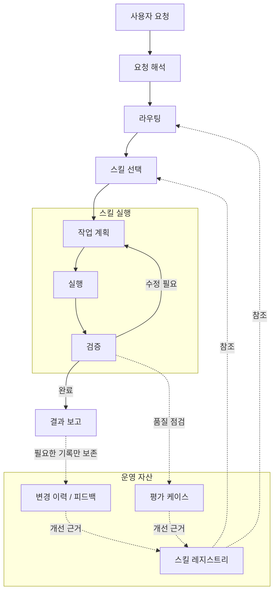

# AI Skill System

[English README](README.md)

AI Skill System은 반복적인 AI 작업을 스킬 단위로 나누고, 선택·실행·검증·개선할 수 있도록 정리한 작업 시스템입니다. 처음에는 로컬 프롬프트 파일에서 시작했지만, 시간이 지나면서 작업 라우팅, 상태 관리, 계획 수립, 산출물 검증, 결과 보고, 연구 워크플로 조율까지 다루는 구조로 확장되었습니다.

이 저장소는 내부 규칙이나 비공개 워크플로 전체를 공개하기 위한 공간이 아닙니다. 공개 가능한 범위 안에서 시스템의 발전 과정, 운영 모델, 스킬 구성, 예시 구조를 정리합니다.

## 요약

이 시스템의 목적은 같은 지시를 반복해서 입력하지 않고, 자주 수행하는 AI 작업을 재사용 가능한 스킬로 분리하는 것입니다.

여기서 말하는 스킬은 단순히 긴 프롬프트가 아닙니다. 특정 작업을 언제 호출할지, 어떤 입력을 받을지, 어떤 절차로 수행할지, 어떤 산출물을 남길지, 어떻게 검증할지를 함께 정의한 작업 단위입니다. 이를 통해 AI 작업을 더 일관되게 실행하고, 결과를 더 쉽게 점검할 수 있습니다.

## 7.3.1 드롭인 번들

이 저장소에는 7.3.1 기준으로 정리한 스킬 번들이 포함되어 있습니다. 주요 구성은 다음과 같습니다.

* `skills`: 실제로 사용할 스킬 패키지
* `docs`: 스킬 목록, 사용 기준, 운영 참고 문서
* `eval`: 스킬 선택과 사용 품질을 점검하기 위한 예시 케이스
* `tools`: 번들 구성을 확인하기 위한 보조 도구
* `integrations`: 선택적 연동 페이로드 — `integrations/kanboard-plan-sync`를 포함합니다. Markdown 플랜을 로컬 Kanboard에 projection하는 plan-centric MCP/CLI입니다. Kanboard 앱·DB·테마·플러그인은 번들에 포함하지 않으며, 연동 코드·Agent 스킬 2종(`kanboard-plan-rollout`, `kanboard-plan-ops`)·MCP 등록 예시·로컬 호스트 설정 방법론만 포함합니다.
* `CHANGELOG.md`, `TERMS.md`, `FIELD_FEEDBACK.md`: 변경 이력, 용어 정리, 사용 후 피드백 기록 양식

## 8.0 방향: Context Compounding

현재 아키텍처 목표는 `8.0.0 — Context Compounding / Wiki Bank Architecture`입니다. 현재 구현 패키지는 `8.0.0-alpha — Context Compounding`으로 보는 것이 정확합니다. 즉 context-compounding 모델의 development baseline이지, 정식 8.0 릴리스나 default context operating layer는 아직 아닙니다.

`7.4.x Context Assurance`는 현재 구현 목표가 아니라 legacy label이자 전환 흔적입니다. 7.3.1 드롭인 번들은 기존 호출을 위한 호환 기준선으로 유지하고, 8.0 방향에서는 context 모델을 바꿉니다. evidence를 claim과 relation으로 만들고, 이를 Wiki Bank page로 projection한 뒤, 저맥락 Runtime Projection card를 Context Pack으로 컴파일해 실행에 공급합니다.

Wiki Bank는 Source of Truth가 아닙니다. 저장소 파일, 테스트, 스키마, 명시적 사용자 결정, 검증된 plan, Kanboard 상태, Agent Run evidence가 authority source입니다. Hook과 runtime trace는 proposal evidence를 만들 수 있지만, accepted knowledge 변경에는 명시적 review가 필요합니다.

## 핵심 원칙

이 시스템은 반복적인 AI 작업을 단순한 프롬프트가 아니라, 선택하고 실행하고 점검할 수 있는 스킬 단위로 다루기 위해 만들어졌습니다.

* **스킬은 작업 단위입니다.** 각 스킬은 언제 사용할지, 어떤 입력을 받는지, 어떤 결과를 만들어야 하는지, 어떻게 검증할지를 함께 정의합니다.
* **라우팅과 실행 지침을 분리합니다.** 스킬을 찾기 위한 정보는 가볍게 유지하고, 자세한 절차와 참고 자료는 각 스킬 패키지 안에 둡니다.
* **상태와 근거를 남깁니다.** 중요한 맥락, 판단 근거, 검증 결과는 대화 안에만 두지 않고 점검 가능한 산출물로 관리합니다.
* **사람이 통제할 수 있어야 합니다.** 파괴적 변경, 인증 정보, 네트워크 접근, 비공개 데이터처럼 위험이 큰 작업에는 명확한 경계와 확인 절차를 둡니다.

## 운영 모델

이 시스템은 하나의 긴 프롬프트로 모든 작업을 처리하지 않습니다. 요청을 해석한 뒤, 작업 성격에 맞는 스킬을 선택하고, 실행 결과를 검증하며, 필요한 경우 평가와 피드백을 통해 스킬을 다시 개선합니다.

핵심은 스킬을 단순한 프롬프트 조각이 아니라, 선택·실행·검증·개선이 가능한 운영 단위로 다루는 것입니다. 요청은 먼저 해석되고, 레지스트리를 기준으로 적절한 스킬에 라우팅됩니다. 실행 중에는 계획과 검증을 반복할 수 있으며, 완료 후에는 결과 보고와 함께 필요한 기록만 남깁니다.

이 구조를 통해 스킬은 일회성 지시문이 아니라, 반복 사용하면서 점검하고 개선할 수 있는 작업 단위로 유지됩니다.

## 스킬 카탈로그

스킬은 패밀리별로 구성되어 있습니다. 사용자는 모든 스킬 이름을 외우기보다, 자신이 하려는 일의 의도에서 출발해 적절한 패밀리와 스킬을 찾을 수 있습니다.

### Analysis

Analysis 스킬은 실패를 진단하거나, 접근 방식을 비교하거나, 코드베이스 수준의 이해를 구축할 때 사용합니다.

| 스킬                   | 역할                                                                 |
| -------------------- | ------------------------------------------------------------------ |
| `analysis-router`    | 복잡한 기술 분석 요청에서 버그 진단, 알고리즘 비교, 코드베이스 분석 중 적절한 경로를 선택합니다.           |
| `analysis-bug`       | 반복되거나 원인이 불분명하거나 위험도가 높은 실패를 재현하고, 주된 원인과 회귀 검증 경로를 정리합니다.         |
| `analysis-algorithm` | 명시된 제약과 성공 기준에 맞춰 알고리즘, 아키텍처, 모델, 검색 전략, 구현 접근을 비교합니다.             |
| `analysis-codebase`  | 저장소 전역 산출물, 아키텍처 맵, 의존성 관점, 품질 게이트 보고서가 필요할 때 코드베이스 수준의 분석을 수행합니다. |

### Design

Design 스킬은 시각적 의도를 구현 가능한 UI 작업이나 검증 가능한 근거로 전환합니다.

| 스킬                         | 역할                                                                                            |
| -------------------------- | --------------------------------------------------------------------------------------------- |
| `design-frontend`          | 구체적인 시각 디자인을 실제 프론트엔드 코드로 구현합니다. 대상 저장소의 기존 프레임워크, 컴포넌트, 토큰, 자산을 재사용하고 가능한 경우 렌더링 결과를 검증합니다.  |
| `design-ui-decomposer`     | 스크린샷, Figma 내보내기, 목업, AI 이미지 같은 UI 참조물을 계층, 레이아웃, 반복 패턴, 컴포넌트·토큰 후보, 상태, 검증 항목으로 분해합니다.       |
| `design-layout-translator` | Auto Layout, flex/grid, 크기 조정, 오버플로, 브레이크포인트 제약을 코드로 옮길 수 있는 레이아웃 규칙으로 번역합니다.                 |
| `design-tokens`            | 디자인 토큰 소스를 정규화하고 플랫폼 값에 매핑합니다. 값을 임의로 만들지 않고, 누락·충돌·드리프트가 있는 토큰을 근거와 함께 보고합니다.                |
| `design-component-mapper`  | 디자인 컴포넌트, 변형, 상태, 슬롯, 이벤트를 저장소의 기존 컴포넌트와 연결하고, 아직 해결되지 않은 구현 간극을 식별합니다.                       |
| `design-visual-regression` | 렌더링된 UI 스크린샷을 캡처하거나 검토하고, 빈 화면 여부, 프레이밍, 오버플로, 화면 크기별 시각 차이를 보고합니다.                           |
| `design-a11y-audit`        | 구현된 UI의 접근성 근거를 검토합니다. 키보드 도달성, 포커스 표시, 의미 구조, 대비, 대상 크기, 반응형 가독성을 포함합니다.                     |
| `design-mobile-screen`     | 안전 영역, 내비게이션·탭 바, 키보드 오버레이, 터치 대상, 스크롤·고정 영역, 플랫폼 상태, 모바일 접근성 같은 모바일/네이티브 화면 제약을 적용합니다.       |
| `design-dashboard`         | KPI 위계, 필터, 검색, 날짜 범위, 차트, 표, 정보 밀도, 비동기·빈 상태·오류·로딩 상태, 운영용 접근성처럼 대시보드에 필요한 제약을 적용합니다.        |
| `design-section-web`       | 랜딩, 제품, 문서, 포트폴리오, 마케팅 페이지처럼 섹션 기반 웹페이지에서 히어로, 섹션 구조, CTA 흐름, 반응형 순서, 미디어 배치, 첫 화면 신호를 점검합니다. |

### Report

Report 스킬은 근거, 검토, 변경 내용, 작업 산출물을 사용자가 읽기 쉬운 결과물로 정리합니다.

| 스킬                          | 역할                                                      |
| --------------------------- | ------------------------------------------------------- |
| `report-qualitative`        | 명시적 기준, 근거, 해석, 판단, 권고를 갖춘 정성 평가 보고서를 만듭니다.             |
| `report-critical`           | 산출물, 계획, 출력, 대화에 대해 블로커 우선 비판 검토, 위험 검토, QA식 판정을 수행합니다. |
| `report-diff`               | 실제 변경된 줄이나 검증된 전후 스냅샷만을 읽기 쉬운 묶음형 diff 형식으로 제시합니다.      |
| `report-artifact-inventory` | 한 작업에서 나온 산출물, 실행 명령, 검증 기록, 남은 확인 사항을 요약합니다.           |

### Workflow

Workflow 스킬은 구현 작업의 실행 규율, 검증, 실패 복구를 통제합니다.

| 스킬                     | 역할                                                                                |
| ---------------------- | --------------------------------------------------------------------------------- |
| `workflow-rigor`       | 근거 우선 실행, 범위가 명확한 변경, 검증 결과 분리, 중·고위험 변경의 리뷰 규율을 적용합니다.                           |
| `workflow-minimal-implementation` | 구현·리팩터링 작업에서 불필요한 의존성, 추상화, 파일, 보일러플레이트를 줄이도록 조건부 YAGNI 압력을 적용합니다. |
| `workflow-plan-runner` | 승인된 계획, 명세, 패키지를 구현 배치로 실행하고, 범위가 정해진 검증과 롤백 또는 대안 선택을 관리합니다.                     |
| `workflow-validation`  | 변경 완료 또는 변경 예정 산출물에 대해 검증 계획을 세우거나 실행합니다. 에이전트가 실행한 검증과 사용자가 직접 확인해야 할 검증을 분리합니다. |
| `workflow-recovery`    | 구현 또는 검증 실패가 반복될 때 하나의 가설에 집중한 진단, 좁힌 재현 절차, 롤백 또는 대안 결정을 통해 재시도 루프를 끊습니다.        |

### Planning

Planning 스킬은 실제 구현을 대신하지 않고, 계획·명세 산출물을 만들거나 정리합니다.

| 스킬                       | 역할                                                                    |
| ------------------------ | --------------------------------------------------------------------- |
| `plan-short-term-docs`   | 가까운 작업, 상태, 구현 전환을 다루는 지속 `docs/plan` 작업 계획을 만들거나 갱신합니다.              |
| `plan-long-term-package` | 대량 작업, 마이그레이션, 재작성, 마일스톤 플랜처럼 향후 세션이 문서만 보고 이어가야 하는 대형 다문서 계획 패키지를 만듭니다.   |
| `plan-spec-curator`      | 활성 맥락과 오래되었거나 대체된 명세·계획을 정리하고, 보관·재로딩 정책을 제안해 계획 맥락이 비대해지지 않도록 관리합니다. |

### Coordination

Coordination 스킬은 영구적인 워크플로 장치를 만들지 않고, 작업 분할과 인계를 위한 가벼운 구조를 제공합니다.

| 스킬                         | 역할                                                        |
| -------------------------- | --------------------------------------------------------- |
| `coordination-brief`       | 기존 계획이나 작업 목록에서 목표 브리프, 작업 DAG 조각, 인계 메모, 잠금 범위 개요를 만듭니다. |
| `coordination-multi-agent` | 명시적인 멀티 에이전트 작업을 작업 카드, 소유권 메모, 잠금 범위, 인계 경계로 나눕니다.       |

### Research

Research 스킬은 과학 연구 또는 논문 중심 작업을 요청 라우팅부터 리뷰까지 단계별로 조직합니다.

| 스킬                              | 역할                                                                  |
| ------------------------------- | ------------------------------------------------------------------- |
| `research-router`               | 연구 요청을 적절한 연구 단계 스킬로 라우팅하고, 일반 구현 작업에서 연구 스킬이 실수로 발동하지 않도록 경계를 둡니다. |
| `research-literature-ideation`  | 확보된 근거를 후보 연구 가설로 바꾸고, 검증할 활성 가설 하나를 선택합니다.                         |
| `research-literature-synthesis` | 근거 목록이나 제공된 논문을 바탕으로 문헌 검토 구조, 합의, 이견, 모순, 한계, 주장 경계를 종합합니다.        |
| `research-hypothesis-planning`  | 가설, 어블레이션, 손실 함수 설계, 학습 계획, 주장 전개 경로를 계획합니다.                        |
| `research-experiment-blueprint` | 선택된 가설에서 기준 실험, 지표, 어블레이션, 반증 확인을 포함한 실험 청사진을 만듭니다.                 |
| `research-experiment-scaffold`  | 승인된 실험 청사진을 바탕으로, 명시된 쓰기 경계 안에서 최소 실험 코드 골격을 생성합니다.                 |
| `research-statistical-analysis` | 결과 표, 지표, 불확실성을 통계적 근거와 함께 분석하고, 사전 계획 분석과 탐색적 분석을 구분합니다.           |
| `research-manuscript-writing`   | 검증된 연구 산출물, 인용 상태, 결과를 바탕으로 과학 원고 섹션을 작성하거나 수정합니다.                  |
| `research-peer-review`          | 원고, 제안서, 연구 계획을 새로움, 근거, 재현성, 한계, 보고 품질 관점에서 피어 리뷰 형식으로 비평합니다.      |

### Search

Search 스킬은 근거를 찾거나 근거 수집 경로를 정하되, 종합과 구현 책임이 섞이지 않도록 분리합니다.

| 스킬                      | 역할                                                                                    |
| ----------------------- | ------------------------------------------------------------------------------------- |
| `search-router`         | 논문, 코드, 런타임, 시각 자료, 메모리 근거 같은 검색 의도를 감지하고 알맞은 evidence lane으로 라우팅합니다.                 |
| `search-paper-evidence` | 논문 또는 출처 근거를 검색하거나 검색 계획을 세우고, 허구 인용을 만들지 않으면서 인용 상태를 추적할 수 있는 evidence ledger를 만듭니다. |

### Memory

Memory 스킬은 장기 프로젝트 맥락을 관리합니다. 메모리 사용 또는 변경 의도가 명시된 경우에만 사용됩니다.

| 스킬                               | 역할                                                           |
| -------------------------------- | ------------------------------------------------------------ |
| `memory-bank-harness`            | 승인된 메모리에서 현재 작업에 필요한 맥락 팩을 구성하되, 오래되었거나 충돌하거나 위험한 항목을 걸러냅니다. |
| `memory-bank-ingestion`          | 승인된 종료 패킷과 제안 후보를 추가 전용 이벤트와 보관 링크가 있는 장기 메모리로 승격합니다.        |
| `memory-bank-init`               | 프로젝트 정체성과 쓰기 경계를 확인한 뒤, 프로젝트 범위의 지속 메모리 뱅크를 초기화합니다.          |
| `memory-bank-update`             | 사용자가 장기 메모리 변경을 원할 때, 지속 목표나 규칙을 추가 전용 이력으로 갱신합니다.           |
| `memory-bank-maintenance`        | 기존 메모리 상태를 검사하고, 검증하고, 통합하거나 복구합니다.                          |
| `memory-bank-correction-capture` | 사용자의 명시적인 정정을 메모리 후보로 기록하되, 승인 절차와 민감 정보 경계를 유지합니다.          |

### Evaluation

Evaluation 스킬은 사례와 사용 관찰을 통해 스킬 시스템 자체를 개선합니다.

| 스킬                         | 역할                                                                               |
| -------------------------- | -------------------------------------------------------------------------------- |
| `evaluation-harness`       | `.codex/eval`의 사용 사례, 라우팅 기대값, 스키마 일관성을 검토합니다. 패키지 승인 도구가 아니라 사용 품질 점검 도구로 다룹니다. |
| `evaluation-usage-tracker` | 원문 프롬프트나 대화 기록을 저장하지 않고, 메타데이터만 담은 스킬 호출 기록을 사용 요약, 저사용·고사용 신호, 개선 후보로 집계합니다.    |

### Skill System

Skill System 스킬은 스킬 번들 자체를 만들고 유지보수합니다.

| 스킬                  | 역할                                              |
| ------------------- | ----------------------------------------------- |
| `create-skill-pack` | 사용자 정의 스킬과 메타데이터를 만들고, 강화하고, 이전하고, 폐기하고, 등록합니다. |

## 설계 타임라인

버전 이력은 완전한 기능 체크리스트가 아니라, 시스템이 어떤 방향으로 변해 왔는지를 보여주는 타임라인입니다.

|    버전 | 초점             | 설계 변화                                                                                                                                                                                     |
| ----: | -------------- | ----------------------------------------------------------------------------------------------------------------------------------------------------------------------------------------- |
|   1.x | 프롬프트 부트스트랩     | 기본 작업 규칙을 로컬 지시 파일에 기록했습니다.                                                                                                                                                               |
|   2.x | AGENT 서브스킬     | 큰 지시 블록을 재사용 가능한 스킬형 모듈로 분리했습니다.                                                                                                                                                          |
|   3.x | 설계와 보고         | HLD, LLD, 인터랙션, 보고, 스킬 작성 패턴이 반복 가능한 워크플로로 정착했습니다.                                                                                                                                        |
|   4.x | 메모리 뱅크         | 장기 프로젝트 맥락을 대화 기억이 아니라 명시적 상태 파일과 이벤트 이력으로 옮겼습니다.                                                                                                                                         |
|   5.x | 에이전틱 워크플로와 안정화 | 계획, 실행, 검증, 보고, 검토를 서로 다른 책임으로 분리했습니다. 이후 명시적 라우팅 계약, smoke test 가능한 발동 규칙, 드리프트 점검, 가벼운 자동화, phase 단위 계획 패키지를 통해 워크플로 안정성을 높였습니다. |
|   6.x | 연구 라이프사이클      | 초기 연구 계획 갈래를 evidence search, literature synthesis, hypothesis planning, experiment design, analysis, manuscript writing, peer review가 분리된 단계형 연구 라이프사이클로 확장했습니다. |
|   7.x | 공개 명세          | 비공개 시스템을 공개 가능한 타임라인, 설계 철학, manifest/profile 구조로 재구성했습니다.                                                                                                                                |
| 7.1.x | 드롭인 번들         | 읽기 전용 구조 점검과 보수적인 명시 우선 라우팅을 갖춘 드롭인 번들로 다시 패키징했습니다.                                                                                                                                       |
| 7.2.x | 스킬 패밀리         | 사용자 관점의 패밀리 그룹, 패밀리 접두 기반 스킬명, search/coordination/evaluation 패밀리를 추가했습니다. 7.2.1에서는 workflow 실행 하위 패밀리와 `report-qualitative`를 추가했고, 7.2.5에서는 사용자가 스킬의 역할을 패밀리별로 파악할 수 있는 스킬 카탈로그를 추가했습니다. |
| 7.3.x | 실행 보증          | context-layer 전환 전 호환 기준선으로 agent output validation, release verification profile, run evidence fixture를 안정화했습니다. |
| 8.0.0-alpha | Context compounding | Wiki Bank, Runtime Projection, Context Pack, source-grounded claim, review-gated knowledge feedback을 위한 alpha baseline을 세웁니다. `7.4.x Context Assurance`는 legacy transition label로 취급하며, 정식 8.0/default-layer readiness는 별도 gate로 남깁니다. |

## 라이선스

MIT License를 따릅니다.
