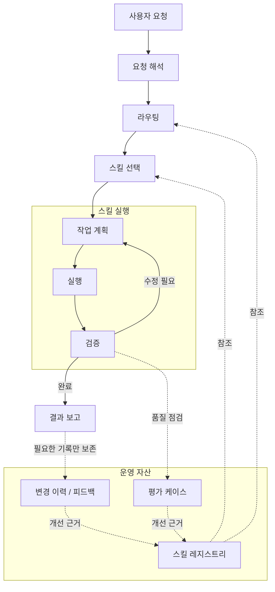

# AI Skill System

[English README](README.md)

AI Skill System은 반복적인 AI 작업을 스킬 단위로 나누고, 선택·실행·검증·개선할 수 있도록 정리한 작업 시스템입니다. 처음에는 로컬 프롬프트 파일에서 시작했지만, 시간이 지나면서 작업 라우팅, 상태 관리, 계획 수립, 산출물 검증, 결과 보고, 연구 워크플로 조율까지 다루는 구조로 확장되었습니다.

이 저장소는 내부 규칙이나 비공개 워크플로 전체를 공개하기 위한 공간이 아닙니다. 공개 가능한 범위 안에서 시스템의 발전 과정, 운영 모델, 스킬 구성, 예시 구조를 정리합니다.

## 요약

이 시스템의 목적은 같은 지시를 반복해서 입력하지 않고, 자주 수행하는 AI 작업을 재사용 가능한 스킬로 분리하는 것입니다.

여기서 말하는 스킬은 단순히 긴 프롬프트가 아닙니다. 특정 작업을 언제 호출할지, 어떤 입력을 받을지, 어떤 절차로 수행할지, 어떤 산출물을 남길지, 어떻게 검증할지를 함께 정의한 작업 단위입니다. 이를 통해 AI 작업을 더 일관되게 실행하고, 결과를 더 쉽게 점검할 수 있습니다.

## 10.0.2 릴리즈

이 소스 트리는 breaking 10.0 기준선의 10.0.2 patch 릴리즈입니다. 현재 구성은 다음과
같습니다.

* `skills`: 실제로 사용할 스킬 패키지
* `docs`: 스킬 목록, 사용 기준, 운영 참고 문서
* `tools`: 번들 구성을 확인하기 위한 보조 도구
* `execution-handoff`: risk-adaptive 유한 DAG, event-driven coordination, Core Card, Human Test 인계
* `providers`: active Codex·Claude·Grok·Antigravity package/rule 선언, provider별 독립 Go 하네스 모듈, host가 소유한 native hook adapter
* `tests`: Core 공통 규약 1개, 스킬시스템 전역 3개, 축소된 provider-neutral component test
* `work-contract`: graph state를 소유하지 않는 개인정보 제한형 자연어 사용자 범위·상호작용 projection
* `report-delivery` + `report-canvas`: 각 Report 스킬의 Markdown-first 계약과 Core plugin이 한 번만 공유하는 선택적 offline HTML renderer
* `CHANGELOG.md`, `TERMS.md`: 변경 이력과 용어 정리

## 10.x 방향: DAG Execution Handoff & Multi-Provider Harness

현재 아키텍처 라인은 `10.x — DAG Execution Handoff & Multi-Provider Harness`입니다.
10.0.0 릴리즈는 9.x 중앙 평가와 release gate 전제를 현재 Core 계약과 좁은 시스템 검사로
교체합니다. 로컬 설치는 계속 별도의 명시적 작업으로 수행합니다.

10.0.0은 `plan-execution-handoff`의 유한 typed DAG를 durable execution의 중심으로 두고,
하나의 Core Card 계약을 Workflow 생산자와 Handoff 기록자에 투영합니다. 중앙 eval, Skill
Diet, release hygiene를 제거하고 지속 평가는 모델과 무관한 4개 테스트로 축소했습니다.
TaskRun·LoopRun·WorkItem runtime state는 제거됐고, Loop Term의 유효한 반복 작업 원칙은
Execution Handoff 내부로 흡수됐습니다.

Codex 라우터는 정확히 명시됐거나 분명히 일치하는 전문 스킬을 바로 사용하며, 여러 소유자가 실제로 경쟁할 때만 좁은 라우터 하나를 엽니다. implicit router는 선언되어 실제 노출된 읽기·분석 owner에만 자동 handoff할 수 있고, 무거운 writer와 명시적으로 선택하는 context는 explicit-only로 유지합니다. 하나의 canonical 호출 비트를 플랫폼별 native 계약으로 투영합니다. Codex는 `agents/openai.yaml`을 읽고, Claude에는 explicit-only 스킬에만 `disable-model-invocation: true`를 생성합니다. Codex 패키지는 기존 `plugins/<name>/skills`를 유지하고, Claude 패키지는 같은 이름·버전으로 `plugins/claude/<name>/skills`에 생성해 각 호스트가 자기 메타데이터만 탐색하게 합니다. 가장 가까운 `project-context.yaml`은 manifest 상대 경로나 정확히 승인된 절대 경로로 Memory Bank, Knowledge Base, plan, skill root, 이름 있는 LLM Wiki를 선언할 수 있습니다. 없는 항목은 사용할 수 없는 것으로 처리하며 홈이나 인접 저장소를 추측해 검색하지 않습니다. Knowledge 작업은 고정 디렉터리 대신 해석된 `knowledge_root`와 `knowledge_index` 변수를 소비합니다.

Memory Bank는 세션을 넘는 목표·작업 규칙·반복 실수·검증된 작업 방식을 보존합니다. Knowledge Base는 도메인·디자인·알고리즘·아키텍처·리뷰·결정 지식을 현재 Markdown snapshot, typed relation, semantic revision, 출처가 추적되는 observation event로 보존합니다. 반복성은 confidence·maturity·importance·popularity 점수가 아니라 observation과 provenance의 분리된 차원에서 파생합니다. LLM Wiki는 명시적으로 선택하고 자체 탐색 규칙을 따르는 선택적 읽기 전용 컨텍스트입니다.

명시적인 “다음에 어떤 흐름인가” 질문은 중복 registry navigator가 아니라 기존 Work Horizon과 Planning State 계약으로 풉니다. horizon은 지속성·산출물 고도를, planning state는 저장된 계획 산출물의 전이를 맡고, 현재 턴 owner는 host routing이 유지합니다. `management-project-context`는 manifest-init, guided bootstrap, update, read-only doctor를 명시적으로 지원하며, 한 transaction에서 분리 열거한 write 전부 또는 일부를 승인할 수 있습니다. maker/checker 위험이 실질적이면 Contract/Spec과 Repository/Constraints 리뷰를 분리하고, 다중 배치는 `vertical_slice`, `migration_sequence`, `evidence_unit` 중 하나를 선택합니다. 어느 항목도 자동 거대 오케스트레이터를 만들지 않습니다.

기본 Codex hook map은 8개 lifecycle event를 하나의 Go 실행 파일로 직접 보냅니다. 교정 방어, 사용자 Work Contract 집행, 데스크톱 알림, 위치 전용 project context는 서로 독립된 제한 분기입니다. Stop은 loop 평가, Python child process, graph continuation을 수행하지 않습니다.

개발 중심 설치에서는 `skill-system-core` + `skill-system-dev`를 최소 profile로 사용합니다. Core에는 lifecycle·정성평가·critical report 스킬이 포함되며, 구현 및 도메인 owner는 각자의 조건 일치 검증을 유지합니다.

4개 plugin은 8개 사용자-facing skill family가 아니라 설치 profile입니다. Core는 cross-domain
Planning·Management·Evidence·Workflow modifier와 모든 Report를, Dev는 engineering Analysis와
Workflow owner를 담으며, Design과 Research는 각 도메인 전용 profile입니다. Grok과
Antigravity는 스킬 복제를 두 벌 더 만들지 않고 Claude-compatible portable package를 함께
소비합니다. 생성된 전역 규칙 companion은 worker inbox·heartbeat·`worker_done`을 Orca에
맡기고 Coordinator polling과 fixed/busy wait를 금지합니다.

네 provider의 로컬 설치 방법은 [Local Plugin Marketplace](LOCAL_PLUGIN_MARKETPLACE.md)를 참고합니다.

## 핵심 원칙

이 시스템은 반복적인 AI 작업을 단순한 프롬프트가 아니라, 선택하고 실행하고 점검할 수 있는 스킬 단위로 다루기 위해 만들어졌습니다.

* **스킬은 작업 단위입니다.** 각 스킬은 언제 사용할지, 어떤 입력을 받는지, 어떤 결과를 만들어야 하는지, 어떻게 검증할지를 함께 정의합니다.
* **라우팅과 실행 지침을 분리합니다.** 스킬을 찾기 위한 정보는 가볍게 유지하고, 자세한 절차와 참고 자료는 각 스킬 패키지 안에 둡니다.
* **상태와 근거를 남깁니다.** 중요한 맥락, 판단 근거, 검증 결과는 대화 안에만 두지 않고 점검 가능한 산출물로 관리합니다.
* **사람이 통제할 수 있어야 합니다.** 파괴적 변경, 인증 정보, 네트워크 접근, 비공개 데이터처럼 위험이 큰 작업에는 명확한 경계와 확인 절차를 둡니다.

## 운영 모델

이 시스템은 하나의 긴 프롬프트로 모든 작업을 처리하지 않습니다. 요청을 해석한 뒤 명시됐거나 분명히 맞는 전문 스킬을 바로 사용하고, 실제 모호성이 있을 때만 좁은 라우터 하나를 사용합니다. 개선은 실사용 중 사용자가 언급한 문제를 기준으로 하며, 작성된 시나리오는 회귀 자료일 뿐 필드 품질 근거로 취급하지 않습니다.

```mermaid
flowchart TB
  A[사용자 요청] --> B[요청 해석]

  B --> C[라우팅]
  C --> D[스킬 선택]
  D --> E[작업 계획]

  subgraph S[스킬 실행]
    E --> F[실행]
    F --> G[검증]
    G -- 수정 필요 --> E
  end

  G -- 완료 --> H[결과 보고]

  subgraph K[운영 자산]
    R[스킬 레지스트리]
    V[평가 케이스]
    L[변경 이력 / 피드백]
  end

  R -. 참조 .-> C
  R -. 참조 .-> D
  G -. 품질 점검 .-> V
  H -. 필요한 기록만 보존 .-> L
  V -. 개선 근거 .-> R
  L -. 개선 근거 .-> R
```

핵심은 스킬을 단순한 프롬프트 조각이 아니라, 선택·실행·검증·개선이 가능한 운영 단위로 다루는 것입니다. 요청은 먼저 해석되고, 레지스트리를 기준으로 적절한 스킬에 라우팅됩니다. 실행 중에는 계획과 검증을 반복할 수 있으며, 완료 후에는 결과 보고와 함께 필요한 기록만 남깁니다.

이 구조를 통해 스킬은 일회성 지시문이 아니라, 반복 사용하면서 점검하고 개선할 수 있는 작업 단위로 유지됩니다.

## 스킬 카탈로그

스킬은 패밀리별로 구성되어 있습니다. 사용자는 모든 스킬 이름을 외우기보다, 자신이 하려는 일의 의도에서 출발해 적절한 패밀리와 스킬을 찾을 수 있습니다.

### Analysis

Analysis 스킬은 실패를 진단하거나, 접근 방식을 비교하거나, 코드베이스 수준의 이해를 구축할 때 사용합니다.

| 스킬                   | 역할                                                                 |
| -------------------- | ------------------------------------------------------------------ |
| `analysis-router`    | 복잡한 기술 분석 요청에서 버그 진단, 알고리즘 비교, 코드베이스 설계, 도메인 모델링, 성능 분석 중 적절한 경로를 선택합니다.           |
| `analysis-bug`       | 반복되거나 원인이 불분명하거나 위험도가 높은 실패를 재현하고, 주된 원인과 회귀 검증 경로를 정리합니다.         |
| `analysis-algorithm` | 명시된 제약과 성공 기준에 맞춰 알고리즘, 아키텍처, 모델, 검색 전략, 구현 접근을 비교합니다.             |
| `analysis-codebase-map`  | 저장소 전체 또는 지정 구간을 흐름·구조·상태의 Mermaid HLD/LLD 맵으로 모델링합니다. |
| `analysis-boundary-design` | 구현 전에 모듈 경계, deep module, interface, seam, adapter, 의존성 방향, testability를 판단합니다. |
| `analysis-architecture-deepening` | 전체 repo report 없이 architecture deepening 후보를 순위화합니다. 사용자가 범위를 지정하지 않았을 때 최근 canonical production 경로를 YAGNI용 sampling weight로 사용하되, 변경 이력만으로 추천하지 않습니다. |
| `analysis-domain-modeling` | 소프트웨어 설계를 위해 도메인 개념, entity/value object 경계, state transition, invariant, business rule, naming language를 정리합니다. |
| `analysis-performance` | latency, throughput, CPU, memory, query, rendering, startup, bundle, algorithmic bottleneck을 근거 중심으로 진단합니다. |
| `analysis-llm-wiki-context` | 명시적으로 선택한 LLM Wiki 하나의 자체 탐색 규칙을 따라 최소 읽기 전용 작업 컨텍스트를 구성합니다. |

### Design

Design 스킬은 실제 UI 디자인을 제작하고 저장소 UI로 구현한 뒤, 필요한 디자인 시스템·시각·접근성 근거를 반환합니다.

| 스킬                         | 역할                                                                                            |
| -------------------------- | --------------------------------------------------------------------------------------------- |
| `workflow-ui-design`       | 승인된 요구사항·제품 동작·콘텐츠·플랫폼·시각 맥락에서 실제로 볼 수 있는 UI 디자인 하나를 만들고, production UI code 없이 구현 인계를 반환합니다. |
| `design-frontend`          | 구체적인 시각 디자인을 실제 프론트엔드 코드로 구현합니다. mobile, dashboard, section-web, general 중 한 profile만 선택하고 저장소의 컴포넌트·토큰·자산을 재사용해 렌더링 결과를 검증합니다. |
| `design-ui-decomposer`     | 스크린샷, Figma 내보내기, 목업, AI 이미지 같은 UI 참조물을 계층, 레이아웃, 반복 패턴, 컴포넌트·토큰 후보, 상태, 검증 항목으로 분해합니다.       |
| `design-layout-translator` | Auto Layout, flex/grid, 크기 조정, 오버플로, 브레이크포인트 제약을 코드로 옮길 수 있는 레이아웃 규칙으로 번역합니다.                 |
| `design-tokens`            | 디자인 토큰 소스를 정규화하고 플랫폼 값에 매핑합니다. 값을 임의로 만들지 않고, 누락·충돌·드리프트가 있는 토큰을 근거와 함께 보고합니다.                |
| `design-component-mapper`  | 디자인 컴포넌트, 변형, 상태, 슬롯, 이벤트를 저장소의 기존 컴포넌트와 연결하고, 아직 해결되지 않은 구현 간극을 식별합니다.                       |
| `design-visual-regression` | 렌더링된 UI 스크린샷을 캡처하거나 검토하고, 빈 화면 여부, 프레이밍, 오버플로, 화면 크기별 시각 차이를 보고합니다.                           |
| `design-a11y-audit`        | 구현된 UI의 접근성 근거를 검토합니다. 키보드 도달성, 포커스 표시, 의미 구조, 대비, 대상 크기, 반응형 가독성을 포함합니다.                     |

### Report

Report 스킬은 근거, 검토, 변경 내용, 작업 산출물을 사용자가 읽기 쉬운 결과물로 정리합니다.

| 스킬                          | 역할                                                      |
| --------------------------- | ------------------------------------------------------- |
| `report-qualitative`        | 명시적 기준, 근거, 해석, 판단, 권고를 갖춘 정성 평가 보고서를 만듭니다.             |
| `report-critical`           | 일반 진단이나 Plan 전이를 가로채지 않고 명시적으로 요청된 blocker·risk·critical-review·QA-gate 보고서를 만듭니다. |
| `report-implementation-explainer` | 대상 변경 없이 source/runtime anchor 기반 인과 설명 또는 검증된 changed-lines 비교를 만듭니다. |
| `report-lifecycle-artifacts` | 빈 SDLC shell을 생성하지 않고 선택된 기존 lifecycle 산출물을 패키징하고 추적합니다. |

Report Markdown이 기본 내용 산출물입니다. 명시적인 `html` 또는 `both` 요청은 같은 finding을 공용 offline Report Canvas로 추가 투영하며, 3D·수식·그래픽을 실제로 확인해야 할 때만 spatial HTML이 필요합니다. 모든 Report 스킬은 Core에 속하며 provider package마다 renderer payload 하나를 공유합니다. HTML은 evidence·finding·workflow 권한을 추가할 수 없고 renderer 실패도 완성된 Markdown 보고서를 막지 않습니다.

### Workflow

Workflow 스킬은 구현 작업의 실행 규율, 검증, 실패 복구를 통제합니다.

| 스킬                     | 역할                                                                                |
| ---------------------- | --------------------------------------------------------------------------------- |
| `workflow-implementation` | 범위가 정해진 요구에서 가장 작은 일관된 production 변경, 산출물, 집중 검증까지 담당합니다. |
| `workflow-bug-fix` | concrete failure를 재현 신호, targeted code/test change, original failure 검증으로 수정합니다. |
| `workflow-dependency-upgrade` | dependency, runtime, SDK, framework, package, lockfile upgrade와 필요한 호환성 수정을 담당합니다. |
| `workflow-code-review` | 코드에서 상태·흐름·도달성·순서·실패 동작을 정적으로 리뷰하고 설계 비교는 선택적으로 수행한 뒤 compact Coordinator disposition과 handoff를 반환합니다. |
| `workflow-refactor-safely` | behavior contract, characterization check, 작은 batch, validation으로 동작 보존 refactor를 수행합니다. |
| `workflow-rigor`       | DAG 노드나 변경 owner가 되지 않고 활성 Workflow에 선택적 standard/strict assurance를 부착합니다. |
| `workflow-prototype` | 하나의 결정만 풀기 위한 bounded throwaway UI 비교 또는 비개발자가 결정론적 규칙 모델을 직접 조작할 수 있는 브라우저용 HTML 증거 파일 하나를 만듭니다. |
| `workflow-source-maintenance` | 명시적인 동작 보존 모드로 obsolete source를 제거하거나 comment·docstring·TODO marker를 동기화합니다. |

### 조건부 반복 작업

대부분의 Execution Handoff Plan은 일반 phase delivery를 사용하며 repeated-work 규칙을 읽지
않습니다. durable graph가 이미 필요하고 verifier evidence가 이후 행동을 여러 번 바꾸는
경우에만 `plan-execution-handoff`의 조건부 repeated-work 프로필을 부착합니다.

| 스킬                       | 역할                                                                                       |
| ------------------------ | ---------------------------------------------------------------------------------------- |
| `plan-execution-handoff` | 승인된 verifier-steered graph에만 condition/verifier 계약과 evidence-delta 기반 expansion/stop 규칙을 추가합니다. LoopRun·Python evaluator·continuation engine은 만들지 않습니다. |

Runtime 지원에는 provider-neutral orchestration capability contract도 포함됩니다. TaskRun·LoopRun·WorkItem schema/tool과 Stop-hook LoopRun 분기는 제거됐습니다.

### Planning

Planning 스킬은 실제 구현을 대신하지 않고, 계획·명세 산출물을 만들거나 정리합니다.

| 스킬                       | 역할                                                                    |
| ------------------------ | --------------------------------------------------------------------- |
| `plan-decision-map`      | 목표 결과, 의존 관계가 있는 결정 항목, 현재 처리 가능한 항목, 아직 질문으로 만들기 어려운 불확실성, 제외 범위를 하나의 다중 세션 결정 지도로 유지합니다. |
| `plan-behavior-discovery` | 기존 capability의 제품 행동 결정을 한 번에 하나씩 해결해 다음 human-operable vertical slice를 준비합니다. |
| `plan-requirements-discovery` | 결정 의존성을 기록하고 안전하게 확인 가능한 사실은 agent가 조사하며, 서로 독립적인 준비된 질문을 한 라운드에 최대 3개까지 묻습니다. |
| `plan-requirements-brief` | 승인된 discovery note와 반환된 질문 문서 답변을 bounded requirements contract 또는 PRD/SRS-lite로 정리합니다. |
| `plan-question-document` | 빠진 정보의 답변 소유자 한 명을 위해 downstream decision과 연결된 Markdown 질문 문서를 만들며, 외부 전달은 별도 작업으로 남깁니다. |
| `plan-execution-handoff` | risk-adaptive typed acyclic pair를 만들고 필요할 때만 반복 작업 verifier/budget/stop 원칙을 적용하며, 기본 phase graph는 `human_test_ready`에서 종료합니다. |

이 Planning 산출물들이 durable execution package에 속하면 별도 전역 위치가 아니라 해당
package의 `inputs/` 아래에 저장합니다. `plan.md`는 소비한 경로·상태·권위·범위를 기록하고,
`handoff.md`는 실행 상태만 소유합니다.

### Coordination

Coordination 스킬은 영구적인 워크플로 장치를 만들지 않고, 작업 분할과 인계를 위한 가벼운 구조를 제공합니다.

| 스킬                       | 역할                                                                                   |
| -------------------------- | -------------------------------------------------------------------------------------- |
| `plan-task-handoff`     | 명시적인 목표 브리프, 작업 DAG, 멀티 에이전트·세션 인계, 잠금 범위, 검증 소유권, 작업별 산출물 목록을 만듭니다. |

### Research

Research 스킬은 자동 lifecycle을 만들지 않고 직접적인 과학 산출물과 Plan에 명시된 Research 노드를 처리합니다.

| 스킬                              | 역할                                                                  |
| ------------------------------- | ------------------------------------------------------------------- |
| `workflow-research`             | Plan에 명시된 Research DAG 노드 하나를 관리하고, 선택된 단계 전문 스킬 하나만 적용한 뒤 다음 노드를 고르지 않고 `research_result`를 반환합니다. |
| `research-literature-ideation`  | 확보된 근거를 후보 연구 가설로 바꾸고, 검증할 활성 가설 하나를 선택합니다.                         |
| `research-literature-synthesis` | 근거 목록이나 제공된 논문을 바탕으로 문헌 검토 구조, 합의, 이견, 모순, 한계, 주장 경계를 종합합니다.        |
| `research-hypothesis-planning`  | 가설, 어블레이션, 손실 함수 설계, 학습 계획, 주장 전개 경로를 계획합니다.                        |
| `research-experiment-blueprint` | 선택된 가설에서 기준 실험, 지표, 어블레이션, 반증 확인을 포함한 실험 청사진을 만듭니다.                 |
| `research-experiment-scaffold`  | 승인된 실험 청사진을 바탕으로, 명시된 쓰기 경계 안에서 최소 실험 코드 골격을 생성합니다.                 |
| `research-statistical-analysis` | 결과 표, 지표, 불확실성을 통계적 근거와 함께 분석하고, 사전 계획 분석과 탐색적 분석을 구분합니다.           |
| `research-manuscript-writing`   | 검증된 연구 산출물, 인용 상태, 결과를 바탕으로 과학 원고 섹션을 작성하거나 수정합니다.                  |
| `research-peer-review`          | 원고, 제안서, 연구 계획을 새로움, 근거, 재현성, 한계, 보고 품질 관점에서 피어 리뷰 형식으로 비평합니다.      |

### Search

Search 스킬은 근거를 찾거나 근거 수집 경로를 정하되, 종합과 구현 책임이 섞이지 않도록 분리합니다.

| 스킬                      | 역할                                                                                    |
| ----------------------- | ------------------------------------------------------------------------------------- |
| `search-paper-evidence` | 인용·메타데이터·데이터셋·지표·결과를 꾸며내지 않고 추적 가능한 논문 근거를 수집하거나 검색 계획을 반환합니다. |
| `search-deep-evidence`  | 하나의 주장을 필요한 evidence lane에서만 교차검증하고 의존성·모순을 보존하며, machine-verified truth를 주장하지 않는 추적 가능한 evidence set을 반환합니다. |

### Management

Management 스킬은 프로젝트 Memory, Knowledge, `project-context.yaml` 위치·checkpoint 작업을 담당합니다. store 설정, 읽기, 변경 의도가 명시된 경우에만 사용합니다.

| 스킬 | 역할 |
| --- | --- |
| `management-project-context` | 프로젝트 컨텍스트 manifest를 초기화·진단·갱신·bootstrap하고 unrelated section을 보존합니다. |
| `management-project-context-checkpoint` | 명시적 종료 checkpoint에서 현재 작업의 durable 항목을 기존에 선언된 Memory Bank 또는 Knowledge Base로 분류합니다. |
| `management-memory-bank-harness` | 현재 작업의 구체적인 anchor와 일치하는 Memory record만 읽고 candidate·unverified 항목은 비권위로 유지합니다. |
| `management-memory-bank-init` | 프로젝트 정체성과 쓰기 경계를 확인한 뒤 읽기 쉬운 `memory.md` 하나를 초기화합니다. |
| `management-memory-bank-update` | 명시적으로 지속할 Memory record 하나와 짧은 semantic revision 하나만 갱신합니다. |
| `management-memory-bank-maintenance` | 선언된 Memory Bank 하나를 report·integrity-check·통합·압축하거나 명시적으로 migration합니다. |
| `management-knowledge-base-record` | 공용 record contract와 선택한 category profile로 새 domain, design, algorithm, architecture, decision, recurring code-review identity 하나를 만듭니다. |
| `management-knowledge-base-read` | 현재 작업에 필요한 artifact anchor와 relation/history 경로만 제한적으로 읽습니다. |
| `management-knowledge-base-init` | 명시적으로 승인된 빈 저장소와 manifest binding을 초기화합니다. |
| `management-knowledge-base-update` | 기존 identity를 갱신, 재검증, 재연결, 대체 또는 폐기합니다. |
| `management-knowledge-base-maintenance` | index, relation, history, overlap, recurrence 구조를 integrity-check하고 유지합니다. |

## 설계 타임라인

버전 이력은 완전한 기능 체크리스트가 아니라, 시스템이 어떤 방향으로 변해 왔는지를 보여주는 타임라인입니다.

|    버전 | 초점             | 설계 변화                                                                                                                                                                                     |
| ----: | -------------- | ----------------------------------------------------------------------------------------------------------------------------------------------------------------------------------------- |
|   1.x | 프롬프트 부트스트랩     | 기본 작업 규칙을 로컬 지시 파일에 기록했습니다.                                                                                                                                                               |
|   2.x | AGENT 서브스킬     | 큰 지시 블록을 재사용 가능한 스킬형 모듈로 분리했습니다.                                                                                                                                                          |
|   3.x | 설계와 보고         | HLD, LLD, 인터랙션, 보고, 스킬 작성 패턴이 반복 가능한 워크플로로 정착했습니다.                                                                                                                                        |
|   4.x | 메모리 뱅크         | 장기 프로젝트 맥락을 대화 기억이 아니라 명시적 상태 파일과 이벤트 이력으로 옮겼습니다.                                                                                                                                         |
|   5.x | 에이전틱 워크플로와 안정화 | 계획, 실행, 검증, 보고, 검토를 서로 다른 책임으로 분리했습니다. 이후 명시적 라우팅 계약, smoke test 가능한 발동 규칙, 드리프트 점검, 가벼운 자동화, phase 단위 계획 패키지를 통해 워크플로 안정성을 높였습니다. |
|   6.x | 연구 라이프사이클      | 초기 연구 계획 갈래를 evidence search, literature synthesis, hypothesis planning, experiment design, analysis, manuscript writing, peer review가 분리된 단계형 연구 라이프사이클로 확장했습니다. |
|   7.x | 공개 명세          | 비공개 시스템을 공개 가능한 타임라인, 설계 철학, manifest/profile 구조로 재구성했습니다.                                                                                                                                |
| 7.1.x | portable skill bundle | 읽기 전용 구조 점검과 보수적인 명시 우선 라우팅을 갖춘 portable skill bundle로 다시 패키징했습니다.                                                                                                                               |
| 7.2.x | 스킬 패밀리         | 사용자 관점의 패밀리 그룹, 패밀리 접두 기반 스킬명, search/coordination/evaluation 패밀리를 추가했습니다. 7.2.1에서는 workflow 실행 하위 패밀리와 `report-qualitative`를 추가했고, 7.2.5에서는 사용자가 스킬의 역할을 패밀리별로 파악할 수 있는 스킬 카탈로그를 추가했습니다. |
| 7.3.x | 실행 보증          | context-layer 전환 전 호환 기준선으로 agent output validation, release verification profile, run evidence fixture를 안정화했습니다. |
| 8.0.2 | Context compounding | Context Compounding 패키지를 8.0.2 field line으로 승격합니다. Wiki Bank, Runtime Projection, Context Pack, source-grounded claim, review-gated knowledge feedback, hook/runtime validation hardening, analysis-codebase-map hardening, home-install path 정리를 포함합니다. `7.4.x Context Assurance`는 legacy transition label로 취급합니다. |
| 8.1.0 | Bounded verification loops | `/goal`과 명시적 loop 실행 전 readiness 판정, `plan-loop-term` 계약, verifier mapping, 최소 LoopRun runtime을 추가합니다. loop schema, state/checkpoint, progress/stall 판정, Stop-hook continuation, recovery handoff, 검증 근거, idempotency note, loop governance metric, Wiki feedback candidate, 실행 인계 문구를 다룹니다. |
| 8.3.0 | Bounded loop 하드닝 | LoopRun 무결성 격차를 닫습니다: 세션 스코프 activation bridge(`activate_loop_run.py`/`deactivate_loop_run.py` + Stop hook이 `session_id`로 run 해석, generic agent-run manifest와 디커플링), 단조 iteration·terminal 불변·멱등 replay, `iterations/` 감사기록, precedence 반영 종료 + wall-time 집행, confirmed-only `search-deep-evidence` 수렴 검증기, 런타임 스키마 유효 `plan-loop-term` 계약을 포함합니다. |
| 8.3.1 | 평가 프레이밍 정리 | 평가를 왜곡하는 배포/autonomy-negative 표현을 제거하고, runtime/hygiene 문서를 host-managed asset 언어로 정리하며, 검증 실행 후 cache cleanup이 안정적으로 유지되도록 합니다. |
| 8.3.2 | 검증 범위 정리 | 번들 검증을 커밋·배포 콘텐츠로 한정합니다. 번들 검증기가 local-only 소스-프로젝트 경로(`docs/`, `.github/`, `.kanboard-plan`) 존재를 더는 요구하지 않고, local-only context-compounding 릴리즈 게이트를 `core`에서 제거합니다. 글로벌 작업 규칙을 Claude 측 `.claude/CLAUDE.md`로 매핑합니다. |
| 8.4.0 | 근거 기반 하네스 개선 | `workflow-rigor`의 관찰-증거 완료와 `accepted_risk` 종결, `analysis-bug` 가설 사다리, `workflow-recovery` capability-ceiling escalation, 검증-접지/노이즈-제어 eval 케이스, opt-in Claude 관찰형 hook 어댑터를 추가합니다. |
| 8.4.1 | Checkpointed 실행 + 하네스 패리티 | Claude strict-block 패리티와 `workflow-task-ledger` checkpointed 실행 스킬을 추가합니다. 이 스킬은 재개 가능한 step/finding 원장, 관찰된 `evidence_refs`, `accepted_risk` 종결, findings 완료 게이트를 사용합니다. 과거 측정 machinery는 이후 제거했습니다. |
| 8.4.2 | Runtime capability closure | opt-in live agent-run manifest bootstrap, tool/permission 운영 카탈로그, orchestration capability contract를 추가해 hook, permission, host scheduler를 패키지 암시 동작이 아니라 evidence-bound capability로 기록합니다. |
| 8.4.3 | Live manifest finalization hardening | structured final report의 `result_label`과 `C-###` task claim을 `run.yaml`로 동기화하도록 live bootstrap finalization을 보강해, bootstrap placeholder claim drift를 줄이면서 opt-in·evidence-bound 경계를 유지합니다. |
| 8.4.4 | Activation surface & feedback hardening | `invocation_surface` policy metadata와 검증, report-only context-surface 분석, optional harness-improvement field feedback, friction-signal maturity guidance를 추가합니다. WorkItem lifecycle은 8.5.0 horizon concept으로 남기며, 이 cut에서는 queue runtime을 도입하지 않습니다. |
| 8.5.0 | WorkItem lifecycle governance | triage/explore/ready/implement/verify/review/closed를 따르는 schema-bound WorkItem 상태 모델, 검증 도구, execution-assurance coverage, TaskRun의 optional `work_item_ref` 연결을 추가합니다. 이는 lifecycle governance이며 queue runtime, scheduler, Kanboard source of truth, LoopRun replacement가 아닙니다. |
| 8.5.1 | Work horizon routing clarification | Work Horizon 모델과 plan/workflow 스킬의 `work_horizon`, `planning_altitude`, `execution_mode` metadata를 추가합니다. one-shot, task/ticket, short-plan, long-plan, loop-overlay 라우팅을 명확히 하며 queue/runtime 동작은 추가하지 않습니다. |
| 9.0.0 | Neutral source & plugin packaging | 중립 canonical `source/` 트리를 단일 소스로 두고 `.codex`/`.claude` 런타임 타깃을 거기서 byte-identical로 생성합니다(verbatim 공유 payload, mirror-from-canonical, platform overlay). generated-only cutover와 재생성 기반 무결성 게이트를 적용하고, 플랫폼 무관 schema 정의를 Claude 타깃에 공유하며, 직군형 Codex plugin 패키지(`skill-system-{core,dev,design,research,quality,maintainer}`)를 58개 skill 완전·중복 없는 분배로 추가합니다. |
| 9.0.1 | Dev plugin skill expansion | 초기 9.0.0 컷 이후 `skill-system-dev` 엔지니어링 직군을 구체 실행 owner·분석 스킬로 확장합니다(`analysis-architecture-deepening`, `analysis-boundary-design`, `analysis-domain-modeling`, `analysis-performance`, `workflow-implementation`, `workflow-bug-fix`, `workflow-dependency-upgrade`, `workflow-refactor-safely`, `workflow-source-maintenance`, `workflow-comment-maintenance`). `source_maintenance_execution`/`comment_maintenance_execution` work-horizon 모드와 라우팅·레지스트리·runtime/negative eval 커버리지를 추가합니다. skill 수 58 → 68, 타깃 재생성·무결성 검증 완료. |
| 9.0.2 | Legacy template cleanup | 9.0.1 이후 template hygiene·출력 품질 maintenance cut: short-term plan 템플릿과 `plan-short-term-docs` evidence 규칙에서 toy C++ before/after 예시를 제거하고, `plan-short-term-docs` 다이어그램 정책을 `workflow-rigor`·`report-critical`로 전파하며(plan lifecycle/approval/agent workflow는 기본 다이어그램 아님), long-term `ui-state-contract` 전이 다이어그램을 실제 전이가 있을 때만 그리도록 conditional 처리하고, `analysis-codebase-map` `report.py`의 unverified fallback 다이어그램(subsystem/path/class/metric)을 text notice로 변경합니다. 번들 버전 9.0.2로 상향, 타깃 재생성·무결성 검증 완료. |
| 9.1.0 | Canonical quality, harness hardening & skill consolidation | canonical 스킬 표면을 71개에서 66개로 통합하고, schema-v2 hook evidence와 observe-default Recovery Guard를 강화하며, planning determinism과 token-cost 제어를 추가하고 `v9.0.2` 이후 release identity를 정합화합니다. Claude standalone 호환성 보완은 9.1.1로 연기합니다. |
| 9.1.1 | Patch safety & evidence hardening | dev routing metadata를 host-neutral로 만들고, hook evidence를 durable per-run ledger로 이동하며, C/C++ 구조 근거가 없으면 fail-closed 처리합니다. 장기 패키지 cap/staged 생성, Kanboard pytest-absence SKIP 제거, Recovery Guard/output-gate mode 분리도 포함하며 호환성 영향은 `CHANGELOG.md`에 명시합니다. |
| 9.1.2 | Design governance & pre-diet baseline | 제품군 규칙 탐색, 승인 컨트롤 재사용, UX 판단, target/family 시각 증거 분리를 강화합니다. 9.2.0 스킬 다이어트 전 강화된 66개 스킬의 행동과 instruction 크기를 고정한 미배포·비반영 비교 베이스라인입니다. |
| 9.2.1 | Conditional reference disclosure | 6개 디자인 스킬에 bounded progressive disclosure를 적용하되 routing selector, evidence ceiling, fail-closed 판단은 본문에 유지합니다. `v9.2.0` 대비 본문은 638단어/4,723 UTF-8 bytes, 본문+Markdown reference 표면은 450단어/3,184 bytes 감소했습니다. fresh admission 관찰은 `design-visual-regression`과 `design-frontend`만 덮으며 나머지 4개 스킬은 universal behavior-preserved가 아니라 admission-unverified입니다. opt-in harness monitor는 verifier receipt freshness만 다루며 task result-label 권한이 없습니다. |
| 9.2.2 | Field-driven simplification | 활성 스킬 성숙도·필드 피드백 영속화 체계를 제거하고 usage tracker 스킬과 Python validator/report generator를 삭제했습니다. 해당 대리 지표 검사를 core hygiene에서 제거했으며, 필드 입력은 사용자가 대화에서 명시적으로 언급한 문제로 제한합니다. 활성 canonical 표면은 65개 스킬이고 과거 baseline은 역사 자료로만 남습니다. |
| 9.2.3 | Field-driven routing simplification | 저장소 스킬 변경은 현재 작업 소유자가 직접 처리하고 앱 관리 `skill-creator`는 명시 호출이나 개인 스킬 생성에만 사용합니다. 생성된 Claude manifest의 미지원 `displayName`도 제거해 로컬 플러그인 6개가 모두 설치되도록 했습니다. |
| 9.3.0 | Field harness & project context | 기본 훅을 비우고 전역 라우팅을 압축하며, 저장소별 컨텍스트 경로를 선언합니다. Memory Bank, 산출물 연계 Knowledge Base, 명시적 LLM Wiki 읽기를 분리하고 제한된 commit/closeout 체크포인트를 추가하며, 성숙도·패킷 ingestion·텔레메트리·자동 Wiki projection 체계를 제거합니다. 이 소스 후보는 홈이나 live plugin cache에 설치하지 않습니다. |
| 9.3.1 | Platform harness split | Codex와 Claude의 전역 지침·라우팅·훅·도구·생성·동일성 검사를 독립 경로로 분리하면서 번들 버전과 태그는 하나로 유지합니다. Codex는 9.3 압축 라우터를, Claude는 현재 공유 스킬에 맞춘 9.2.1 구조형 동작 계열을 유지합니다. 과거 버전 선택형 receipt monitor는 현재 번들의 버전 없는 opt-in 기능으로 전환합니다. |
| 9.3.2 | Native Codex harness reconstruction | Codex의 8개 lifecycle event를 cross-compiled Go artifact로 연결하고, 패키지된 Swift macOS overlay와 redaction을 복원하며 Windows `CODEX_HOME`, 공식 Stop continuation 계약, 성공 후 Kanboard stamp를 적용합니다. 알림·Kanboard·active LoopRun은 독립 분기로 유지하고, 위치 전용 project context는 명시적으로만 사용하며, 진단 호환 스택은 제거합니다. 전역 `AGENTS.md`와 별도 Claude hook runtime은 보존합니다. |
| 9.3.3 | Reproducible Codex harness artifacts | Go 자동 VCS 빌드 메타데이터를 비활성화해 릴리스 커밋 뒤에도 macOS·Windows 하네스 바이너리를 byte-identical하게 재생성할 수 있도록 하고, Codex 검증 도구의 `/private/tmp` 쓰기 하드코딩을 제거하며, 9.3.2 Go 하네스 동작과 단일 번들 버전은 유지합니다. |
| 9.3.4 | Claude-native Go harness | `prompt_id`와 해시형 세션 순번 fallback, native `Notification` 매핑, `stop_hook_active`, 제한된 공유 Go core, macOS·Windows·Linux artifact를 사용하는 4-event Claude dispatcher를 추가합니다. Claude의 독립 지침·라우팅 모델은 유지하면서 Python ledger·transcript Output Gate·measurement·lifecycle schema·notification adapter를 제거합니다. |
| 9.4.2 | 공개 번들 경계 | 시계열·관계형 Knowledge와 workflow 지침을 clean-install 상태 보호와 통합합니다. 공개 외부 source revision/license/채택 원장을 폐기하고 프로젝트 결정은 선언된 로컬 Knowledge Base에만 남기며, release 검증이 해당 원장을 다시 도입하지 못하게 합니다. |
| 9.4.3 | 작업계약·Report Canvas | direct/Task/Loop 작업 전반에서 사용자 범위, 검증 소유권, 국소 보류, 비차단 continuation을 보존하고 구현 설명·행동 발견·공용 오프라인 Report Canvas를 추가합니다. |
| 9.4.4 | 암시적 workflow 라우팅·prototyping | 명확한 자연어 의도에 맞는 workflow 및 제한된 support owner를 노출하면서 lifecycle·영속화 gate는 explicit-only로 유지합니다. 선택된 skill을 위임 경계에 전달하고, 하나의 미해결 결정을 위한 격리·보존형 runnable prototype을 추가합니다. |
| 9.4.5 | 직접 specialist 라우팅·표면 정리 | 독립 search/analysis/research router를 제거하고 겹치는 Knowledge·coordination·Kanboard·project-context·loop·maintenance owner를 합치며 maintainer 플러그인을 폐기하고 canonical 표면을 79개에서 65개로 줄입니다. |
| 9.4.6 | Visual decision·inspectable reports | visual-decision 계약을 추가하고, 3D·수식·그래픽 주장은 spatial Report Canvas를 강제하며, management/analysis 스킬 ID를 맞추면서 65개 표면은 유지합니다. |
| 10.0.2 | Provider별 Go 하네스·Codex 실행 admission | 공용 Go baseline을 4개 provider 독립 모듈로 분배하고, Codex 승인 전 정규화와 opaque evaluator 차단을 추가하며, 생성·설치 중 host-owned 승인 규칙을 보존합니다. |
| 10.0.1 | 직접 도구·Codex 승인 정책 | 편의성 shell composition보다 직접 도구를 우선하고 Git·Codex plugin은 기본 allow로 두되 파괴적 Git과 shell·dependency·process·network 검토 경계는 유지합니다. |
| 10.0.0 | DAG Execution Handoff·4-provider 배포 | 유한 Execution Handoff DAG, Core Card, Human Test 인계, event-driven Orca coordination, Codex·Claude·Grok·Antigravity 4개 provider의 4개 설치 profile, 최소 모델 독립 계약, 구형 runner/eval/runtime-state 퇴역을 고정합니다. |

## 라이선스

MIT License를 따릅니다.
