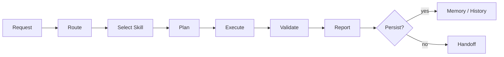

# Personal Skill System

[Korean translation](README.ko.md)

Personal Skill System is a public-facing summary of a personal AI work system that evolved from local prompt files into a more inspectable skill operating model.

The goal is not to publish every private rule, backup, or workflow detail. This repository focuses on the shareable parts: the timeline, design perspective, operating model, and public-safe structure behind the system.

## Summary

This system started as a way to avoid repeating the same instructions to AI tools. Over time, it became a layered workflow for routing tasks, keeping project state, planning work, validating outputs, reporting results, and orchestrating research.

In short:

> A skill system is not just a longer prompt. It is a way to make repeated AI work run through clear capability units, explicit state, verifiable outputs, and human-controlled boundaries.

## Timeline

The version history is presented as a design timeline, not as a complete feature checklist.

| Version | Focus | Design Shift |
|---:|---|---|
| 1.0 | Prompt bootstrap | Basic working rules were captured in local instruction files. |
| 2.0 | AGENT subskills | Large instruction blocks were split into reusable skill-like modules. |
| 3.0 | Design and reporting | HLD, LLD, interaction, reporting, and skill authoring patterns became repeatable workflows. |
| 4.0 | Memory bank | Long-running project context moved from chat memory into explicit state files and event history. |
| 5.0 | Agentic workflow | Planning, execution, validation, reporting, and review became separate responsibilities. |
| 5.6.x | Stabilization | Trigger conflicts, cross-skill ownership, validation states, and drift audits became first-class concerns. |
| 6.0 | Research lifecycle | Literature review, hypothesis, experiment planning, analysis, writing, and review were organized as a research pipeline. |
| 7.0 | Public specification | The private system was reframed as a public timeline, design philosophy, and manifest/profile structure. |
| 7.1 | Drop-in bundle | The system was repackaged as a manual drop-in bundle with read-only hygiene checks and conservative, explicit-first routing. |
| 7.2 | Skill families | A user-facing family grouping layer, family-stem skill renames, new search/coordination/evaluation families, and `search-router` / `memory-bank-ingestion` / `evaluation-usage-tracker` skills. 7.2.1 adds a workflow execution sub-family (`workflow-plan-runner` / `workflow-validation` / `workflow-recovery`) and a redefined `report-qualitative` evaluation report skill. 7.2.5 adds a family-grouped skill catalog for users. |

## 7.2.5 Drop-in Bundle

This repository includes the 7.2.5 manual drop-in skill bundle payload:

- `.codex/skills`: Codex skill packages
- `.codex/docs`: runtime guidance and registry documents
- `.codex/eval`: routing and usage evaluation cases
- `.codex/tools`: read-only bundle hygiene tooling
- `.claude`: Claude-side runtime guidance, docs, and eval cases
- `CHANGELOG.md`, `TERMS.md`, and `FIELD_FEEDBACK.md`: packaging notes and field feedback template

The bundle intentionally does not include `.codex/config.toml`, `automations/`, or the default `.codex/skills/.system` payload. App-managed system skills are treated as optional review material, not as part of the default repository payload.

## Skill Catalog

The skills are grouped by family so users can start from intent instead of memorizing every skill name. Skill names use the family-stem convention introduced in 7.2.

### Analysis

Analysis skills diagnose failures, compare approaches, or build codebase-level understanding.

| Skill | What it means |
| --- | --- |
| `analysis-router` | Chooses the right analysis path for deep technical questions. It routes to bug diagnosis, algorithm recommendation, or a hybrid flow without doing broad repo reporting by default. |
| `analysis-bug` | Reproduces and diagnoses failures, especially recurring or high-risk issues. It focuses on evidence, root cause, and regression-safe validation rather than quick guesses. |
| `analysis-algorithm` | Compares algorithms, architectures, models, retrieval strategies, or implementation approaches under explicit constraints and success metrics. |
| `analysis-codebase` | Produces broad codebase intelligence reports when the user explicitly wants a repo-wide artifact, architecture map, dependency view, or quality-gate report. |

### Design

Design skills turn visual intent into implementable UI work or evidence.

| Skill | What it means |
| --- | --- |
| `design-frontend` | Implements a concrete visual design as real frontend code, using the target repo's existing patterns and validating the rendered result when possible. |
| `design-ui-decomposer` | Breaks a UI reference into hierarchy, layout regions, component candidates, token candidates, states, and validation needs before implementation. |
| `design-layout-translator` | Converts Auto Layout, flex/grid, sizing, overflow, and breakpoint constraints into implementation-ready layout rules. |
| `design-tokens` | Normalizes design tokens, maps them to platform values, and reports missing or conflicting tokens without inventing values. |
| `design-component-mapper` | Maps design components, variants, states, slots, and events to existing repo components and identifies unresolved gaps. |
| `design-visual-regression` | Captures or inspects rendered screenshots, checks nonblank/framing evidence, and reports visual differences across viewports. |
| `design-a11y-audit` | Reviews accessibility evidence for implemented UI, including keyboard flow, focus visibility, semantics, contrast, target size, and responsive readability. |
| `design-mobile-screen` | Applies mobile or native screen constraints such as safe areas, navigation, keyboard overlays, touch targets, scrolling, states, and mobile accessibility. |
| `design-dashboard` | Applies dashboard-specific constraints for KPIs, filters, charts, tables, data density, async states, and operational accessibility. |
| `design-section-web` | Applies section-page constraints for heroes, semantic sections, CTA flow, responsive order, media placement, first-viewport signal, and text fitting. |

### Report

Report skills shape evidence, review, diffs, and task artifacts into readable user-facing outputs.

| Skill | What it means |
| --- | --- |
| `report-qualitative` | Produces structured qualitative evaluation reports with explicit criteria, evidence, interpretation, judgment, and recommendations. It also preserves compact `srq`-style evidence reporting as an explicit compatibility path. |
| `report-critical` | Runs blocker-first critical review, risk review, and QA-style verdicts for artifacts, plans, outputs, or conversations. |
| `report-diff` | Presents actual changed lines or verified before/after snapshots in a readable grouped diff format. |
| `report-artifact-inventory` | Summarizes the artifacts, commands, verification notes, and remaining checks from a task without creating a persistent registry. |

### Workflow

Workflow skills control execution discipline, validation, and recovery for implementation work.

| Skill | What it means |
| --- | --- |
| `workflow-rigor` | Enforces evidence-first execution, scoped changes, validation separation, and higher-risk review discipline. |
| `workflow-plan-runner` | Executes an approved plan, spec, or package into implementation batches with scoped validation and rollback or fallback decisions. |
| `workflow-validation` | Designs or runs focused validation plans for changed or planned artifacts, separating agent-run checks from user/manual checks. |
| `workflow-recovery` | Recovers repeated implementation or validation failure loops using one-hypothesis diagnostics, narrowed repros, and rollback/fallback decisions. |

### Planning

Planning skills create or curate plan/spec artifacts without replacing actual implementation.

| Skill | What it means |
| --- | --- |
| `plan-short-term-docs` | Creates or updates persisted `docs/plan` task plans for near-term work, status, and implementation transitions. |
| `plan-long-term-package` | Builds larger multi-document planning packages for phases, migrations, rewrites, or long-term work when explicitly requested. |
| `plan-spec-curator` | Curates active context and stale specs or plans, proposes archive/load policy, and keeps planning context from becoming bloated. |

### Coordination

Coordination skills help split or hand off work without creating persistent workflow machinery.

| Skill | What it means |
| --- | --- |
| `coordination-brief` | Produces lightweight goal briefs, task DAG slices, handoff notes, or lock-scope outlines from an existing plan or task list. |
| `coordination-multi-agent` | Splits explicit multi-agent work into task cards, ownership notes, lock scopes, and handoff boundaries. |

### Research

Research skills organize scientific or paper-oriented work from routing through review.

| Skill | What it means |
| --- | --- |
| `research-router` | Routes research requests to the right research-stage skill while avoiding accidental activation for ordinary implementation work. |
| `research-literature-ideation` | Turns acquired evidence into candidate hypotheses and selects a focused active hypothesis. |
| `research-literature-synthesis` | Synthesizes evidence ledgers or papers into literature review structure, contradictions, limitations, and claim boundaries. |
| `research-hypothesis-planning` | Plans hypotheses, ablations, loss design, training plans, and claim-development paths. |
| `research-experiment-blueprint` | Creates experiment blueprints from selected hypotheses, including baselines, metrics, ablations, and falsification checks. |
| `research-experiment-scaffold` | Generates minimal experiment scaffolds from approved blueprints within explicit write boundaries. |
| `research-statistical-analysis` | Analyzes result tables, metrics, and uncertainty with statistical rationale and planned-vs-exploratory separation. |
| `research-manuscript-writing` | Drafts or revises manuscript sections from verified research artifacts, citation status, and results. |
| `research-peer-review` | Critiques manuscripts, proposals, and research plans for novelty, evidence, reproducibility, limitations, and reporting quality. |

### Search

Search skills route or collect evidence while keeping synthesis and implementation separate.

| Skill | What it means |
| --- | --- |
| `search-router` | Detects evidence-search intent and routes to the right evidence lane, such as paper, code, runtime, visual, or memory evidence. |
| `search-paper-evidence` | Searches or plans paper/source evidence collection and builds citation-aware evidence ledgers without fabricated citations. |

### Memory

Memory skills manage persistent project context only when memory use or mutation is explicit.

| Skill | What it means |
| --- | --- |
| `memory-bank-harness` | Compiles task-specific context from accepted memory while filtering stale, conflicting, or risky entries. |
| `memory-bank-ingestion` | Promotes approved closeout packets and proposal candidates into durable memory with append-only events and archive links. |
| `memory-bank-init` | Initializes project-scoped persistent memory after identity and write-boundary checks. |
| `memory-bank-update` | Updates persistent goals or rules with append-only history when the user wants durable memory mutation. |
| `memory-bank-maintenance` | Inspects, validates, consolidates, or repairs existing memory state. |
| `memory-bank-correction-capture` | Captures explicit user corrections as candidate memory while preserving approval and sensitivity boundaries. |

### Evaluation

Evaluation skills improve the skill system itself through cases and usage observations.

| Skill | What it means |
| --- | --- |
| `evaluation-harness` | Reviews `.codex/eval` usage cases, routing expectations, and schema consistency without acting as package approval. |
| `evaluation-usage-tracker` | Aggregates metadata-only skill invocation records into usage summaries, low/high-use signals, and improvement candidates. |

### Skill System

Skill-system skills create and maintain the skill bundle itself.

| Skill | What it means |
| --- | --- |
| `create-skill-pack` | Creates, hardens, migrates, deprecates, or registers custom skills and their metadata. |

## Design Perspective

The system is built around a few practical principles:

- **Skill as capability package**: a skill should describe when it runs, what it receives, what it produces, and how it is validated.
- **Progressive disclosure**: routing stays lightweight, while detailed instructions, references, and scripts live deeper in the skill package.
- **Explicit state**: important project context should be stored as inspectable artifacts rather than hidden conversation memory.
- **Plan before implementation**: non-trivial work should have an explicit plan, scope, risk, and validation path.
- **Evidence before assertion**: reports should distinguish verified results, unverified claims, blocked work, and user checks.
- **Human boundaries**: destructive actions, credentials, network access, and private data need clear approval and redaction rules.

## Operating Model

At a high level, the workflow looks like this:

The important part is the separation of responsibilities. A request should not become one large prompt. It should move through routing, skill selection, planning, execution, validation, and reporting with the right amount of context at each step.

## Public Scope

This repository is intended to share the public-safe shape of the system:

- the evolution from prompt files to skill packages
- the design principles behind the workflow
- the role of memory, planning, validation, and reporting
- the idea of source-adjacent skill metadata such as manifests or profiles
- examples and schemas that do not expose private project data

It is not intended to publish private memories, credentials, raw backups, unreduced logs, or project-specific operating details.

## License

MIT
