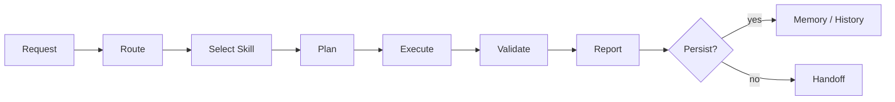

# Personal Skill System

Personal Skill System is a public-facing summary of a personal AI work system that evolved from local prompt files into a more inspectable skill operating model.

The goal is not to publish every private rule, backup, or workflow detail. This repository focuses on the shareable parts: the timeline, design perspective, operating model, and public-safe structure behind the system.

## Summary

This system started as a way to avoid repeating the same instructions to AI tools. Over time, it became a layered workflow for routing tasks, keeping project state, planning work, validating outputs, reporting results, and orchestrating research.

In short:

> A skill system is not just a longer prompt. It is a way to make repeated AI work run through clear capability units, explicit state, verifiable outputs, and human-controlled boundaries.

## Timeline

The version history is presented as a design timeline, not as a complete feature checklist.

| Version | Focus | Design Shift |
|---:|---|---|
| 1.0 | Prompt bootstrap | Basic working rules were captured in local instruction files. |
| 2.0 | AGENT subskills | Large instruction blocks were split into reusable skill-like modules. |
| 3.0 | Design and reporting | HLD, LLD, interaction, reporting, and skill authoring patterns became repeatable workflows. |
| 4.0 | Memory bank | Long-running project context moved from chat memory into explicit state files and event history. |
| 5.0 | Agentic workflow | Planning, execution, validation, reporting, and review became separate responsibilities. |
| 5.6.x | Stabilization | Trigger conflicts, cross-skill ownership, validation states, and drift audits became first-class concerns. |
| 6.0 | Research lifecycle | Literature review, hypothesis, experiment planning, analysis, writing, and review were organized as a research pipeline. |
| 7.0 | Public specification | The private system was reframed as a public timeline, design philosophy, and manifest/profile structure. |
| 7.1 | Drop-in bundle | The system was repackaged as a manual drop-in bundle with read-only hygiene checks and conservative, explicit-first routing. |
| 7.2 | Skill families | A user-facing family grouping layer, family-stem skill renames, new search/coordination/evaluation families, and `search-router` / `memory-bank-ingestion` / `evaluation-usage-tracker` skills. 7.2.1 adds a workflow execution sub-family (`workflow-plan-runner` / `workflow-validation` / `workflow-recovery`) and a redefined `report-qualitative` evaluation report skill. |

## 7.2.1 Drop-in Bundle

This repository includes the 7.2.1 manual drop-in skill bundle payload:

- `.codex/skills`: Codex skill packages
- `.codex/docs`: runtime guidance and registry documents
- `.codex/eval`: routing and usage evaluation cases
- `.codex/tools`: read-only bundle hygiene tooling
- `.claude`: Claude-side runtime guidance, docs, and eval cases
- `CHANGELOG.md`, `TERMS.md`, and `FIELD_FEEDBACK.md`: packaging notes and field feedback template

The bundle intentionally does not include `.codex/config.toml`, `automations/`, or the default `.codex/skills/.system` payload. App-managed system skills are treated as optional review material, not as part of the default repository payload.

## Design Perspective

The system is built around a few practical principles:

- **Skill as capability package**: a skill should describe when it runs, what it receives, what it produces, and how it is validated.
- **Progressive disclosure**: routing stays lightweight, while detailed instructions, references, and scripts live deeper in the skill package.
- **Explicit state**: important project context should be stored as inspectable artifacts rather than hidden conversation memory.
- **Plan before implementation**: non-trivial work should have an explicit plan, scope, risk, and validation path.
- **Evidence before assertion**: reports should distinguish verified results, unverified claims, blocked work, and user checks.
- **Human boundaries**: destructive actions, credentials, network access, and private data need clear approval and redaction rules.

## Operating Model

At a high level, the workflow looks like this:

The important part is the separation of responsibilities. A request should not become one large prompt. It should move through routing, skill selection, planning, execution, validation, and reporting with the right amount of context at each step.

## Public Scope

This repository is intended to share the public-safe shape of the system:

- the evolution from prompt files to skill packages
- the design principles behind the workflow
- the role of memory, planning, validation, and reporting
- the idea of source-adjacent skill metadata such as manifests or profiles
- examples and schemas that do not expose private project data

It is not intended to publish private memories, credentials, raw backups, unreduced logs, or project-specific operating details.

## License

MIT
