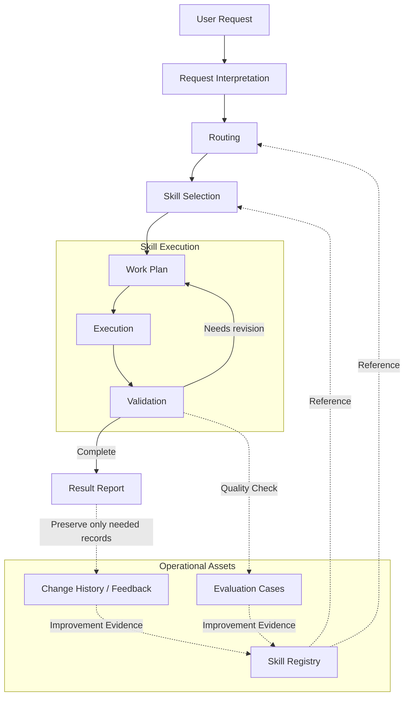

# AI Skill System

[Korean README](README.ko.md)

AI Skill System is a work system for organizing repetitive AI tasks into reusable skills that can be selected, executed, validated, and improved. It started as a set of local prompt files, but gradually expanded into a structure that covers task routing, state management, planning, artifact validation, result reporting, and research workflow coordination.

This repository is not intended to expose every internal rule or private workflow. It documents the system’s evolution, operating model, skill structure, and example patterns within a publicly shareable scope.

## Summary

The purpose of this system is to avoid repeatedly entering the same instructions into AI tools by separating recurring AI tasks into reusable skills.

A skill in this system is not simply a longer prompt. It is a work unit that defines when it should be invoked, what inputs it expects, what procedure it follows, what outputs it should produce, and how those outputs should be validated. This makes AI work more consistent and easier to inspect.

## 7.3.1 Drop-in Bundle

This repository includes the skill bundle organized for version 7.3.1. Its main components are:

* `skills`: skill packages intended for actual use
* `docs`: skill lists, usage criteria, and operational reference documents
* `eval`: example cases for checking skill selection and usage quality
* `tools`: helper tools for inspecting the bundle structure
* `integrations`: optional integration payloads — includes `integrations/kanboard-plan-sync`, a plan-centric MCP/CLI that projects Markdown plans onto a local Kanboard. The Kanboard app, DB, themes, and plugins are NOT bundled; only the integration code, two Agent skills (`kanboard-plan-rollout`, `kanboard-plan-ops`), MCP registration examples, and a local-host setup methodology are included.
* `CHANGELOG.md`, `TERMS.md`, `FIELD_FEEDBACK.md`: change history, terminology notes, and field feedback template

## 8.0 Direction: Context Compounding

The current architecture target is `8.0.0 — Context Compounding / Wiki Bank Architecture`. The current implementation package is best read as `8.0.0-alpha — Context Compounding`: a development baseline for the context-compounding model, not a final 8.0 release or default context operating layer.

`7.4.x Context Assurance` is a legacy label and transition trace, not the current implementation target. The 7.3.1 drop-in bundle remains the compatibility baseline for existing calls, while the 8.0 direction changes the context model: evidence becomes claims and relations, claims are projected into Wiki Bank pages, and low-context Runtime Projection cards are compiled into Context Packs for execution.

The Wiki Bank is not a Source of Truth. Repository files, tests, schemas, explicit user decisions, validated plans, Kanboard state, and Agent Run evidence remain authority sources. Hooks and runtime traces may produce proposal evidence, but accepted knowledge changes require explicit review.

## Core Principles

This system is designed to treat repetitive AI work as skills that can be selected, executed, and inspected, rather than as one-off prompts.

* **A skill is a work unit.** Each skill defines when it should be used, what inputs it receives, what result it should produce, and how that result should be validated.
* **Routing and execution guidance are separated.** Routing information is kept lightweight, while detailed procedures and reference materials live inside each skill package.
* **State and evidence are preserved.** Important context, reasoning evidence, and validation results should be managed as inspectable artifacts, not only as hidden conversation state.
* **Human control must remain explicit.** Risky operations such as destructive changes, credential handling, network access, or private data access require clear boundaries and confirmation steps.

## Operating Model

This system does not handle every task through one large prompt. It interprets the request, selects an appropriate skill based on the task type, validates the execution result, and uses evaluation and feedback to improve the skill system when needed.

The key idea is to treat skills not as prompt fragments, but as operational units that can be selected, executed, validated, and improved. A request is first interpreted, then routed to an appropriate skill using the registry. During execution, planning and validation may repeat as needed. After completion, the result is reported and only the necessary records are preserved.

This structure keeps skills from becoming disposable instructions. Instead, they remain reusable work units that can be inspected and improved over time.

## Skill Catalog

Skills are organized by family. Instead of memorizing every skill name, users can start from the intent of the task and find the appropriate family and skill.

### Analysis

Analysis skills are used to diagnose failures, compare approaches, or build codebase-level understanding.

| Skill                | Role                                                                                                                                           |
| -------------------- | ---------------------------------------------------------------------------------------------------------------------------------------------- |
| `analysis-router`    | Selects the appropriate analysis path for complex technical requests, such as bug diagnosis, algorithm comparison, or codebase analysis.       |
| `analysis-bug`       | Reproduces and diagnoses recurring, unclear, or high-risk failures, then summarizes the primary cause and regression validation path.          |
| `analysis-algorithm` | Compares algorithms, architectures, models, search strategies, or implementation approaches against explicit constraints and success criteria. |
| `analysis-codebase`  | Performs codebase-level analysis when repository-wide artifacts, architecture maps, dependency views, or quality-gate reports are needed.      |

### Design

Design skills turn visual intent into implementable UI work or verifiable evidence.

| Skill                      | Role                                                                                                                                                                                                                |
| -------------------------- | ------------------------------------------------------------------------------------------------------------------------------------------------------------------------------------------------------------------- |
| `design-frontend`          | Implements a concrete visual design as frontend code. It reuses the target repository’s existing framework, components, tokens, and assets, and validates the rendered result when possible.                        |
| `design-ui-decomposer`     | Breaks down UI references such as screenshots, Figma exports, mockups, or AI-generated images into hierarchy, layout, repeated patterns, component/token candidates, states, and validation items.                  |
| `design-layout-translator` | Translates Auto Layout, flex/grid, resizing, overflow, and breakpoint constraints into layout rules that can be implemented in code.                                                                                |
| `design-tokens`            | Normalizes design token sources and maps them to platform values. It does not invent values, and reports missing, conflicting, or drifting tokens with evidence.                                                    |
| `design-component-mapper`  | Maps design components, variants, states, slots, and events to existing repository components and identifies unresolved implementation gaps.                                                                        |
| `design-visual-regression` | Captures or reviews rendered UI screenshots and reports blank states, framing issues, overflow, and visual differences across screen sizes.                                                                         |
| `design-a11y-audit`        | Reviews accessibility evidence for implemented UI, including keyboard reachability, focus visibility, semantic structure, contrast, target size, and responsive readability.                                        |
| `design-mobile-screen`     | Applies mobile and native screen constraints such as safe areas, navigation/tab bars, keyboard overlays, touch targets, scroll/fixed regions, platform states, and mobile accessibility.                            |
| `design-dashboard`         | Applies dashboard-specific constraints such as KPI hierarchy, filters, search, date ranges, charts, tables, information density, async/empty/error/loading states, and operational accessibility.                   |
| `design-section-web`       | Checks section-based web pages such as landing, product, documentation, portfolio, or marketing pages for hero structure, section hierarchy, CTA flow, responsive order, media placement, and first-screen signals. |

### Report

Report skills organize evidence, reviews, changes, and work artifacts into results that are easy for users to read.

| Skill                       | Role                                                                                                                       |
| --------------------------- | -------------------------------------------------------------------------------------------------------------------------- |
| `report-qualitative`        | Produces qualitative evaluation reports with explicit criteria, evidence, interpretation, judgment, and recommendations.   |
| `report-critical`           | Performs blocker-first critical review, risk review, and QA-style judgment on artifacts, plans, outputs, or conversations. |
| `report-diff`               | Presents only actual changed lines or verified before/after snapshots in a readable grouped diff format.                   |
| `report-artifact-inventory` | Summarizes artifacts, executed commands, validation records, and remaining checks produced during a single task.           |

### Workflow

Workflow skills control implementation discipline, validation, and failure recovery.

| Skill                  | Role                                                                                                                                                                    |
| ---------------------- | ----------------------------------------------------------------------------------------------------------------------------------------------------------------------- |
| `workflow-rigor`       | Applies evidence-first execution, scoped changes, separated validation results, and review discipline for medium- and high-risk changes.                                |
| `workflow-minimal-implementation` | Applies conditional YAGNI pressure to implementation and refactoring work to avoid unnecessary dependencies, abstractions, files, and boilerplate. |
| `workflow-plan-runner` | Executes approved plans, specifications, or packages as implementation batches, while managing scoped validation, rollback, or alternative choices.                     |
| `workflow-validation`  | Plans or performs focused validation for completed or planned changes. It separates validation performed by the agent from validation that must be checked by the user. |
| `workflow-recovery`    | Breaks repeated implementation or validation retry loops through single-hypothesis diagnosis, narrowed reproduction steps, rollback, or alternative decisions.          |

### Planning

Planning skills create or organize planning and specification artifacts without performing the actual implementation.

| Skill                    | Role                                                                                                                                                                       |
| ------------------------ | -------------------------------------------------------------------------------------------------------------------------------------------------------------------------- |
| `plan-short-term-docs`   | Creates or updates persistent `docs/plan` work plans for near-term tasks, state, and implementation transitions.                                                           |
| `plan-long-term-package` | Creates large multi-document planning packages for bulk work, migrations, rewrites, or milestone plans that future sessions must be able to continue from documents alone. |
| `plan-spec-curator`      | Organizes active context and outdated or superseded specifications/plans, and proposes archive/reload policies to prevent planning context from becoming overloaded.       |

### Coordination

Coordination skills provide lightweight structures for task splitting and handoff without creating permanent workflow machinery.

| Skill                      | Role                                                                                                               |
| -------------------------- | ------------------------------------------------------------------------------------------------------------------ |
| `coordination-brief`       | Creates goal briefs, task DAG fragments, handoff notes, and lock-scope outlines from existing plans or task lists. |
| `coordination-multi-agent` | Splits explicitly multi-agent work into task cards, ownership notes, lock scopes, and handoff boundaries.          |

### Research

Research skills organize scientific or paper-centered work from request routing through review.

| Skill                           | Role                                                                                                                                                              |
| ------------------------------- | ----------------------------------------------------------------------------------------------------------------------------------------------------------------- |
| `research-router`               | Routes research requests to the appropriate research-stage skill and prevents research skills from being triggered accidentally for ordinary implementation work. |
| `research-literature-ideation`  | Converts gathered evidence into candidate research hypotheses and selects one active hypothesis to validate.                                                      |
| `research-literature-synthesis` | Synthesizes a literature review structure, consensus, disagreements, contradictions, limitations, and claim boundaries from evidence lists or provided papers.    |
| `research-hypothesis-planning`  | Plans hypotheses, ablations, loss-function design, training plans, and claim-development paths.                                                                   |
| `research-experiment-blueprint` | Produces an experiment blueprint from a selected hypothesis, including baseline experiments, metrics, ablations, and falsification checks.                        |
| `research-experiment-scaffold`  | Generates a minimal experiment code scaffold from an approved experiment blueprint within explicit write boundaries.                                              |
| `research-statistical-analysis` | Analyzes result tables, metrics, and uncertainty with statistical evidence, while separating pre-planned analysis from exploratory analysis.                      |
| `research-manuscript-writing`   | Writes or revises scientific manuscript sections based on validated research artifacts, citation status, and results.                                             |
| `research-peer-review`          | Critiques manuscripts, proposals, or research plans in peer-review format across novelty, evidence, reproducibility, limitations, and reporting quality.          |

### Search

Search skills find evidence or define evidence-gathering paths while keeping synthesis and implementation responsibilities separate.

| Skill                   | Role                                                                                                                                             |
| ----------------------- | ------------------------------------------------------------------------------------------------------------------------------------------------ |
| `search-router`         | Detects search intent for papers, code, runtime evidence, visual references, or memory evidence, and routes it to the appropriate evidence lane. |
| `search-paper-evidence` | Searches for paper/source evidence or plans a search path, while tracking citation status in an evidence ledger without fabricating citations.   |

### Memory

Memory skills manage long-term project context. They are used only when memory use or memory changes are explicitly intended.

| Skill                            | Role                                                                                                                             |
| -------------------------------- | -------------------------------------------------------------------------------------------------------------------------------- |
| `memory-bank-harness`            | Builds a context pack from approved memory for the current task while filtering out stale, conflicting, or risky entries.        |
| `memory-bank-ingestion`          | Promotes approved closeout packets and proposed candidates into long-term memory with append-only events and archive links.      |
| `memory-bank-init`               | Initializes a project-scoped persistent memory bank after confirming project identity and write boundaries.                      |
| `memory-bank-update`             | Updates persistent goals or rules as append-only history when the user wants long-term memory changes.                           |
| `memory-bank-maintenance`        | Inspects, validates, consolidates, or repairs existing memory state.                                                             |
| `memory-bank-correction-capture` | Captures an explicit user correction as a memory candidate while preserving approval steps and sensitive-information boundaries. |

### Evaluation

Evaluation skills improve the skill system itself through cases and usage observations.

| Skill                      | Role                                                                                                                                                           |
| -------------------------- | -------------------------------------------------------------------------------------------------------------------------------------------------------------- |
| `evaluation-harness`       | Reviews `.codex/eval` usage cases, routing expectations, and schema consistency. It is treated as a usage-quality review tool, not as a package approval tool. |
| `evaluation-usage-tracker` | Aggregates skill-call metadata into usage summaries, low/high-usage signals, and improvement candidates without storing original prompts or conversation logs. |

### Skill System

Skill System skills create and maintain the skill bundle itself.

| Skill               | Role                                                                               |
| ------------------- | ---------------------------------------------------------------------------------- |
| `create-skill-pack` | Creates, strengthens, migrates, retires, and registers custom skills and metadata. |

## Design Timeline

The version history is not a complete feature checklist. It is a timeline showing how the system’s design direction has changed over time.

| Version | Focus                              | Design Change                                                                                                                                                                                                                                                                     |
| ------: | ---------------------------------- | --------------------------------------------------------------------------------------------------------------------------------------------------------------------------------------------------------------------------------------------------------------------------------- |
|     1.x | Prompt bootstrap                   | Recorded basic working rules in local instruction files.                                                                                                                                                                                                                          |
|     2.x | AGENT subskills                    | Split large instruction blocks into reusable skill-like modules.                                                                                                                                                                                                                  |
|     3.x | Design and reporting               | HLD, LLD, interaction, reporting, and skill-authoring patterns became repeatable workflows.                                                                                                                                                                                       |
|     4.x | Memory bank                        | Moved long-term project context from conversation memory into explicit state files and event history.                                                                                                                                                                             |
|     5.x | Agentic workflow and stabilization | Separated planning, execution, validation, reporting, and review into distinct responsibilities. The workflow also matured around explicit routing contracts, smoke-testable trigger rules, drift checks, lightweight automation, and phase-level planning packages. |
|     6.x | Research lifecycle                 | Expanded the early research-planning branch into a routed research lifecycle, separating evidence search, literature synthesis, hypothesis planning, experiment design, analysis, manuscript writing, and peer review into distinct stages. |
|     7.x | Public specification               | Reworked the private system into a publicly shareable timeline, design philosophy, and manifest/profile structure.                                                                                                                                                                |
|   7.1.x | Drop-in bundle                     | Repackaged the system as a drop-in bundle with read-only structure checks and conservative explicit-first routing.                                                                                                                                                                |
|   7.2.x | Skill families                     | Added user-facing family groups, family-prefixed skill names, and the search/coordination/evaluation families. Version 7.2.1 added workflow execution subfamilies and `report-qualitative`; version 7.2.5 added a skill catalog that helps users understand each skill by family. |
|   7.3.x | Execution assurance                | Stabilized agent output validation, release verification profiles, and run evidence fixtures as the compatibility baseline before the context-layer transition. |
| 8.0.0-alpha | Context compounding            | Establishes the alpha baseline for Wiki Bank, Runtime Projection, Context Packs, source-grounded claims, and review-gated knowledge feedback. `7.4.x Context Assurance` is treated as a legacy transition label; full 8.0/default-layer readiness remains gated. |

## License

MIT License.
