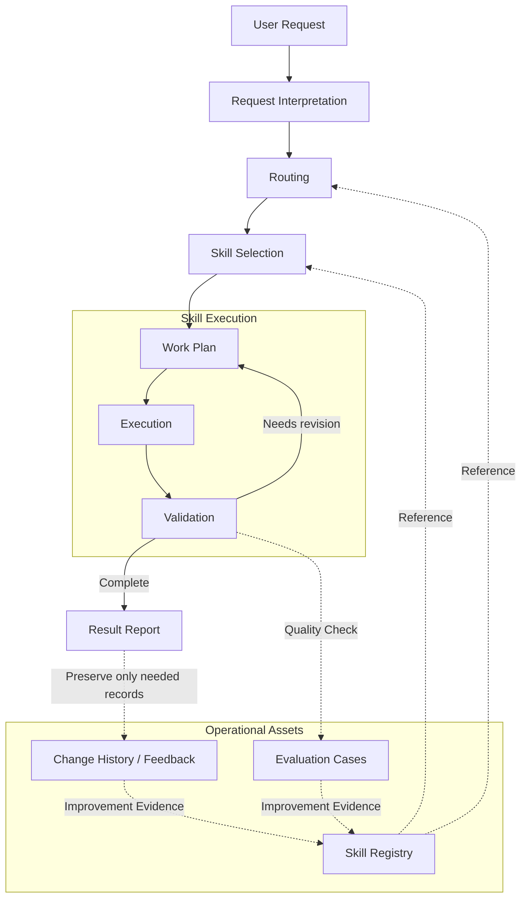

# AI Skill System

[Korean README](README.ko.md)

AI Skill System is a work system for organizing repetitive AI tasks into reusable skills that can be selected, executed, validated, and improved. It started as a set of local prompt files, but gradually expanded into a structure that covers task routing, state management, planning, artifact validation, result reporting, and research workflow coordination.

This repository is not intended to expose every internal rule or private workflow. It documents the system’s evolution, operating model, skill structure, and example patterns within a publicly shareable scope.

## Summary

The purpose of this system is to avoid repeatedly entering the same instructions into AI tools by separating recurring AI tasks into reusable skills.

A skill in this system is not simply a longer prompt. It is a work unit that defines when it should be invoked, what inputs it expects, what procedure it follows, what outputs it should produce, and how those outputs should be validated. This makes AI work more consistent and easier to inspect.

## 10.0.0 Release

This source tree is the 10.0.0 release baseline and the breaking successor to the 9.4.x line. Its
current components are:

* `skills`: skill packages intended for actual use
* `docs`: skill lists, usage criteria, and operational reference documents
* `tools`: helper tools for inspecting the bundle structure
* `execution-handoff`: risk-adaptive finite DAGs, event-driven coordination, Core Cards, and Human Test handoff
* `providers`: active Codex, Claude, Grok, and Antigravity package/rule declarations, with native harnesses only where the host owns one
* `tests`: one Core-contract test, three Skill System-wide tests, and a reduced provider-neutral harness component suite
* `work-contract`: privacy-bounded natural-language user-scope and interaction projection with no graph-state ownership
* `report-delivery` + `report-canvas`: Markdown-first contracts in each Report skill plus one optional offline HTML renderer shared by the Core plugin
* `CHANGELOG.md`, `TERMS.md`: change history and terminology notes

## 10.x Direction: DAG Execution Handoff & Multi-Provider Harness

The current architecture line is `10.x — DAG Execution Handoff & Multi-Provider Harness`. The
10.0.0 release replaces the 9.x central evaluation and release-gate assumptions with current Core
contracts and narrowly scoped system checks. Local installation remains a separate explicit action.

10.0.0 makes `plan-execution-handoff` and its finite typed DAG the primary durable execution
model, projects one Core Card contract into the Workflow producers and Handoff recorder, removes
the central eval/Skill Diet/release-hygiene stack, and reduces persistent evaluation to four
model-independent tests. TaskRun, LoopRun, and WorkItem runtime state have been removed; the useful
repeated-work principles from Loop Term now live inside Execution Handoff.

The Codex router uses an exact specialist directly and opens at most one narrow router only when several owners genuinely compete. Clear intent-matched workflow owners and bounded design/support specialists may be implicitly selected, while model selection never expands user authority. Persistent Memory/Knowledge writes, project-context mutation, lifecycle gates, and explicitly selected context remain explicit-only. An implicit router may hand off only to a declared implicitly exposed target, and an already selected canonical skill ID is preserved across worker handoff. One canonical invocation bit is projected into each host's native contract: Codex reads `agents/openai.yaml`, while Claude receives `disable-model-invocation: true` only for explicit-only skills. Codex packages stay at `plugins/<name>/skills`; paired Claude packages are generated at `plugins/claude/<name>/skills` under the same plugin name and version so each host discovers only its native metadata. The nearest `project-context.yaml` may declare manifest-relative or exact approved absolute Memory Bank, Knowledge Base, plan, skill-root, and named LLM Wiki paths; missing entries are unavailable and never trigger home or adjacent-repository discovery. Knowledge operations consume resolved `knowledge_root` and `knowledge_index` variables rather than a fixed directory.

Memory Bank preserves cross-session goals, working rules, recurring mistakes, and proven practices. Knowledge Base preserves accepted project domain, design, algorithm, architecture, review, and decision knowledge as readable current snapshots with typed relations, semantic revisions, and source-traced observation events. Recurrence is derived from transparent observation/provenance dimensions rather than a confidence, maturity, importance, or popularity score. LLM Wikis remain optional read-only context sources selected explicitly and navigated using their own conventions.

Explicit “what next” questions use the existing Work Horizon and Planning State contracts instead of a duplicate registry navigator: horizon owns persistence/altitude, planning state owns persisted-artifact transitions, and host routing retains the current-turn owner. `management-project-context` supports explicit manifest-init, guided bootstrap, update, and read-only doctor modes; one transaction may approve all or a subset of separately enumerated writes. Material maker/checker risk may separate Contract/Spec from Repository/Constraints review, while multi-batch work selects `vertical_slice`, `migration_sequence`, or `evidence_unit`. None of these additions creates an automatic mega-orchestrator.

The default Codex hook map sends eight lifecycle events directly to one Go executable. Response correction, user Work Contract enforcement, desktop notification, and location-only project context are independent bounded branches. Stop performs no loop evaluation, child Python process, or graph continuation.

For development-focused installs, use `skill-system-core` + `skill-system-dev` as the minimum profile. Core includes the shared lifecycle, qualitative, and critical report skills; implementation and domain owners retain their own condition-matched validation.

The four plugins are installation profiles, not the eight user-facing skill families. Core contains
cross-domain Planning, Management, Evidence, Workflow modifiers, and all Report skills; Dev contains
engineering Analysis and Workflow owners; Design and Research carry their domain-specific families.
Grok and Antigravity reuse the Claude-compatible portable package set instead of adding two more
copies of every skill. Their generated global-rule companions bind Orca work to the same
event-driven lifecycle: worker-side inbox/heartbeat/`worker_done`, no Coordinator polling, and no
fixed/busy wait loop.

For local installation on all four providers, see [Local Plugin Marketplace](LOCAL_PLUGIN_MARKETPLACE.md).

## Core Principles

This system is designed to treat repetitive AI work as skills that can be selected, executed, and inspected, rather than as one-off prompts.

* **A skill is a work unit.** Each skill defines when it should be used, what inputs it receives, what result it should produce, and how that result should be validated.
* **Routing and execution guidance are separated.** Routing information is kept lightweight, while detailed procedures and reference materials live inside each skill package.
* **State and evidence are preserved.** Important context, reasoning evidence, and validation results should be managed as inspectable artifacts, not only as hidden conversation state.
* **Human control must remain explicit.** Risky operations such as destructive changes, credential handling, network access, or private data access require clear boundaries and confirmation steps.

## Operating Model

This system does not handle every task through one large prompt. It interprets the request, uses a directly named or clearly matching specialist, opens one narrow router only for genuine ambiguity, and improves from problems the user reports during real use. Authored scenarios remain regression material, not field-quality evidence.

```mermaid
flowchart TB
  A[User Request] --> B[Request Interpretation]

  B --> C[Routing]
  C --> D[Skill Selection]
  D --> E[Work Plan]

  subgraph S[Skill Execution]
    E --> F[Execution]
    F --> G[Validation]
    G -- Needs revision --> E
  end

  G -- Complete --> H[Result Report]

  subgraph K[Operational Assets]
    R[Skill Registry]
    V[Evaluation Cases]
    L[Change History / Feedback]
  end

  R -. Reference .-> C
  R -. Reference .-> D
  G -. Quality Check .-> V
  H -. Preserve only needed records .-> L
  V -. Improvement Evidence .-> R
  L -. Improvement Evidence .-> R
```

The key idea is to treat skills not as prompt fragments, but as operational units that can be selected, executed, validated, and improved. A request is first interpreted, then routed to an appropriate skill using the registry. During execution, planning and validation may repeat as needed. After completion, the result is reported and only the necessary records are preserved.

This structure keeps skills from becoming disposable instructions. Instead, they remain reusable work units that can be inspected and improved over time.

## Skill Catalog

Skills are organized by family. Instead of memorizing every skill name, users can start from the intent of the task and find the appropriate family and skill.

### Analysis

Analysis skills are used to diagnose failures, compare approaches, or build codebase-level understanding.

| Skill                | Role                                                                                                                                           |
| -------------------- | ---------------------------------------------------------------------------------------------------------------------------------------------- |
| `analysis-router`    | Selects the appropriate analysis path for complex technical requests, such as bug diagnosis, algorithm comparison, codebase design, domain modeling, or performance analysis. |
| `analysis-bug`       | Reproduces and diagnoses recurring, unclear, or high-risk failures, then summarizes the primary cause and regression validation path.          |
| `analysis-algorithm` | Compares algorithms, architectures, models, search strategies, or implementation approaches against explicit constraints and success criteria. |
| `analysis-codebase-map`  | Models a repository or named slice as Mermaid HLD/LLD maps of flow, structure, and state.      |
| `analysis-boundary-design` | Judges targeted module boundaries, deep modules, interfaces, seams, adapters, dependency direction, and testability before implementation. |
| `analysis-architecture-deepening` | Finds ranked architecture-deepening candidates without a full repo report, using recent canonical production paths as a YAGNI sampling weight when the user did not name a scope. |
| `analysis-domain-modeling` | Clarifies domain concepts, entity/value-object boundaries, state transitions, invariants, business rules, and naming language for software design. |
| `analysis-performance` | Diagnoses latency, throughput, CPU, memory, query, rendering, startup, bundle, or algorithmic bottlenecks with scoped evidence. |
| `analysis-llm-wiki-context` | Builds a minimum read-only task context from one explicitly selected LLM Wiki using that Wiki's own navigation rules. |

### Design

Design skills create concrete UI designs, implement them as repository UI, and return scoped design-system, visual, and accessibility evidence.

| Skill                      | Role                                                                                                                                                                                                                |
| -------------------------- | ------------------------------------------------------------------------------------------------------------------------------------------------------------------------------------------------------------------- |
| `workflow-ui-design`       | Creates one concrete inspectable UI design from accepted requirements, product behavior, content, platform, and visual context, then returns an implementation handoff without writing production UI code. |
| `design-frontend`          | Implements a concrete visual design as frontend code. It selects one conditional mobile, dashboard, section-web, or general profile, reuses repository components/tokens/assets, and validates the rendered result. |
| `design-ui-decomposer`     | Breaks down UI references such as screenshots, Figma exports, mockups, or AI-generated images into hierarchy, layout, repeated patterns, component/token candidates, states, and validation items.                  |
| `design-layout-translator` | Translates Auto Layout, flex/grid, resizing, overflow, and breakpoint constraints into layout rules that can be implemented in code.                                                                                |
| `design-tokens`            | Normalizes design token sources and maps them to platform values. It does not invent values, and reports missing, conflicting, or drifting tokens with evidence.                                                    |
| `design-component-mapper`  | Maps design components, variants, states, slots, and events to existing repository components and identifies unresolved implementation gaps.                                                                        |
| `design-visual-regression` | Captures or reviews rendered UI screenshots and reports blank states, framing issues, overflow, and visual differences across screen sizes.                                                                         |
| `design-a11y-audit`        | Reviews accessibility evidence for implemented UI, including keyboard reachability, focus visibility, semantic structure, contrast, target size, and responsive readability.                                        |

### Report

Report skills organize evidence, reviews, changes, and work artifacts into results that are easy for users to read.

| Skill                       | Role                                                                                                                       |
| --------------------------- | -------------------------------------------------------------------------------------------------------------------------- |
| `report-qualitative`        | Produces qualitative evaluation reports with explicit criteria, evidence, interpretation, judgment, and recommendations.   |
| `report-critical`           | Produces an explicitly requested blocker, risk, critical-review, or QA-gate report without taking over ordinary diagnosis or Plan transitions. |
| `report-implementation-explainer` | Creates a source/runtime-anchored causal explanation or verified changed-lines comparison without changing the target. |
| `report-lifecycle-artifacts` | Packages and traces selected existing lifecycle artifacts without generating empty SDLC shells or treating package presence as delivery completion. |

Report Markdown is the default content artifact. Explicit `html` or `both` requests add the shared offline Report Canvas as a readability projection of the same findings; inspectable 3D/math/graphics claims may require spatial HTML. All Report skills live in Core and share one renderer payload per provider package. HTML never adds evidence, findings, or workflow authority, and renderer failure never blocks the completed Markdown report.

### Workflow

Workflow skills control implementation discipline, validation, and failure recovery.

| Skill                  | Role                                                                                                                                                                    |
| ---------------------- | ----------------------------------------------------------------------------------------------------------------------------------------------------------------------- |
| `workflow-implementation` | Owns direct coding requests from scoped requirement to the smallest coherent production change and focused validation. |
| `workflow-bug-fix` | Fixes concrete software failures with a repro signal, targeted code/test change, and verification against the original failure. |
| `workflow-dependency-upgrade` | Upgrades dependencies, runtimes, SDKs, frameworks, packages, and lockfiles with required compatibility fixes and validation. |
| `workflow-code-review` | Reviews code-derived state, flow, reachability, ordering, and failure behavior with optional design comparison, then returns a compact Coordinator disposition and handoff. |
| `workflow-refactor-safely` | Runs behavior-preserving refactors with a behavior contract, characterization checks, small batches, and validation. |
| `workflow-rigor`       | Attaches optional standard/strict assurance to an active Workflow without becoming a DAG node or owning writes. |
| `workflow-prototype` | Builds one bounded throwaway UI comparison or one browser-openable HTML evidence page that lets a non-developer exercise a deterministic rule model. |
| `workflow-source-maintenance` | Prunes source proven obsolete or synchronizes comments/docstrings/TODO markers in explicit behavior-preserving modes. |

### Conditional Repeated Work

Most Execution Handoff plans use ordinary phase delivery and never load repeated-work rules.
Only an already-needed durable graph whose verifier evidence will steer later actions more than
once attaches the conditional `plan-execution-handoff` repeated-work profile.

| Skill                    | Role                                                                                                                                                    |
| ------------------------ | ------------------------------------------------------------------------------------------------------------------------------------------------------- |
| `plan-execution-handoff` | For an admitted verifier-steered graph only, adds condition/verifier terms and evidence-delta expansion/stop rules to the ordinary bounded acyclic DAG. No LoopRun, Python evaluator, or continuation engine is created. |

Runtime support also includes the provider-neutral orchestration capability contract. TaskRun, LoopRun, WorkItem schemas/tools, and the Stop-hook LoopRun branch are removed.

### Planning

Planning skills create or organize planning and specification artifacts without performing the actual implementation.

| Skill                    | Role                                                                                                                                                                       |
| ------------------------ | -------------------------------------------------------------------------------------------------------------------------------------------------------------------------- |
| `plan-decision-map`      | Maintains one explicit multi-session decision map with a target outcome, prerequisite-linked decision items, a derived ready set, unshaped unknowns, and exclusions.       |
| `plan-behavior-discovery` | Resolves one product-behavior decision at a time for an existing capability until the next human-operable vertical slice is ready. |
| `plan-requirements-discovery` | Runs dependency-aware discovery: the agent resolves safely discoverable facts and asks up to three mutually independent ready questions per round.                         |
| `plan-requirements-brief` | Distills accepted discovery notes and returned question-document answers into a bounded requirements contract or PRD/SRS-lite. |
| `plan-question-document` | Creates one decision-linked Markdown question document for the answer owner who holds missing information; artifact delivery remains outside the skill. |
| `plan-execution-handoff` | Compiles one risk-adaptive archetype into a typed acyclic pair, conditionally applies repeated-work verifier/budget/stop principles, validates typed advisory timing once at `worker_done`, and terminates the default phase graph at `human_test_ready`. |

When these Planning outputs belong to a durable execution package, they live under that package's
`inputs/` tree rather than in unrelated global locations. `plan.md` records the consumed paths,
statuses, authority, and scope; `handoff.md` remains execution state only.

### Coordination

Coordination skills provide lightweight structures for task splitting and handoff without creating permanent workflow machinery.

| Skill                      | Role                                                                                                                                              |
| -------------------------- | ------------------------------------------------------------------------------------------------------------------------------------------------- |
| `plan-task-handoff`     | Creates explicit goal briefs, task DAGs, multi-agent/session handoffs, lock scopes, validation ownership, and task-local artifact inventories.     |

### Research

Research skills handle direct scientific artifacts and explicit Plan-assigned Research nodes without creating an automatic lifecycle.

| Skill                           | Role                                                                                                                                                              |
| ------------------------------- | ----------------------------------------------------------------------------------------------------------------------------------------------------------------- |
| `workflow-research`             | Manages one explicitly assigned Research DAG node, applies exactly one Plan-selected stage specialist, and returns `research_result` without choosing the next node. |
| `research-literature-ideation`  | Converts gathered evidence into candidate research hypotheses and selects one active hypothesis to validate.                                                      |
| `research-literature-synthesis` | Synthesizes a literature review structure, consensus, disagreements, contradictions, limitations, and claim boundaries from evidence lists or provided papers.    |
| `research-hypothesis-planning`  | Plans hypotheses, ablations, loss-function design, training plans, and claim-development paths.                                                                   |
| `research-experiment-blueprint` | Produces an experiment blueprint from a selected hypothesis, including baseline experiments, metrics, ablations, and falsification checks.                        |
| `research-experiment-scaffold`  | Generates a minimal experiment code scaffold from an approved experiment blueprint within explicit write boundaries.                                              |
| `research-statistical-analysis` | Analyzes result tables, metrics, and uncertainty with statistical evidence, while separating pre-planned analysis from exploratory analysis.                      |
| `research-manuscript-writing`   | Writes or revises scientific manuscript sections based on validated research artifacts, citation status, and results.                                             |
| `research-peer-review`          | Critiques manuscripts, proposals, or research plans in peer-review format across novelty, evidence, reproducibility, limitations, and reporting quality.          |

### Search

Search skills find evidence or define evidence-gathering paths while keeping synthesis and implementation responsibilities separate.

| Skill                   | Role                                                                                                                                             |
| ----------------------- | ------------------------------------------------------------------------------------------------------------------------------------------------ |
| `search-paper-evidence` | Acquires traceable paper evidence or returns a search plan without fabricating citations, metadata, datasets, metrics, or results. |
| `search-deep-evidence`  | Cross-checks one claim across only the needed evidence lanes, preserves dependence and contradictions, and returns a traceable evidence set without claiming machine-verified truth. |

### Management

Management skills own project Memory, Knowledge, and `project-context.yaml` location or checkpoint operations. They are used only when store setup, read, or mutation is explicitly intended.

| Skill | Role |
| --- | --- |
| `management-project-context` | Initializes, diagnoses, updates, or bootstraps the project context manifest while preserving unrelated sections. |
| `management-project-context-checkpoint` | At an explicit closeout checkpoint, classifies durable current-task items into an existing declared Memory Bank or Knowledge Base. |
| `management-memory-bank-harness` | Reads only the Memory records matching concrete current-task anchors and keeps candidates or unverified records non-authoritative. |
| `management-memory-bank-init` | Initializes one readable project `memory.md` after confirming project identity and the exact write boundary. |
| `management-memory-bank-update` | Mutates one explicitly persistent Memory record and appends one concise semantic revision. |
| `management-memory-bank-maintenance` | Reports, integrity-checks, consolidates, compacts, or explicitly migrates one declared Memory Bank. |
| `management-knowledge-base-record` | Creates one new accepted domain, design, algorithm, architecture, decision, or recurring code-review identity using the shared record contract and one selected category profile. |
| `management-knowledge-base-read` | Reads the smallest artifact-anchored current slice and only the relations or history needed by the task. |
| `management-knowledge-base-init` | Initializes an explicitly approved empty store and its manifest binding. |
| `management-knowledge-base-update` | Updates, reverifies, relinks, supersedes, or deprecates an existing identity. |
| `management-knowledge-base-maintenance` | Integrity-checks and maintains index, relation, history, overlap, and recurrence structure. |

## Design Timeline

The version history is not a complete feature checklist. It is a timeline showing how the system’s design direction has changed over time.

| Version | Focus                              | Design Change                                                                                                                                                                                                                                                                     |
| ------: | ---------------------------------- | --------------------------------------------------------------------------------------------------------------------------------------------------------------------------------------------------------------------------------------------------------------------------------- |
|     1.x | Prompt bootstrap                   | Recorded basic working rules in local instruction files.                                                                                                                                                                                                                          |
|     2.x | AGENT subskills                    | Split large instruction blocks into reusable skill-like modules.                                                                                                                                                                                                                  |
|     3.x | Design and reporting               | HLD, LLD, interaction, reporting, and skill-authoring patterns became repeatable workflows.                                                                                                                                                                                       |
|     4.x | Memory bank                        | Moved long-term project context from conversation memory into explicit state files and event history.                                                                                                                                                                             |
|     5.x | Agentic workflow and stabilization | Separated planning, execution, validation, reporting, and review into distinct responsibilities. The workflow also matured around explicit routing contracts, smoke-testable trigger rules, drift checks, lightweight automation, and phase-level planning packages. |
|     6.x | Research lifecycle                 | Expanded the early research-planning branch into a routed research lifecycle, separating evidence search, literature synthesis, hypothesis planning, experiment design, analysis, manuscript writing, and peer review into distinct stages. |
|     7.x | Public specification               | Reworked the private system into a publicly shareable timeline, design philosophy, and manifest/profile structure.                                                                                                                                                                |
|   7.1.x | Portable skill bundle              | Repackaged the system as a portable skill bundle with read-only structure checks and conservative explicit-first routing.                                                                                                                                                          |
|   7.2.x | Skill families                     | Added user-facing family groups, family-prefixed skill names, and the search/coordination/evaluation families. Version 7.2.1 added workflow execution subfamilies and `report-qualitative`; version 7.2.5 added a skill catalog that helps users understand each skill by family. |
|   7.3.x | Execution assurance                | Stabilized agent output validation, release verification profiles, and run evidence fixtures as the compatibility baseline before the context-layer transition. |
| 8.0.2 | Context compounding            | Promotes the Context Compounding package to the 8.0.2 field line, including Wiki Bank, Runtime Projection, Context Packs, source-grounded claims, review-gated knowledge feedback, hook/runtime validation hardening, analysis-codebase-map hardening, and home-install path cleanup. `7.4.x Context Assurance` is treated as a legacy transition label. |
| 8.1.0 | Bounded verification loops            | Adds loop readiness classification, `plan-loop-term` contracts, verifier mapping, and a minimal LoopRun runtime for explicit repeated agent work: loop schemas, state/checkpoints, progress/stall decisions, Stop-hook continuation, recovery handoff, verifier evidence, idempotency notes, loop governance metrics, Wiki feedback candidates, and execution handoff text. |
| 8.3.0 | Bounded loop hardening                | Closes the LoopRun integrity gaps: a session-scoped activation bridge (`activate_loop_run.py`/`deactivate_loop_run.py` + Stop hook resolves the run by `session_id`, decoupled from the generic agent-run manifest), monotonic iteration with terminal immutability and idempotent replay, `iterations/` audit records, precedence-honored termination with wall-time enforcement, a confirmed-only `search-deep-evidence` convergence verifier, and a runtime-schema-valid `plan-loop-term` contract. |
| 8.3.1 | Evaluation framing cleanup            | Removes evaluation-distorting deployment/autonomy-negative wording, updates runtime and hygiene docs to host-managed asset language, and keeps cache cleanup stable after verification runs. |
| 8.3.2 | Verification scope cleanup            | Scopes bundle verification to committed/distributable content: bundle validators no longer require local-only source-project paths (`docs/`, `.github/`, `.kanboard-plan`) to exist, and the local-only context-compounding release gate is removed from `core`. Adds a Claude-side `.claude/CLAUDE.md` mapping of the global working rules. |
| 8.4.1 | Checkpointed execution + harness parity | Adds Claude-side strict-block parity and the `workflow-task-ledger` checkpointed-execution skill with a resume-safe step/finding ledger, observed `evidence_refs`, an `accepted_risk` terminal, and a findings completion gate. Historical measurement machinery was later removed. |
| 8.4.2 | Runtime capability closure | Adds opt-in live agent-run manifest bootstrap, a tool/permission operating catalog, and an orchestration capability contract so hooks, permissions, and host schedulers are recorded as evidence-bound capabilities rather than implied package behavior. |
| 8.4.3 | Live manifest finalization hardening | Updates live bootstrap finalization so structured final reports synchronize `result_label` and `C-###` task claims back into `run.yaml`, reducing placeholder-claim drift while keeping bootstrap opt-in and evidence-bound. |
| 8.4.4 | Activation surface & feedback hardening | Adds invocation-surface policy metadata and validation, report-only context-surface analysis, optional harness-improvement field feedback, and friction-signal maturity guidance. WorkItem lifecycle remains an 8.5.0 horizon concept, not a queue runtime in this cut. |
| 8.5.0 | WorkItem lifecycle governance | Adds a schema-bound WorkItem state model for triage/explore/ready/implement/verify/review/closed, validation tooling, execution-assurance coverage, and optional `work_item_ref` linkage from TaskRun. This remains lifecycle governance, not a queue runtime, scheduler, Kanboard source of truth, or LoopRun replacement. |
| 8.5.1 | Work horizon routing clarification | Adds the Work Horizon model plus `work_horizon`, `planning_altitude`, and `execution_mode` metadata for plan/workflow skills. This clarifies one-shot vs task/ticket vs short-plan vs long-plan vs loop-overlay routing without adding queue/runtime behavior. |
| 9.0.0 | Neutral source & plugin packaging | Promotes a neutral canonical `source/` tree as the single source of truth and generates `.codex`/`.claude` runtime targets byte-identically from it (verbatim shared payload, mirror-from-canonical, platform overlay), with a generated-only cutover and regeneration-enforced integrity. Shares platform-agnostic schema definitions to the Claude target and adds initial role-based Codex plugin packages (`skill-system-{core,dev,design,research,quality,maintainer}`) with full disjoint coverage of the 58 skills. |
| 9.0.1 | Dev plugin skill expansion | Expands the `skill-system-dev` engineering role beyond the initial 9.0.0 cut with concrete execution-owner and analysis skills (`analysis-architecture-deepening`, `analysis-boundary-design`, `analysis-domain-modeling`, `analysis-performance`, `workflow-implementation`, `workflow-bug-fix`, `workflow-dependency-upgrade`, `workflow-refactor-safely`, `workflow-source-maintenance`, `workflow-comment-maintenance`), adding `source_maintenance_execution` / `comment_maintenance_execution` work-horizon modes plus routing, registry, and runtime/negative eval coverage. Skill count 58 → 68; targets regenerated and integrity-verified. |
| 9.0.2 | Legacy template cleanup | Template-hygiene and output-quality maintenance cut after 9.0.1: removes toy C++ before/after examples from the short-term plan template and `plan-short-term-docs` evidence rule, propagates the `plan-short-term-docs` diagram policy to `workflow-rigor` and `report-critical` (no default plan-lifecycle/approval/agent-workflow diagrams), makes the long-term `ui-state-contract` transition diagram conditional on real transitions, and converts `analysis-codebase-map` `report.py` unverified fallback diagrams (subsystem/path/class/metric) to plain text notices. Bundle version bumped to 9.0.2; targets regenerated and integrity-verified. |
| 9.1.0 | Canonical quality, harness hardening & skill consolidation | Consolidates the canonical surface from 71 to 66 skills, hardens schema-v2 hook evidence and the observe-default Recovery Guard, adds planning determinism and token-cost controls, and aligns the release identity after `v9.0.2`. Claude-specific standalone compatibility follow-up is deferred to 9.1.1. |
| 9.1.1 | Patch safety & evidence hardening | Makes dev routing metadata host-neutral, moves hook evidence to durable per-run ledgers, fails C/C++ reports closed without semantic structure evidence, caps and stages long-term packages, removes the Kanboard pytest-absence SKIP, and reports Recovery Guard/output-gate modes independently. Compatibility changes are called out in `CHANGELOG.md`. |
| 9.1.2 | Design governance & pre-diet baseline | Hardens product-family rule discovery, approved component reuse, UX decision handling, and separate target/family visual evidence lanes. Freezes the strengthened 66-skill source surface and measured instruction size before 9.2.0 skill-diet work; this is an unpublished, non-deployed comparison baseline rather than a release. |
| 9.2.1 | Conditional reference disclosure | Applies bounded progressive disclosure to six design skills while retaining routing selectors, evidence ceilings, and fail-closed decisions in the main bodies. Against `v9.2.0`, their main bodies fall by 638 words/4,723 UTF-8 bytes and main-plus-Markdown-reference surfaces fall by 450 words/3,184 bytes. Fresh admission observations cover only `design-visual-regression` and `design-frontend`; the other four skills remain admission-unverified rather than universally behavior-preserved. The opt-in harness monitor is narrowed to verifier-receipt freshness and has no task-result-label authority. |
| 9.2.2 | Field-driven simplification | Removes the active skill-maturity and field-feedback persistence systems, deletes the usage-tracker skill and its Python validators/report generator, removes those proxy checks from core hygiene, and limits field input to problems the user explicitly reports in conversation. The active canonical surface is 65 skills; historical baselines remain historical only. |
| 9.2.3 | Field-driven routing simplification | Keeps repository skill changes with the current task owner, reserves app-managed `skill-creator` for explicit or personal-skill creation, and fixes generated Claude manifests so all six local plugins install without the unsupported `displayName` key. |
| 9.3.0 | Field harness & project context | Empties default hooks, compresses global routing, declares per-repository context paths, separates Memory Bank, artifact-linked Knowledge Base, and explicit LLM Wiki reads, adds bounded commit/closeout checkpointing, and removes maturity, packet-ingestion, telemetry, and automatic Wiki-projection machinery. The source candidate is not installed into a home or live plugin cache. |
| 9.3.1 | Platform harness split | Gives Codex and Claude independent global instructions, routing, hook, tool, generation, and parity-check paths while retaining one bundle version and tag. Codex keeps the compact 9.3 router; Claude continues the 9.2.1 structured behavior line against the current shared skills. The legacy version-selected receipt monitor becomes a versionless opt-in feature of the current bundle. |
| 9.3.2 | Native Codex harness reconstruction | Routes all eight Codex lifecycle events to cross-compiled Go artifacts, restores the packaged Swift macOS overlay and redaction, honors Windows `CODEX_HOME`, uses the official Stop continuation contract, and stamps Kanboard only after successful sync. Notification/Kanboard/active LoopRun remain independent; location-only project context is explicit, the diagnostic compatibility stack is removed, Global `AGENTS.md` is unchanged, and Claude retains its own hook runtime. |
| 9.3.3 | Reproducible Codex harness artifacts | Disables automatic Go VCS build metadata so committed macOS and Windows harness binaries remain byte-identical when regenerated after the release commit, removes hard-coded `/private/tmp` writes from Codex verification tooling, and retains the 9.3.2 Go harness behavior under one unified bundle version. |
| 9.3.4 | Claude-native Go harness | Adds a four-event Claude dispatcher using `prompt_id` with a hashed sequence fallback, direct `Notification` mapping, `stop_hook_active`, shared bounded Go core packages, and macOS/Windows/Linux artifacts. Removes the Claude Python ledger, transcript Output Gate, measurement, lifecycle schema, and notification adapters without changing Claude's independent instruction/routing model. |
| 9.4.2 | Public bundle boundary | Consolidates temporal/relational Knowledge and workflow guidance with clean-install state protection. Retires the public external-source revision/license/adoption ledger, keeps project decisions in the declared local Knowledge Base, and prevents release validation from reintroducing that ledger. |
| 9.4.3 | Work contracts & Report Canvas | Preserves user scope, verification ownership, local deferral, and non-blocking continuation across direct/Task/Loop work; adds implementation explanation, behavior discovery, and the shared offline Report Canvas. |
| 9.4.4 | Implicit workflow routing & prototyping | Exposes clear intent-matched workflow and bounded support owners to natural-language routing while retaining explicit lifecycle and persistence gates; propagates selected skills across delegation and adds retained, isolated runnable prototypes for one unresolved decision. |
| 9.4.5 | Direct specialist routing & surface consolidation | Removes standalone search/analysis/research routers, merges overlapping Knowledge, coordination, Kanboard, project-context, loop, and maintenance owners, retires the maintainer plugin, and cuts the canonical surface from 79 to 65 skills. |
| 9.4.6 | Visual decision & inspectable reports | Adds a visual-decision contract, requires spatial Report Canvas for 3D/math/graphics claims, and aligns management/analysis skill IDs while keeping 65 skills. |
| 10.0.0 | DAG Execution Handoff & four-provider delivery | Establishes finite Execution Handoff DAGs, Core Cards, Human Test handoff, event-driven Orca coordination, four installation profiles across Codex/Claude/Grok/Antigravity, minimal model-independent contracts, and retirement of the old runner/eval/runtime-state stack. |

## License

MIT License.
