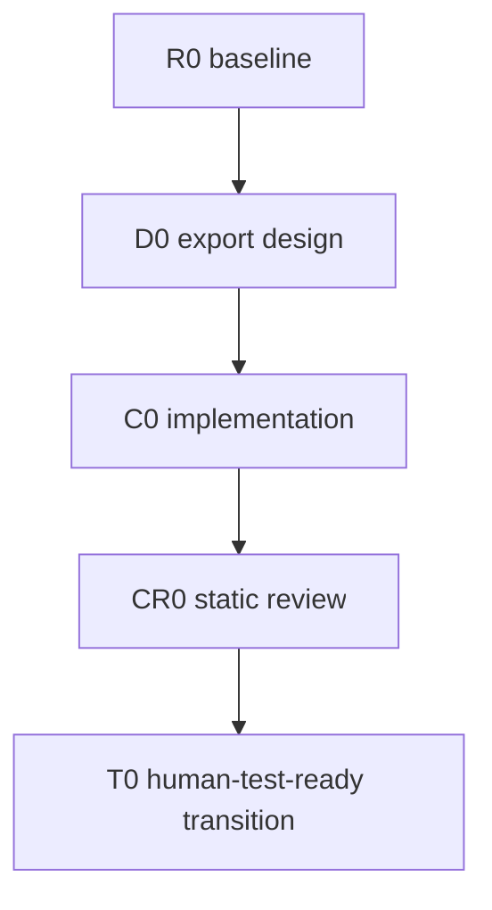

# Example CSV Export

## Canonical Contract

- This file owns the objective, scope, contracts, DAG, validation, and termination.
- `handoff.md` owns only current execution state, evidence, and the next owner.
- Planning does not authorize production writes.
- Cross-owner node results use `core-execution-items-v1`; workers never select successor IDs.

## Positive Outcome

Users can export the current report table as UTF-8 CSV from the report screen.

### Non-goals

- No XLSX or PDF export.

### Do not touch

- `report/storage/` persistence schema.

## Scope Admission

Admit a follow-up only when positive outcome, production owner/boundary, execution DAG,
and completion oracle all remain the same. Otherwise create a sibling Plan/Handoff pair.
At initial creation, record `initial creation` as the evidence on every axis.

| Axis | Evidence | Result |
|---|---|---|
| Positive outcome | initial creation | same |
| Owner and boundary | initial creation | same |
| DAG | initial creation | same |
| Completion oracle | initial creation | same |

## Current-source Evidence

| Field | Observation |
|---|---|
| Workspace | `~/repo/example` |
| Branch / HEAD | `main` @ `0000000` |
| Dirty ownership | clean |
| Production path | `report/view/ReportScreen.cpp:120` export menu |
| Disconfirming path | `report/legacy/CsvDump.cpp` is dead code, not the production route |

## Input Artifacts

| Kind | Path | Status | Authority / owner | Consumed scope or IDs |
|---|---|---|---|---|
| `requirements_contract` | `inputs/requirements-contract.yaml` | `accepted` | product owner | `AC-001`, `AC-002` |
| `behavior_decision_record` | `inputs/behavior-decisions.md` | `decision_ready` | export behavior owner | `BD-001` |

## Boundary and Behavior Contracts

| ID | Required behavior or invariant | Authority / source refs |
|---|---|---|
| `B-01` | Exported CSV preserves row order and UTF-8 header | `report/view/ReportModel.cpp:88` |

## Graph Method Profile

| Field | Decision |
|---|---|
| Method profile | `risk-adaptive-development-v1` |
| Selected archetype | `phase_gate_delivery` |
| Test authority | `human_handoff`; actual export Test is outside this DAG |
| Test transition | `next_waterfall`; current plan terminates at `human_test_ready` |
| Selection evidence | Export behavior and owner boundary are selected; design, implementation, static review, and test can proceed sequentially. |
| Disqualifiers checked | no dominant method uncertainty; no valuable parallel increments; no high-assurance paired traceability; no persistent-state transition |
| Graph rewrite budget | `max_repair=2`, `max_replan=0`; every expansion appends unique node IDs and keeps the compiled DAG acyclic |
| Fixed outer control | scope acceptance → method selection → static graph validation → execution approval → integration → verification → repair/escalation or close eligibility |
| Dynamic inner work graph | selected archetype only; `repair_required` may append `BF1 → CR1 → BF2 → CR2` before `T0`; no literal back-edge, third repair, or unbounded hybrid graph |

## Execution Routing

Copy only the roles used by this plan from `plan-handoff-v6`. User overrides win.
Once copied, this table is canonical for this plan and is not changed retroactively by
later skill-profile revisions. DAG node rows inherit Model, Effort, and selected_skills
from their role row here; a node cell overrides only when it differs.

| Role | Agent | Model | Effort | Default selected skills | Boundary |
|---|---|---|---|---|---|
| Coordinator | coordinator | Opus 5 | medium | none | follow this copied Plan/Handoff contract directly; no planning skill or external runner |
| Implementation owner | implementation_owner | Grok 4.6 | high | `skill-system-dev:workflow-implementation` | sole production writer for `report/view/` |
| Review owner | review_owner | gpt-5.6-sol | xhigh | `skill-system-dev:workflow-code-review` | read-only static review and Core review-card result |
| Human judgment | user | human | qualitative_grade | none | final qualitative grade |

## Event-Driven Coordination

| Control | Contract |
|---|---|
| Worker lifecycle automation | Required when available: dispatch input, inbox check, follow-up consumption, heartbeat, and `worker_done`; the start receipt confirms capability. Unavailable automation stays unresolved and is not emulated by Coordinator polling. |
| Coordinator wake source | Orca/equivalent host or user notification for `question`, `escalation`, or `worker_done`; heartbeat does not resume a Coordinator turn. Human Test results start a new Waterfall and never wake this pair. |
| Coordinator inbox check | One non-waiting check of its own mailbox per external notification; never read the worker inbox. Process, acknowledge, and stop. |
| Automatic polling | Forbidden: automatic `check --wait`, periodic checks, heartbeat turns, and post-ack polling. |
| Context intake | Read baseline source once before dispatch and consume compact `core-execution-items-v1` cards first. If a Plan decision still lacks evidence, read one relevant artifact/report slice once. No `worker-read`, transcript replay, or repeated terminal/Git/source/plan dumps. |
| Execution state | This Plan/Handoff pair is canonical. The Coordinator applies existing edges directly; no parallel state artifact or runner skill is required. |
| Completion | Normal completion requires `worker_done`; terminal idle or elapsed time is not completion. Clean up the terminal once after the completion event. |
| Lifecycle delivery recovery | After confirmed delivery failure, make one bounded resend/reconciliation attempt, then stop as unresolved or blocked. |
| Human approval wait | Send one `question`, continue independent authorized work, and yield the active turn. A response may arrive hours later; keep the session passively resumable and do not convert pending response into timeout, failure, `worker_done`, or DAG-level `blocked`. |
| Independent re-review | Not a default step; include only on explicit current-user request or a higher-priority repository/accepted-plan contract. |
| Wait/resource guard | Fixed-interval and busy waits are forbidden. On sustained CPU/thermal pressure or a `kernel_task` spike, capture one compact observation, stop the wait/process loop, and escalate without automatic retry; the signal does not prove the cause. |

## Timing Observation

| Control | Contract |
|---|---|
| Timing policy | `worker-done-observation-v2` |
| Plan expectation | roughly one working day; advisory only |
| Enforcement | `advisory_only` |
| Observation point | `worker_done_only` |
| Clock reads | `start_finish_only` |
| Overrun effect | `planning_signal_only` |
| Missing observation | `unknown` |
| Carry forward | `next_waterfall_if_material` |
| Forbidden implementation | `no_deadline_timeout_stall_sleep_polling` |

## Task DAG

## Typed Edges

| From | Type | To | Gate / evidence |
|---|---|---|---|
| `R0` | unblocks | `D0` | current-source baseline accepted |
| `D0` | gates | `C0` | design closes behavior contract `B-01` |
| `C0` | unblocks | `CR0` | `implementation_result` and compact `worker_done` body exist |
| `CR0` | gates | `T0` | `code_review_result` is `pass` or `complete_with_deferred_items`; close current pair before Human Test |

## DAG Node Routing

| Task | Kind | Depends on | Role / agent | Model | Effort | selected_skills | Context / input | Expected timing | Lock scope | Expected output | Validation owner | Stop / escalation |
|---|---|---|---|---|---|---|---|---|---|---|---|---|
| `R0` | baseline | none | Coordinator | inherit | inherit | inherit | request, repository instructions, current branch/HEAD/dirty ownership, production path | roughly 30 minutes | read-only | baseline snapshot in handoff | Coordinator | owner conflict |
| `D0` | decision | `R0` | Coordinator | inherit | inherit | inherit | baseline plus behavior contract `B-01` | roughly one hour | read-only | accepted export design | Coordinator | behavior or boundary remains open |
| `C0` | work | `D0` | Implementation owner | inherit | inherit | inherit | accepted design, `B-01`, and `report/view/` anchors | roughly half a day | `report/view/` | Core `implementation_result` | Coordinator | contract `B-01` at risk \| scope growth |
| `CR0` | review | `C0` | Review owner | inherit | inherit | inherit | implementation snapshot/review slice, `B-01`, Known Bug exclusions | roughly one hour | read-only | Core `code_review_result` | Coordinator | lifecycle escalation if result cannot be produced |
| `T0` | handoff | `CR0` | Coordinator | inherit | inherit | inherit | review/deferred items plus Human Test target/procedure and next-plan seeds | roughly 30 minutes | read-only | closed `human_test_ready` transition package | Coordinator | incomplete test transition contract |

## Validation and Termination

| Condition | Decisive evidence | Owner |
|---|---|---|
| Current Waterfall is ready to terminate | static review plus complete Human Test Transition contract at `T0` | Coordinator |
| Broader CSV behavior | outside this plan; user Test result becomes input to a new Waterfall | user |

- Machine checks prove only their stated contracts.
- This plan completes at `human_test_ready`; broader product quality remains
  `user-verification-needed` outside the current pair.
- Human Test results never reopen this plan or handoff.
- Do not infer phase or plan completion from one completed batch.

## Approval Gate

Current state: planning only; implementation not yet approved.

Next authorized action: user reviews this pair and approves `D0` then `C0`.
