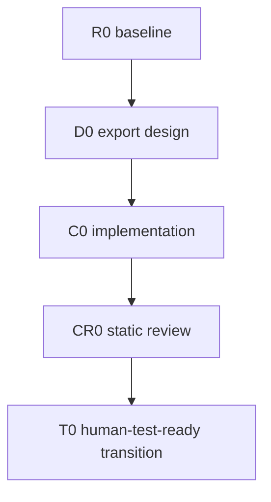

# Example CSV Export

This is a synthetic, proposed pair for illustrating authoring and conditional transitions.
Its source anchors, task cases, and expected observations are examples, not execution evidence.

## Canonical Contract

- This file owns the objective, scope, contracts, DAG, validation, and termination.
- `handoff.md` owns only current execution state, evidence, and the next owner.
- Planning does not authorize production writes.
- Cross-owner node results use `core-execution-items-v1`; workers never select successor IDs.

## Positive Outcome

Users can export the current report table as UTF-8 CSV from the report screen.

### Non-goals

- No XLSX or PDF export.

### Do not touch

- `report/storage/` persistence schema.

## Scope Admission

Admit a follow-up only when positive outcome, accepted implementation/method contract, production
owner/boundary, execution DAG, and completion oracle all remain the same. Otherwise create a sibling Plan/Handoff pair.
At initial creation, record `initial creation` as the evidence on every axis.

An unexecuted owner-kind mislabel that contradicts this pair's already accepted positive outcome
may be corrected in this pair before dispatch only when the node has produced no source change or
execution item; update its kind, skill, Core output, and edges and consume no repair attempt. Any
actual outcome/method/owner/DAG/oracle change uses the normal table and a sibling pair.

| Axis | Evidence | Result |
|---|---|---|
| Positive outcome | initial creation | same |
| Accepted implementation/method contract | initial creation | same |
| Owner and boundary | initial creation | same |
| DAG | initial creation | same |
| Completion oracle | initial creation | same |

## Current-source Evidence

| Field | Observation |
|---|---|
| Workspace | `~/repo/example` |
| Branch / HEAD | `main` @ `0000000` |
| Dirty ownership | clean |
| Production path | `report/view/ReportScreen.cpp:120` export menu |
| Disconfirming path | `report/legacy/CsvDump.cpp` is dead code, not the production route |

## Input Artifacts

| Kind | Path | Status | Authority / owner | Consumed scope or IDs |
|---|---|---|---|---|
| `requirements_contract` | `inputs/requirements-contract.yaml` | `accepted` | product owner | `AC-001`, `AC-002` |
| `behavior_decision_record` | `inputs/behavior-decisions.md` | `decision_ready` | export behavior owner | `BD-001` and its Next Human-Operable Slice's failed-export unchanged boundary |

## Boundary and Behavior Contracts

| ID | Required behavior or invariant | Authority / source refs |
|---|---|---|
| `B-01` | Export the current visible table in the same row order, with both headers and cell values preserved as UTF-8 | `inputs/requirements-contract.yaml` `AC-001`, `AC-002`; `inputs/behavior-decisions.md` `BD-001`; current-table anchor `report/view/ReportModel.cpp:88` |
| `B-02` | A failed export leaves the current report unchanged | `inputs/behavior-decisions.md` → Next Human-Operable Slice → Cancel / failure / recovery behavior |

Use the same illustrative data throughout D0, C0, CR0, and Human Test: headers `이름,도시`,
then rows `Zoë,서울` and `李,Montréal`. The CSV must preserve these headers, values, and row order.
A file with correct headers/order but `?` or corrupted text replacing a cell value does not satisfy
`AC-002` or `BD-001`. This example defines the observation to make; it reports no export result.
D0 also names the available export-failure trigger for `B-02`; Human Test uses that existing path
and compares the current report before/after failure. If no safe trigger is available, preserve
the observation as unavailable; do not invent fault-injection work or claim the condition passed.

## Graph Method Profile

| Field | Decision |
|---|---|
| Method profile | `risk-adaptive-development-v1` |
| Selected archetype | `phase_gate_delivery` |
| Test authority | `human_handoff`; actual export Test is outside this DAG |
| Test transition | `next_waterfall`; current plan terminates at `human_test_ready` |
| Selection evidence | Export behavior and owner boundary are selected; design, implementation, static review, and test can proceed sequentially. |
| Disqualifiers checked | no dominant method uncertainty; no valuable parallel increments; no high-assurance paired traceability; no persistent-state transition |
| Graph rewrite budget | `max_repair=2`, `max_replan=0`; every expansion appends unique node IDs and keeps the compiled DAG acyclic |
| Fixed outer control | scope acceptance → method selection → static graph validation → execution approval → integration → verification → repair/escalation or close eligibility |
| Dynamic inner work graph | selected archetype only; a semantically admitted same-contract repair may append `BF1 → CR1 → BF2 → CR2` before `T0`; first implementation or production-mechanism replacement uses `C → CR` and no BF budget; no literal back-edge, third repair, or unbounded hybrid graph |

## Execution Routing

Copy only the roles used by this plan from `plan-handoff-v6`. User overrides win.
Once copied, this table is canonical for this plan and is not changed retroactively by
later skill-profile revisions. DAG node rows inherit Model, Effort, and selected_skills
from their role row here; a node cell overrides only when it differs.

| Role | Agent | Model | Effort | Default selected skills | Boundary |
|---|---|---|---|---|---|
| Coordinator | coordinator | Opus 5 | medium | none | follow this copied Plan/Handoff contract directly; no planning skill or external runner |
| Implementation owner | implementation_owner | Grok 4.6 | high | `skill-system-dev:workflow-implementation` | sole production writer for `report/view/` |
| Review owner | review_owner | gpt-5.6-sol | xhigh | `skill-system-dev:workflow-code-review` | read-only static review and Core review-card result |
| Human judgment | user | human | qualitative_grade | none | final qualitative grade |

## Event-Driven Coordination

| Control | Contract |
|---|---|
| Worker lifecycle automation | Required when available: dispatch input, inbox check, follow-up consumption, heartbeat, and `worker_done`; the start receipt confirms capability. Unavailable automation stays unresolved and is not emulated by Coordinator polling. |
| Coordinator wake source | Orca/equivalent host or user notification for `question`, `escalation`, or `worker_done`; heartbeat does not resume a Coordinator turn. Human Test results start a new Waterfall and never wake this pair. |
| Coordinator inbox check | One non-waiting check of its own mailbox per external notification; never read the worker inbox. Process, acknowledge, and stop. |
| Automatic polling | Forbidden: automatic `check --wait`, periodic checks, heartbeat turns, and post-ack polling. |
| Context intake | Read baseline source once before dispatch and consume compact `core-execution-items-v1` cards first. If a Plan decision still lacks evidence, read one relevant artifact/report slice once. No `worker-read`, transcript replay, or repeated terminal/Git/source/plan dumps. |
| Execution state | This Plan/Handoff pair is canonical. The Coordinator applies existing edges directly; no parallel state artifact or runner skill is required. |
| Completion | Normal completion requires `worker_done`; terminal idle or elapsed time is not completion. Clean up the terminal once after the completion event. |
| Lifecycle delivery recovery | After confirmed delivery failure, make one bounded resend/reconciliation attempt, then stop as unresolved or blocked. |
| Human approval wait | Send one `question`, continue independent authorized work, and yield the active turn. A response may arrive hours later; keep the session passively resumable and do not convert pending response into timeout, failure, `worker_done`, or DAG-level `blocked`. |
| Independent re-review | Not a default step; include only on explicit current-user request or a higher-priority repository/accepted-plan contract. |
| Wait/resource guard | Fixed-interval and busy waits are forbidden. On sustained CPU/thermal pressure or a `kernel_task` spike, capture one compact observation, stop the wait/process loop, and escalate without automatic retry; the signal does not prove the cause. |

## Timing Observation

| Control | Contract |
|---|---|
| Timing policy | `worker-done-observation-v2` |
| Plan expectation | roughly one working day; advisory only |
| Enforcement | `advisory_only` |
| Observation point | `worker_done_only` |
| Clock reads | `start_finish_only` |
| Overrun effect | `planning_signal_only` |
| Missing observation | `unknown` |
| Carry forward | `next_waterfall_if_material` |
| Forbidden implementation | `no_deadline_timeout_stall_sleep_polling` |

## Task DAG

### Authorized repair transitions

The initial graph contains no speculative repair tasks. After a real review result, the
Coordinator may apply only the following rewrites within `max_repair=2`. A review finding must
require a bounded repair of the already-implemented `B-01`/`B-02` contract. Missing first implementation,
production-mechanism replacement, or an unresolved method requires an authorized C/decision path
or Plan escalation; a `repair_required` label alone never admits BF.

| Observed result | Graph action | T0 admission |
|---|---|---|
| `CR0` is `pass` or `complete_with_deferred_items` | Keep `CR0 → T0`; preserve any deferred items in their declared later destination. | Existing review gate and complete Human Test Transition. |
| `CR0` requires an admitted same-contract repair | Replace `CR0 → T0` with `CR0 → BF1 → CR1 → T0`. | `CR1 pass` or `complete_with_deferred_items` permits T0; `CR1 repair_required` does not. |
| `CR1` still requires an admitted same-contract repair | Replace `CR1 → T0` with `CR1 → BF2 → CR2 → T0`. | `CR2 pass` or `complete_with_deferred_items` permits T0. |
| `CR2` remains `repair_required` with an eligible `known_bug_candidate` | Combine the candidate, its actual BF attempt refs, matching failure fingerprint, and terminal `CR2` evidence into the final `known_bug_record`; keep `CR2 → T0`. | The recorded condition is `excluded_known_bug`, never passed. T0 is eligible only when every remaining required finding is covered by its authorized final record and all other transition conditions are ready. |
| A candidate exists before terminal review | Keep it as evidence; a changed BF result may still enter its already-authorized CR node. The candidate itself creates no node or exclusion. | No T0 admission based on the candidate alone. |
| A required result is missing or a BF returns `no_change_unresolved` | Preserve the unresolved condition and use lifecycle question/escalation; no invented review, retry, exclusion, or successful result. | No T0 admission from that missing/unresolved evidence. |

For each admitted rewrite, update this Plan's Mermaid graph, Typed Edges, and DAG Node Routing
before dispatch, then synchronize Handoff Task State, Execution Routing, and Timing Observations.
Remove the replaced direct edge; type review → BF as `repairs`, BF → re-review as `reverifies`,
and the new final review → T0 as `gates`. Set T0's dependency to that final review in both files;
update its gate and Human Test start condition together. Prior review/attempt evidence remains
visible. No executed node is rerun, no back-edge is introduced, and no BF3 is authorized.

- `BF1`/`BF2` use kind `repair`, the Implementation owner's model/effort and `report/view/` lock,
  but override the primary skill to `skill-system-dev:workflow-bug-fix`. Their context is the
  predecessor CR0/CR1 finding, `B-01`/`B-02`, the current snapshot, and original failure signal; output is
  Core `bug_fix_result` for A1/A2, with a candidate only when supported by actual attempt evidence.
  Expected timing is roughly one hour, validation owner is Coordinator, and scope/method mismatch
  or unavailable required evidence escalates.
- `CR1`/`CR2` inherit CR0's reviewer, skill, timing, read-only lock, output, and stop condition;
  replace their predecessor/context with the corresponding changed BF snapshot and result.
  Dispatch that re-review only for `changed_snapshot_ready_for_review`. A completed
  no-change attempt is not a changed snapshot and never justifies an empty CR cycle.

Only the Coordinator records a final Known Bug; a candidate cannot exclude a condition or choose
the next node. Current-run consumers report `SKIP — excluded Known Bug <id>` for that exact
condition, preserve the reopen condition, and follow the existing T0 edge without another repair,
wait, or global block. An unmatched required finding or unavailable terminal evidence remains
unresolved and follows escalation, not a fabricated Known Bug or early-close state.

## Typed Edges

| From | Type | To | Gate / evidence |
|---|---|---|---|
| `R0` | unblocks | `D0` | current-source baseline accepted |
| `D0` | gates | `C0` | design closes `B-01`/`B-02` for consumed `AC-001`, `AC-002`, and `BD-001`, including non-ASCII headers/values and the failed-export unchanged boundary |
| `C0` | unblocks | `CR0` | `implementation_result` and compact `worker_done` body exist |
| `CR0` | gates | `T0` | `code_review_result` is `pass` or `complete_with_deferred_items`; close current pair before Human Test |

## DAG Node Routing

| Task | Kind | Depends on | Role / agent | Model | Effort | selected_skills | Context / input | Expected timing | Lock scope | Expected output | Validation owner | Stop / escalation |
|---|---|---|---|---|---|---|---|---|---|---|---|---|
| `R0` | baseline | none | Coordinator | inherit | inherit | inherit | request, repository instructions, current branch/HEAD/dirty ownership, production path | roughly 30 minutes | read-only | baseline snapshot in handoff | Coordinator | owner conflict |
| `D0` | decision | `R0` | Coordinator | inherit | inherit | inherit | baseline, `B-01`/`B-02`, consumed inputs, and non-ASCII example | roughly one hour | read-only | accepted design for full consumed scope and the available failure trigger or explicit observation gap | Coordinator | behavior or boundary remains open |
| `C0` | work | `D0` | Implementation owner | inherit | inherit | inherit | accepted design, `B-01`/`B-02` (`AC-001`/`AC-002`/`BD-001` plus adopted failure boundary), non-ASCII example, and `report/view/` anchors | roughly half a day | `report/view/` | Core `implementation_result` covering row order, UTF-8 headers/values, and report preservation on failure | Coordinator | `B-01`/`B-02` at risk \| scope growth |
| `CR0` | review | `C0` | Review owner | inherit | inherit | inherit | implementation snapshot/review slice; full `B-01`/`B-02` and consumed scope, including value-loss and failure-mutation counterexamples; Known Bug exclusions | roughly one hour | read-only | Core `code_review_result`; static coverage of each consumed condition, not an observed export verdict | Coordinator | lifecycle escalation if result cannot be produced |
| `T0` | handoff | `CR0` | Coordinator | inherit | inherit | inherit | review/deferred items plus Human Test target/procedure and next-plan seeds | roughly 30 minutes | read-only | closed `human_test_ready` transition package | Coordinator | incomplete test transition contract |

## Validation and Termination

| Condition | Decisive evidence | Owner |
|---|---|---|
| Current Waterfall is ready to terminate | static review plus complete Human Test Transition contract at `T0` | Coordinator |
| `B-01`: consumed `AC-001`/`AC-002`/`BD-001` | Human Test compares non-ASCII headers, every value, and visible row order; header-only success cannot satisfy the condition | user, outside this plan |
| `B-02`: adopted failed-export boundary | Human Test uses D0's available failure trigger and confirms the current report is unchanged; unavailable observation stays explicit | user, outside this plan |

- Machine checks prove only their stated contracts.
- This plan completes at `human_test_ready`; broader product quality remains
  `user-verification-needed` outside the current pair.
- Human Test results never reopen this plan or handoff.
- Do not infer phase or plan completion from one completed batch.

## Approval Gate

Current state: planning only; implementation not yet approved.

Next authorized action: user reviews this pair and approves `D0` then `C0`.
