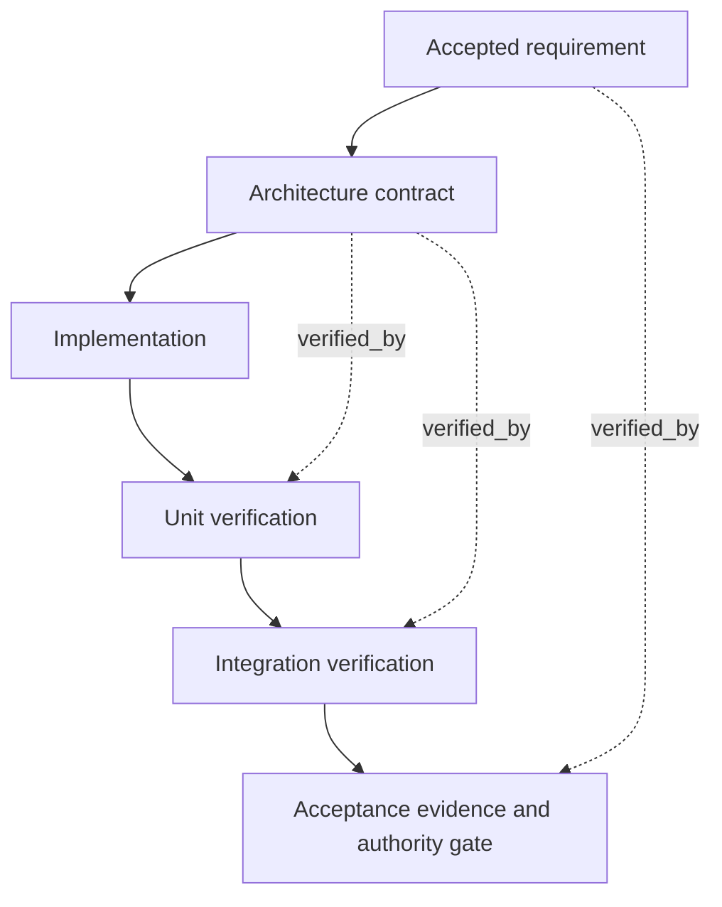

# assurance_v

Apply the common Compilation Model, full Selection Gate, Test Authority, Typed Edge Vocabulary,
and Plan Authoring And Validation Boundary from `../graph-method-profiles.md` before this detail.

The solid path orders the work. The additional `verified_by` edges state which earlier contract
the later evidence must answer; they do not create a second execution of the verification node.

| From | Type | To | Gate / evidence |
|---|---|---|---|
| `R0` | unblocks | `D1` | Accepted requirement and its authority are available. |
| `D1` | gates | `C1` | The accepted design defines component invariants and cross-component behavior. |
| `C1` | unblocks | `V1` | The implementation is available for component checks against the `D1` contract. |
| `D1` | verified_by | `V1` | Component evidence checks the design's local invariants against its accepted test basis. |
| `V1` | gates | `V2` | Required component conditions pass; their evidence does not establish integration behavior. |
| `D1` | verified_by | `V2` | Integration evidence checks the design's cross-component contracts, including material failure paths. |
| `V2` | gates | `H0` | Required integration evidence is available and its conditions pass. |
| `R0` | verified_by | `H0` | The declared acceptance owner checks evidence against the original requirement before accepting the result. |

For example, let `R0` require that a failed import leaves the document unchanged and `D1` require
all changes to remain private until one successful commit. `V1` checks that a rejected component
result cannot publish; `V2` checks that a failure after partial preparation still leaves the
integrated document unchanged. `H0` checks the required user-visible outcome under the Plan's
declared acceptance authority. Passing `V1` cannot substitute for `V2` or `H0`.

This is a topology and evidence-pairing example, not a ready execution plan. Compile concrete
owners, authoritative test bases, outputs, and required static-review nodes before running it.
The implementation snapshot is the subject of verification, never its own correctness oracle.
If a required observation or acceptance decision is unavailable, preserve that condition as
unresolved; do not substitute maker self-report or infer approval from completed earlier nodes.
