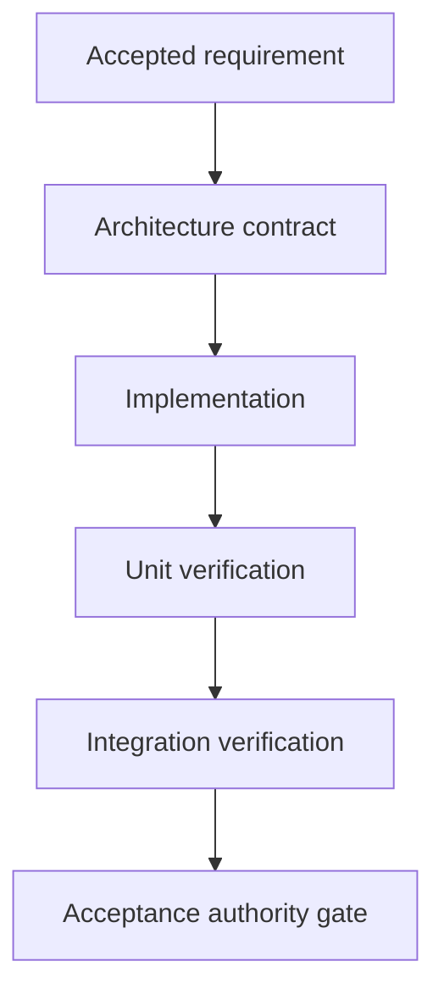

# assurance_v

Apply the common Compilation Model, full Selection Gate, Test Authority, Typed Edge Vocabulary,
and Plan Authoring And Validation Boundary from `../graph-method-profiles.md` before this detail.

Use Typed Edges to record which contract is `verified_by` which node. Maker self-report cannot
replace the evidence path required by the accepted assurance contract.

