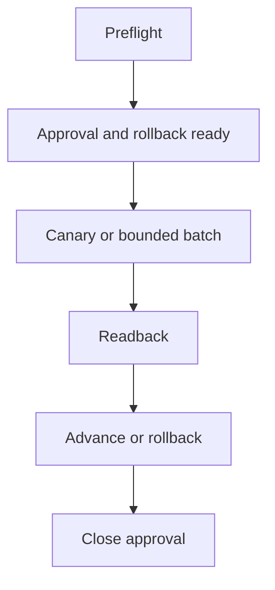

# controlled_transition

Apply the common Compilation Model, full Selection Gate, Test Authority, Typed Edge Vocabulary,
and Plan Authoring And Validation Boundary from `../graph-method-profiles.md` before this detail.

No irreversible step runs before approval and rollback readiness. Each batch has direct
readback; a failed readback selects rollback or stop, never automatic continuation.

