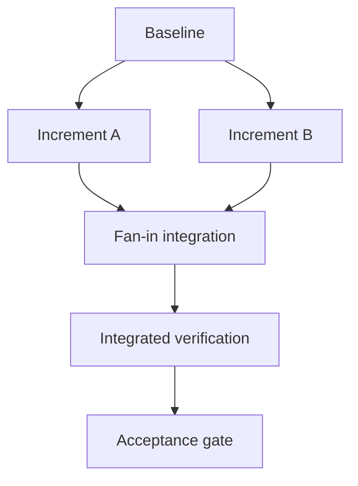

# dependency_incremental

Apply the common Compilation Model, full Selection Gate, Test Authority, Typed Edge Vocabulary,
and Plan Authoring And Validation Boundary from `../graph-method-profiles.md` before this detail.

Parallel increments require disjoint lock scopes. Each increment has an observable output and
matching verification owner; fan-in cannot begin until all required predecessors complete.

