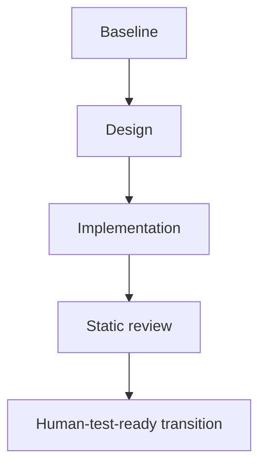

# phase_gate_delivery

Apply the common Compilation Model, full Selection Gate, Test Authority, Typed Edge Vocabulary,
and Plan Authoring And Validation Boundary from `../graph-method-profiles.md` before this detail.

Static review is mandatory but need not be a separately instantiated independent reviewer. Use
the implementation owner, Coordinator, or a declared review owner according to the plan; require
a fresh independent reviewer only when the current user or a higher-priority contract requires
one. Agent-side checks before handoff are supporting evidence, not this Test phase. A semantically
admitted bounded repair that preserves the accepted implementation/method contract may append only
the `BF1 -> CR1 -> BF2 -> CR2` nodes authorized by the current rewrite budget before `T0`.
`repair_required` alone is not BF authority. When the required positive work is first implementation
or explicit production-mechanism replacement, use an existing or Plan-corrected `C -> CR`
continuation; without an authorized edge, escalate for Plan revision and consume no BF budget.
A later human test result always starts a new Waterfall; never append it to this DAG, create an
unbounded back-edge, or keep an agent waiting for the user.

