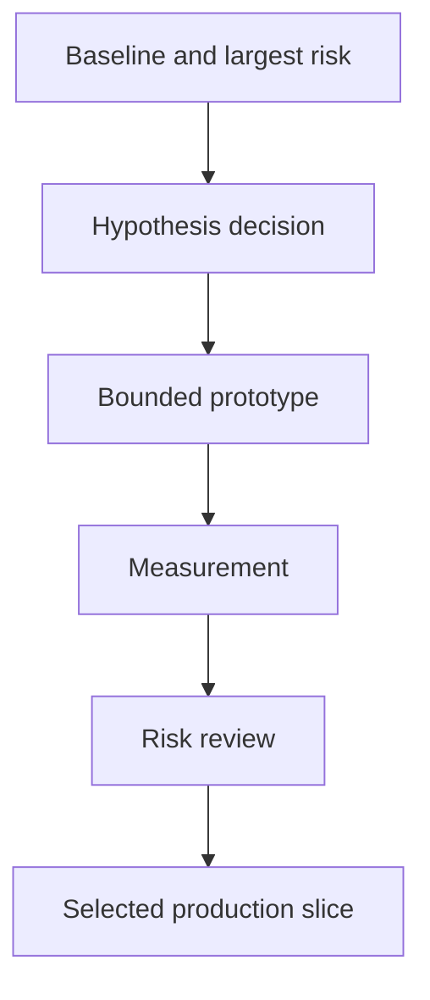

# risk_spiral

Apply the common Compilation Model, full Selection Gate, Test Authority, Typed Edge Vocabulary,
and Plan Authoring And Validation Boundary from `../graph-method-profiles.md` before this detail.

If `D2` selects another cycle, append `D3 → P2 → V2 → D4` only when rewrite budget remains.
The prototype is not production evidence, and failure to discriminate escalates instead of
creating unbounded continuation.
When verifier feedback is intended to select another action, also apply
`../repeated-work-principles.md`; activity without a condition/evidence delta is not another cycle.
