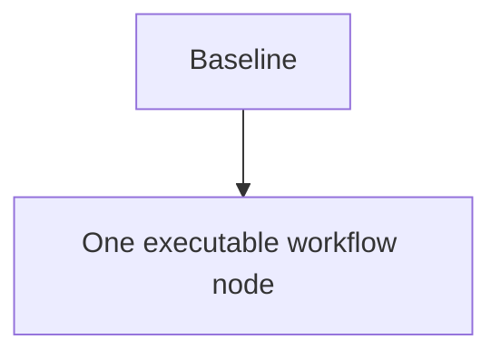

# single_node_execution

Apply the common Compilation Model, full Selection Gate, Test Authority, Typed Edge Vocabulary,
and Plan Authoring And Validation Boundary from `../graph-method-profiles.md` before this detail.

`N0` owns its bounded production or artifact outcome and returns its normal compact result. The
Coordinator applies the only existing edge and records completion or user-verification handoff in
the canonical pair. An assurance mode may attach to `N0`, but it is not another node. If a
separate review, repair, verifier, or second owner becomes required, stop this profile and use
Scope Admission for a new appropriate pair; never introduce a runner or hidden subgraph.

