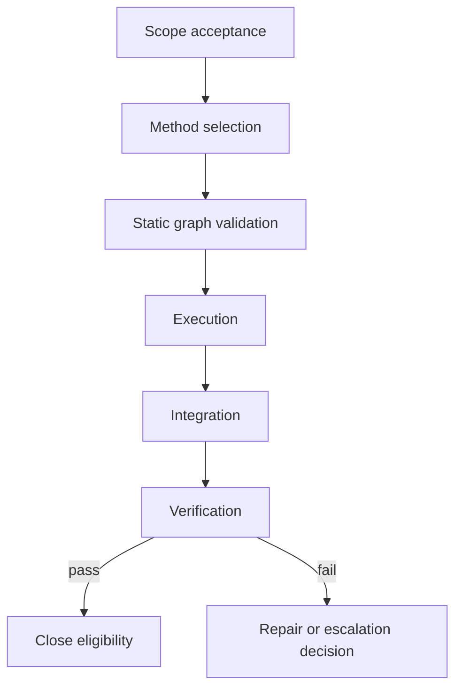
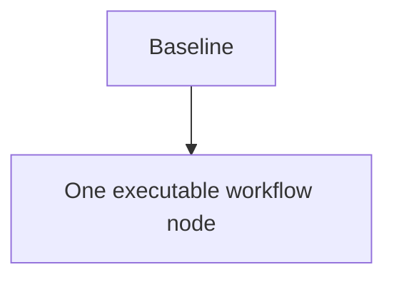
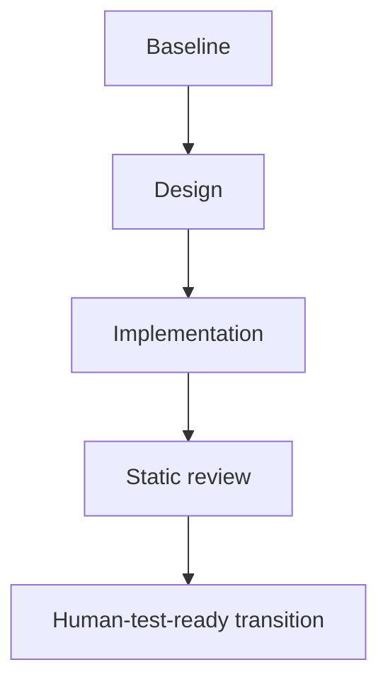
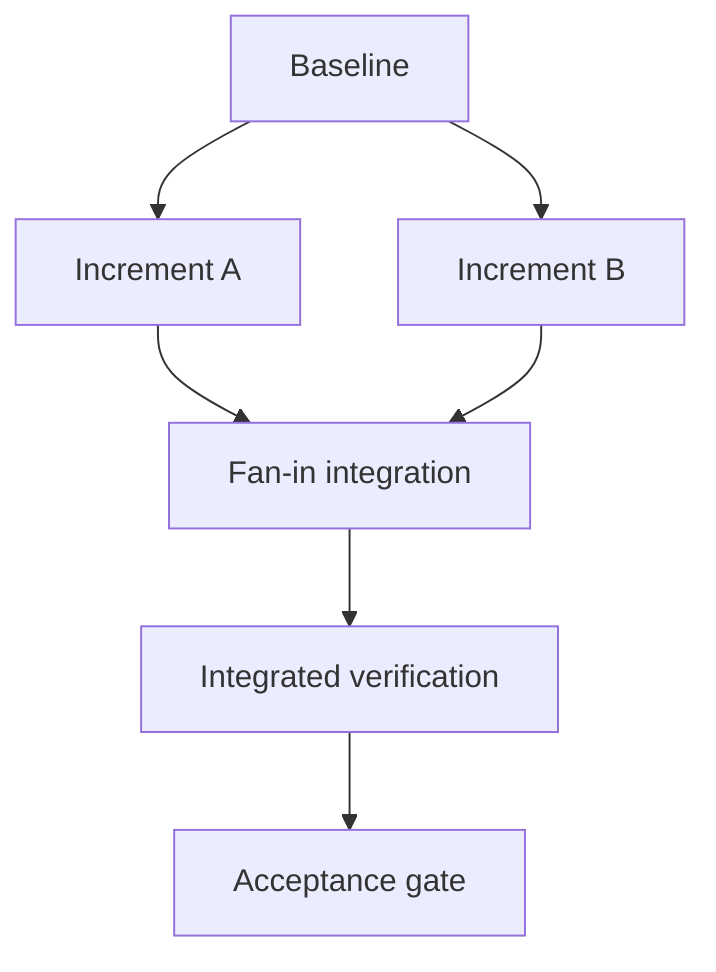
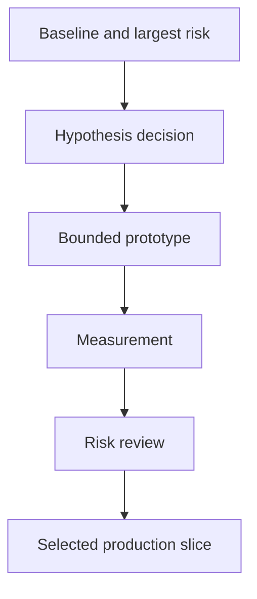
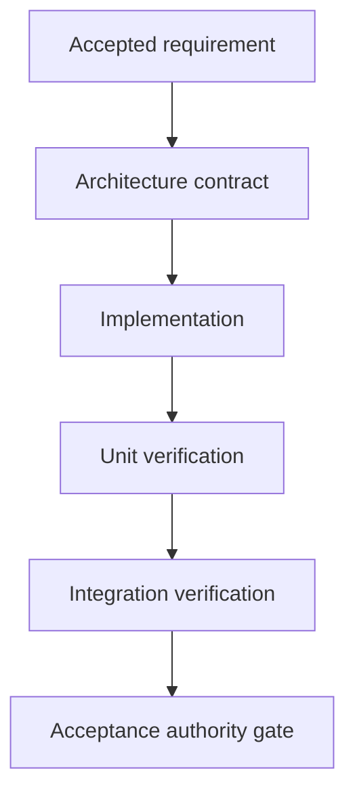
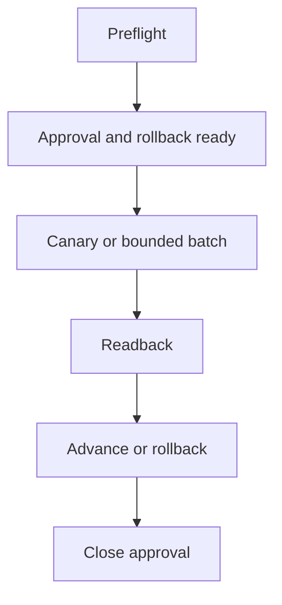

# Graph Method Profiles

Use one graph archetype to compile the inner work graph. Do not imitate methodology names,
ceremonies, or organization charts. Preserve the engineering invariant that makes the selected
topology useful.

## Compilation Model

Every new `plan-handoff-v6` pair has two levels:

1. a fixed outer Control Graph that owns scope acceptance, method selection, static graph
   validation, execution approval, integration, verification, repair/escalation, and close;
2. one selected inner Work Graph archetype whose nodes may be expanded only through the
   plan-declared bounded rewrite policy.

The `Task DAG` is the finite compiled execution instance, never a literal cyclic graph. A
bounded continuation, repair, or replan appends uniquely identified nodes and typed edges while budget
remains. It never creates a back-edge to an already executed node. This preserves acyclicity,
traceability, and bounded cost.

Keep graph meanings separate without creating extra artifacts:

| Graph question | Pair representation |
|---|---|
| Lifecycle / control | fixed outer controls plus `Task DAG` and Typed Edges |
| Work dependency | Mermaid DAG and `depends_on` / `unblocks` edges |
| Agent / authority | Execution Routing and DAG Node Routing role/agent fields |
| Resource / lock | DAG Node Routing lock scopes |
| Artifact / evidence | Expected output, Validation owner, and Validation and Termination |
| Context | DAG Node Routing Context / input field |

Role, node, and agent are distinct. A role declares responsibility and authority; a node is a
state-to-artifact transformation; an agent is the runtime executor bound to that node. Do not
turn a manager/developer/tester organization chart into a work graph.

## Selection Gate

Choose exactly one archetype. Use `single_node_execution` when durable Plan/Handoff state is
needed but there is only one executable owner and no inter-node dependency. Start multi-node work
with `phase_gate_delivery` when design and execution order are already clear. A hard disqualifier
rejects a candidate; do not combine several archetypes to avoid making a decision.

| Archetype | Use when | Required mechanism | Disqualifier / switch condition |
|---|---|---|---|
| `single_node_execution` | One bounded executable task needs durable pause/resume or handoff state, but has one execution owner and no independent downstream work node. | Baseline → one executable node → close or user-verification handoff, using the canonical Plan/Handoff pair as the only state and no external runner. | A separate design, review, repair, verifier, or second production owner is mandatory → `phase_gate_delivery` or `dependency_incremental`; a feedback cycle is intrinsic → `risk_spiral`; external-state transition dominates → `controlled_transition`. |
| `phase_gate_delivery` | The design direction is selected, phase ownership is efficient, and the preferred path is design/implementation → static review → human-test-ready termination. | Waterfall-derived phase gates with lock-safe fan-out inside design/implementation, mandatory fan-in static review, bounded pre-handoff repair/re-review, and a terminal package for later human Test. | A dominant unknown blocks design → `risk_spiral`; genuine cross-increment fan-out/fan-in dominates → `dependency_incremental`; formal paired traceability dominates → `assurance_v`; persistent-state transition dominates → `controlled_transition`. |
| `dependency_incremental` | Cross-module behavior is selected, dependencies are mostly known, and delivery can be split into observable increments. | Dependency-ordered work nodes, lock-safe parallelism, fan-in integration, and matching verification for every increment. | A dominant unknown blocks production shape → `risk_spiral`; formal paired traceability dominates → `assurance_v`; irreversible state transition dominates → `controlled_transition`. |
| `risk_spiral` | Problem, algorithm, performance path, UX behavior, or architecture choice remains materially uncertain. | Risk ranking, one falsifiable hypothesis, bounded prototype/measurement, decision gate, and a finite rewrite budget before production. | The behavior and boundary are already selected → `dependency_incremental`; mandatory development-to-verification traceability → `assurance_v`; release/migration side effects dominate → `controlled_transition`. |
| `assurance_v` | High-assurance, security/auth, safety, regulated, hardware-contract, or accepted-plan work requires each development contract to have a paired verification owner and evidence path. | Contract decomposition on the left, implementation at the base, paired unit/integration/acceptance verification on the right, and bounded repair/reverification. | No material assurance or traceability requirement exists → `dependency_incremental`; the method is still unknown → `risk_spiral`. |
| `controlled_transition` | Release, deployment, schema/data migration, destructive operation, or external-state transition requires approval, rollback, staged execution, and readback. | Preflight, approval/backup/rollback readiness, canary or bounded batch, readback, advance-or-rollback decision, and close approval. | No persistent/external state transition exists → `dependency_incremental`; the transition design itself is unresolved → `risk_spiral` first. |

Small one-session patches and ordinary bug fixes do not need this durable pair. Route them to
the direct task workflow or `plan-task-handoff`. Use `single_node_execution` only when one task
genuinely needs durable pair state; it is not a reason to persist ordinary work. Use
`phase_gate_delivery` as the normal multi-node default for clear bounded development,
`dependency_incremental` only when incremental fan-out/fan-in has real value, the measurement
variant of `risk_spiral` for performance optimization, and
`dependency_incremental` with trace/eval evidence for Skill-System improvement that genuinely
benefits from separable increments.

## Test Authority

Record one test authority in the plan: `human_handoff`, `agent_machine`, or `mixed`, plus one
test transition: `current_graph` or `next_waterfall`. `phase_gate_delivery` defaults to
`human_handoff` + `next_waterfall`:

- agent-owned build, lint, static analysis, or narrow smoke work is a pre-handoff check, not the
  Test phase and not a substitute for the user's observation;
- all runnable agent nodes proceed through static review and terminate at `human_test_ready`
  without waiting for the user;
- Human Test is outside the current Task DAG. The current plan may complete at the pre-test
  boundary while the broader product result remains `user-verification-needed`;
- the current `handoff.md` becomes closed/read-only at transition and is never resumed from a
  human test result;
- after testing, the user supplies the observation plus a new worklist and new design brief.
  That input creates a new `plan_id` and a new Plan/Handoff pair through Scope Admission. Pass,
  failure, or newly discovered work never appends to the old Waterfall.

Design and implementation may each fan out across disjoint context and lock scopes. A production
node depends on the design contract for its own slice, but unrelated design and implementation
slices may overlap when the typed DAG records that independence. Every required slice fans in
before Static Review; the current Waterfall terminates when its human-Test transition package is
ready.

## Archetype Examples

### `single_node_execution`

`N0` owns its bounded production or artifact outcome and returns its normal compact result. The
Coordinator applies the only existing edge and records completion or user-verification handoff in
the canonical pair. An assurance modifier may attach to `N0`, but it is not another node. If a
separate review, repair, verifier, or second owner becomes required, stop this profile and use
Scope Admission for a new appropriate pair; never introduce a runner or hidden subgraph.

### `phase_gate_delivery`

Static review is mandatory but need not be a separately instantiated independent reviewer. Use
the implementation owner, Coordinator, or a declared review owner according to the plan; require
a fresh independent reviewer only when the current user or a higher-priority contract requires
one. Agent-side checks before handoff are supporting evidence, not this Test phase. A
`repair_required` review may append only the bounded `BF1 -> CR1 -> BF2 -> CR2` nodes authorized
by the current rewrite budget before `T0`.
A later human test result always starts a new Waterfall; never append it to this DAG, create an
unbounded back-edge, or keep an agent waiting for the user.

### `dependency_incremental`

Parallel increments require disjoint lock scopes. Each increment has an observable output and
matching verification owner; fan-in cannot begin until all required predecessors complete.

### `risk_spiral`

If `D2` selects another cycle, append `D3 → P2 → V2 → D4` only when rewrite budget remains.
The prototype is not production evidence, and failure to discriminate escalates instead of
creating unbounded continuation.
When verifier feedback is intended to select another action, also apply
`repeated-work-principles.md`; activity without a condition/evidence delta is not another cycle.

### `assurance_v`

Use Typed Edges to record which contract is `verified_by` which node. Maker self-report cannot
replace the evidence path required by the accepted assurance contract.

### `controlled_transition`

No irreversible step runs before approval and rollback readiness. Each batch has direct
readback; a failed readback selects rollback or stop, never automatic continuation.

## Typed Edge Vocabulary

Use only these work/control edge types in the plan:

- `depends_on`: the target cannot start before the source output exists;
- `unblocks`: source completion makes the target runnable;
- `branches_to`: a recorded decision selects the target branch;
- `verified_by`: the target verifies the source output or contract;
- `gates`: source evidence controls admission to the target;
- `repairs`: the target is a new bounded repair node for the source failure;
- `reverifies`: the target rechecks a repaired condition;
- `approves`: source authority admits the target transition.

Every Mermaid edge has exactly one Typed Edges row. Resource, authority, evidence, and context
relations stay in their owning tables rather than being mislabeled as `next` edges.

## Plan Authoring And Validation Boundary

The authored plan must satisfy all of the following:

1. exactly one allowed archetype is selected and its disqualifiers are recorded;
2. exactly one baseline node exists and every node is reachable from it;
3. `single_node_execution` has exactly one executable work node after the baseline and no hidden
   state artifact or runner dependency;
4. the compiled Task DAG is acyclic;
5. every Mermaid edge has one allowed typed edge and references known nodes;
6. every node declares kind, predecessors, executor, selected skills, context/input, lock scope,
   output, validation owner, and stop/escalation condition;
7. parallel write scopes do not overlap;
8. every repeated-work/replan/repair expansion has explicit count/cost bounds and appends new node IDs;
9. every terminal path has decisive evidence or an explicit transition package; a
   `phase_gate_delivery` DAG terminates at `human_test_ready`, closes the old handoff, and leaves
   broader product status `user-verification-needed` for a new Waterfall;
10. every failure path reaches bounded repair, rollback, escalation, or stop;
11. implementation self-report alone cannot establish verification or close eligibility.
12. every node has one rough expected timing, and typed RFC3339/ISO-8601 Timing Observations
    update only when its `worker_done` body arrives; an overrun is advisory and never a deadline,
    block, or retry.

Structural pair validation checks declared enums/fields, required execution-item sections, exact
next-Plan-node identity, table/ID consistency, reachability, acyclicity, Typed Edge coverage,
termination shape, and timing syntax/state. It does not judge archetype fit, design quality,
lock-scope correctness, evidence sufficiency, failure-strategy quality, or timing realism. Those
remain planning decisions evaluated through fresh task output, review, runtime evidence, and Human
Test.
